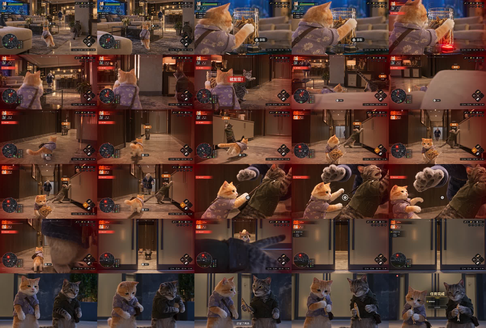

# Console Game Cinematic · RPG GAME Skill

把角色与剧情变成有操控感的第三人称游戏视频提示词：交互按键、复杂 HUD、低机位追逐、QTE、伙伴救援和任务结算。



[查看参考视频](reference.mp4) · [Skill入口](SKILL.md) · [可替换主题模板](prompt-template.md) · [成片拆解](source-analysis.md)

## 适合什么任务

- 把参考视频反推为“主体、风格、时间线、BGM、限制”五段式提示词。
- 更换主角、伙伴、目标物或场景，保留任务反转与游戏运镜。
- 生成首帧方案，明确角色站位、移动路线和 HUD 初始状态。
- 检查镜头动机、QTE反馈、道具连续性与剧情时间分配。

本仓库提供视频创作 Skill 与参考素材，不是真实游戏程序，也不会自动提交生成平台任务。

## 安装到 Codex

下载本仓库，将整个 `console-game-cinematic` 仓库文件夹复制到 `~/.codex/skills/`。

也可在终端执行：

```bash
git clone https://github.com/huangbai-AI/console-game-cinematic.git
mkdir -p ~/.codex/skills
cp -R console-game-cinematic ~/.codex/skills/
```

重新打开会话后使用：

```text
使用 $console-game-cinematic，写一段30秒、16:9、480P的主机游戏实机风格视频提示词。
玩家是小浣熊，伙伴是狐狸，场景是博物馆。要有交互按键、复杂HUD、
追逐、伙伴被困后的救援，以及任务完成结尾。先只给提示词。
```

## 这套效果的关键

| 阶段 | 镜头 | 界面反馈 |
| --- | --- | --- |
| 接近目标 | 背后跟随，保留前进空间 | 目标距离、互动提示 |
| 拿取 | 推近过肩，交代接触点 | 按键进度、物品反馈 |
| 被发现 | 转向危险源，保留角色位置 | 红色警戒、地图危险区 |
| 逃跑 | 低位跟随、转角平滑跟转 | 体力下降、出口标记 |
| 伙伴受困 | 回看并交代追赶距离 | 橙色伙伴状态 |
| 救援 | 侧面近景、短暂慢动作 | 单一主要QTE |
| 脱险 | 回稳、双人奖励镜头 | 警戒解除、任务结算 |

## 文件结构

```text
console-game-cinematic/
├── SKILL.md
├── README.md
├── prompt-template.md
├── source-analysis.md
├── contact-sheet.jpg
└── reference.mp4
```

## 参考与边界

随附样片约30.05秒、852×480、24fps。拆解以可见画面为依据；未核听的声音不冒充原音。模板中的慢动作时长、对白和音乐属于可调整设计。

复杂小字、精确数值与小地图同步可能需要后期叠加。可复刻镜头语言与状态反馈，不承诺生成模型逐帧一致。PS仅用于描述主机动作冒险游戏观感，与Sony或PlayStation不存在官方关联。
