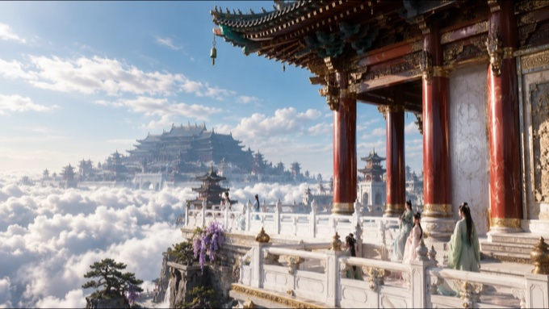
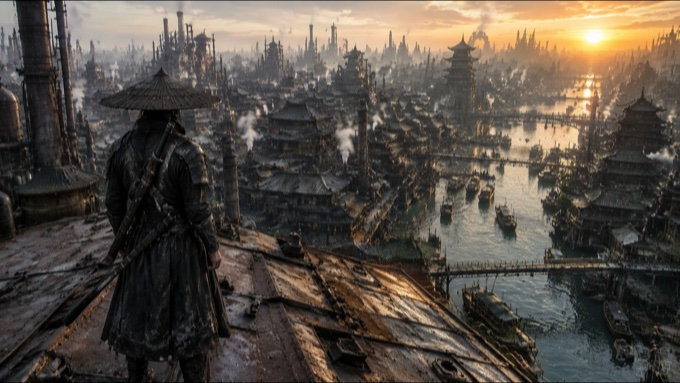
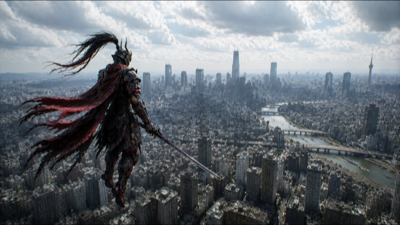
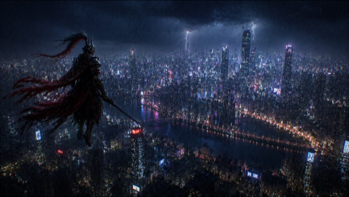
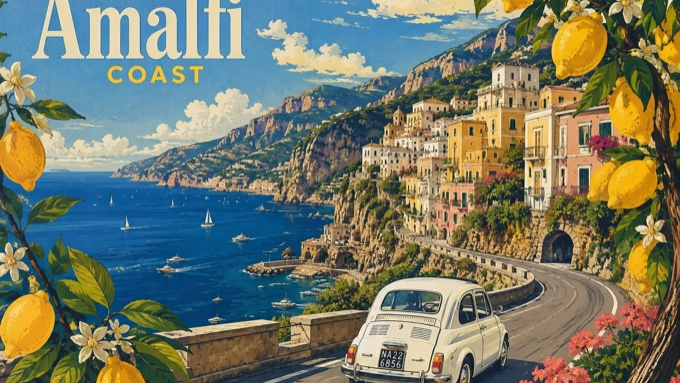

# Image Prompt · AI 图像生成提示词库

> 一个按**视觉风格**分类的中文 AI 绘画提示词（Prompt）收藏库。
> 每一条提示词都不是几个关键词的堆砌，而是一份可直接投喂给模型的**完整摄影/美术指令**：画幅、机位、焦段、空间层次、材质、光线、动态、负面清单一应俱全。

<p>
  
  
  
</p>

---

## 目录

- [这是什么](#这是什么)
- [它能做什么](#它能做什么)
- [快速开始](#快速开始)
- [提示词导航](#提示词导航)
  - [宏大风格 · 东方神界巨构](#宏大风格--东方神界巨构)
  - [武侠 · 蒸汽朋克与机甲剑圣](#武侠--蒸汽朋克与机甲剑圣)
  - [梦幻空灵 · 超现实天象](#梦幻空灵--超现实天象)
  - [治愈 · 夏日旅行](#治愈--夏日旅行)
  - [宫崎骏画风 · 复古旅行海报](#宫崎骏画风--复古旅行海报)
  - [日常 emo · 手机随手拍](#日常-emo--手机随手拍)
  - [游戏 · 体素世界截图](#游戏--体素世界截图)
- [作品示例](#作品示例)
- [提示词写作方法论](#提示词写作方法论)
- [模板变量语法](#模板变量语法)
- [目录与命名规范](#目录与命名规范)
- [贡献](#贡献)
- [声明](#声明)

---

## 这是什么

这个仓库收集的是**长文本、结构化、可复用**的图像生成提示词。

和常见的「关键词串」型 prompt 不同，这里的提示词更接近一份**分镜说明书**——它先告诉模型「这不是什么」（不是概念艺术、不是游戏 CG、不是海报），再逐段规定摄影机在哪、用什么焦段、画面分几层、每层放什么、材质怎么反光、光从哪来、允许出现哪一种动态，最后附上正向关键词块和 Negative Prompt。

因此同一个文件在不同时间、不同模型上出图，**世界观和镜头语言是稳定的**，适合成组产出（比如「九宫格」系列、同一角色的昼夜两版）。

## 它能做什么

| 场景 | 怎么用 |
| --- | --- |
| **直接出图** | 复制整份 `.md` 内容粘贴进模型对话框，一次成图，不需要调参 |
| **成组系列图** | 用同一份基础设定 + 更换单一变量（时间/天气/动态），保证多张图风格一致，见 [`武侠/机甲-白天.md`](武侠/机甲-白天.md) 与 [`武侠/机甲-夜晚.md`](武侠/机甲-夜晚.md) |
| **拆件复用** | 长提示词按 `【】` / `##` 分节，可只取「摄影机」「材质」「Negative Prompt」等段落，拼进自己的 prompt |
| **学习 prompt 结构** | 对照阅读长短两类提示词，理解「负面定义先行 + 三层空间 + 尺度对比」的写法 |
| **做成模板** | 见 [`游戏/我的世界.md`](游戏/我的世界.md) 的参数化写法，可接入自动化流程批量生成 |

适配文本理解能力强的图像模型：Nano Banana / Gemini 系、Seedream、即梦、Sora、Midjourney（建议 `--style raw`，超长文本需压缩）、Flux、Stable Diffusion（配合长文本编码器）。

## 快速开始

```bash
git clone https://github.com/Gloomysunday28/image-prompt.git
```

1. 在下面的[提示词导航](#提示词导航)里挑一个风格；
2. 打开对应 `.md`，**全文复制**（包含 Negative Prompt 段落）；
3. 粘贴到图像模型，按文件开头标注的画幅设置比例（`16:9` 或 `9:16`）；
4. 不满意时**只改一个变量**（天气、时间、机位高度、人物尺寸），不要整段重写——这是这套提示词保持稳定的关键。

---

## 提示词导航

| 分类 | 文件 | 画幅 | 篇幅 | 一句话 |
| --- | --- | --- | --- | --- |
| 宏大风格 | [宫阙图 - (风格 1).md](宏大风格/宫阙图%20-%20%28风格%201%29.md) | 16:9 | 短 | 悬崖天宫巨构，港式奇幻武侠电影语言 |
| 宏大风格 | [prompt-two.md](宏大风格/prompt-two.md) | 16:9 | 长 | 天宫系列世界观设定集，供九宫格成组出图 |
| 武侠 | [蒸汽朋克.md](武侠/蒸汽朋克.md) | 16:9 | 长 | 东方蒸汽朋克工业水城，真人电影实拍质感 |
| 武侠 | [赛博朋克.md](武侠/赛博朋克.md) | 16:9 | 中 | 屋顶武士背影俯瞰黄昏工业巨城 |
| 武侠 | [机甲.md](武侠/机甲.md) | 16:9 | 长 | 生物机械剑圣 × 暴雨都市战争剧照 |
| 武侠 | [机甲-白天.md](武侠/机甲-白天.md) | 16:9 | 长 | 白天版，含铠甲/头盔/流马尾完整设定 |
| 武侠 | [机甲-夜晚.md](武侠/机甲-夜晚.md) | 16:9 | 长 | 夜晚暴雨版，与白天版共用角色设定 |
| 梦幻空灵 | [prompt-one.md](梦幻空灵/prompt-one.md) | 9:16 | 短 | 巨型锦鲤遨游星云，低角度仰拍 |
| 梦幻空灵 | [童话.md](梦幻空灵/童话.md) | 16:9 | 长 | 七彩天河逆光，第三人称跟拍探索感 |
| 梦幻空灵 | [无人区-童话.md](梦幻空灵/无人区-童话.md) | 16:9 | 长 | 渡轮甲板仰望巨大星河漩涡 |
| 治愈 | [滑板治愈.md](治愈/滑板治愈.md) | 9:16 | 中 | 滑板少年冲下海岸公路的夏日治愈画面 |
| 宫崎骏画风 | [意大利旅游.md](宫崎骏画风/意大利旅游.md) | 不限 | 短 | 阿马尔菲海岸复古旅行海报插画 |
| 日常 emo | [prompt-one.md](日常%20emo/prompt-one.md) | 竖版 | 短 | 让模型「拍」一张深夜 emo 的手机快照（英文） |
| 游戏 | [我的世界.md](游戏/我的世界.md) | 16:9 | 短 | 体素世界第一人称游戏截图模板（英文，含变量） |

### 宏大风格 · 东方神界巨构

追求「**极远处的巨物压迫感**」。核心手法是不对称电影构图：右侧近景用被裁切的宫殿局部压框，左侧留出大面积云海负空间，极远处再放一座横向宽广如山脉的主城核心——距离数公里仍要有绝对视觉重量，明确禁止远景发白、发灰、缩小。

- [`宫阙图 - (风格 1).md`](宏大风格/宫阙图%20-%20%28风格%201%29.md)：单张成图用。40–50mm 平视、人眼高度 1.4 米，明确写死「不航拍」。
- [`prompt-two.md`](宏大风格/prompt-two.md)：**设定集**，不是单张提示词。分【巨物迎客松】【天界建筑语言】【仙界地面】【仙人观看方式】【无朝代仙衣】【开放式构图】等段落，规定了云瀑、天河、仙鹤等九种可选动态，每张只用一种主导动态，用来产出一整组世界观统一的图。

### 武侠 · 蒸汽朋克与机甲剑圣

这一组的共同目标是**真人电影实拍质感**，所有文件开头都用大段否定把模型从「概念艺术 / 游戏 CG / 数字绘画 / 油画」上拽下来。

- [`蒸汽朋克.md`](武侠/蒸汽朋克.md)：东方蒸汽朋克巨型工业水城，中式塔楼飞檐与钢铁平台、铜管、锅炉共存，要求符合现实工程逻辑——铆钉、焊缝、支撑结构、承重桥梁一样不少。
- [`赛博朋克.md`](武侠/赛博朋克.md)：第三人称背后视角，武士站在锈红色工业屋顶最前端俯瞰整座水上巨城。指定了 ARRI Alexa 35 + 20mm 电影镜头、黄昏逆光、前中远三层景深衰减，并对皮肤毛孔、发丝、金属氧化、布料垂坠等逐项提出真实材质要求。
- [`机甲.md`](武侠/机甲.md) / [`机甲-白天.md`](武侠/机甲-白天.md) / [`机甲-夜晚.md`](武侠/机甲-夜晚.md)：同一位「未来东方剑圣」的三个变体，按【场景】【城市真实性】【城市规模】【天气环境】【摄影机】【人物设计】【机械铠甲】【胸甲】【头盔】【流马尾结构】【围巾与披帛】【披风】【武器】【镜头真实感】【Real Film Keywords】【Negative Prompt】逐节展开。白天/夜晚两版共用角色设定，只换光照与天气，是本仓库「控制单一变量做系列图」的范例。

### 梦幻空灵 · 超现实天象

真实摄影质感 + 现实中不可能存在的天空，靠**巨大尺度对比**制造空灵感。

- [`prompt-one.md`](梦幻空灵/prompt-one.md)：最短的一条。巨型锦鲤在星云中游动，小人背对观众仰望，锦鲤低头看他。
- [`童话.md`](梦幻空灵/童话.md)：严格规定「近距离、低机位、几乎正后方、向左偏 15°–20°」的第三人称跟拍，配【七彩天河】【太阳与逆光】【严格避免】等段落，要的是「普通人旅途中误入童话区域被同行者随手拍下」的感觉。
- [`无人区-童话.md`](梦幻空灵/无人区-童话.md)：第一人称站在海上渡轮甲板，20–24mm 广角，天空核心是巨大星河漩涡。前提是**先让人相信这是一艘真实的普通渡轮**，然后才发现天空不对劲。

### 治愈 · 夏日旅行

[`滑板治愈.md`](治愈/滑板治愈.md)：9:16 竖版，日系动画背景美术 × 高质量 3D CGI 写实质感。14mm 超广角低机位跟拍，少年踩滑板沿陡坡公路冲向海岸，人物刻意画小以突出世界尺度，公路的黄色中心线充当视觉引导线。

### 宫崎骏画风 · 复古旅行海报

[`意大利旅游.md`](宫崎骏画风/意大利旅游.md)：现代铅笔插画 + 1950–60 年代旅行海报风。阿马尔菲海岸悬崖公路、白色老爷车、地中海帆船、前景柠檬枝框景，丝网印刷质感与松散笔触。整条提示词只有一段，适合当作短提示词的写法参考。

### 日常 emo · 手机随手拍

[`prompt-one.md`](日常%20emo/prompt-one.md)：英文短提示词，反向利用「不完美」——要求轻微运动模糊、光照不均、冷调偏灰、深夜孤独感，让模型输出一张像是 iPhone 误触拍下的生活快照。适合做人物写实向的自拍/生活流图像。

### 游戏 · 体素世界截图

[`我的世界.md`](游戏/我的世界.md)：英文**参数化模板**。第一人称体素世界游戏截图，包含 3D 标题 logo、两只生物、手持道具，以及底部完整 HUD（血条、经验条、饥饿条、9 格快捷栏）。所有可变部分都写成变量，改几个词就能换一套截图。

---

## 作品示例

> 预览图统一为 340×191 缩略图，点击可看原图。

| <a href="宏大风格/宫阙图%20-%20%28风格%201%29.png"></a> | <a href="武侠/蒸汽朋克.png"></a> | <a href="武侠/赛博朋克.png"></a> |
| :---: | :---: | :---: |
| **宏大风格 · 宫阙图**<br />[`宫阙图 - (风格 1).md`](宏大风格/宫阙图%20-%20%28风格%201%29.md) | **武侠 · 蒸汽朋克**<br />[`武侠/蒸汽朋克.md`](武侠/蒸汽朋克.md) | **武侠 · 赛博朋克**<br />[`武侠/赛博朋克.md`](武侠/赛博朋克.md) |
| <a href="武侠/机甲-白天.png"></a> | <a href="武侠/机甲-夜晚.png"></a> | <a href="梦幻空灵/童话.png"></a> |
| **武侠 · 机甲（白天）**<br />[`武侠/机甲-白天.md`](武侠/机甲-白天.md) | **武侠 · 机甲（夜晚）**<br />[`武侠/机甲-夜晚.md`](武侠/机甲-夜晚.md) | **梦幻空灵 · 童话**<br />[`梦幻空灵/童话.md`](梦幻空灵/童话.md) |
| <a href="宫崎骏画风/意大利旅游.png"></a> | <a href="治愈/滑板治愈.png"></a> |  |
| **宫崎骏画风 · 意大利旅游**<br />[`宫崎骏画风/意大利旅游.md`](宫崎骏画风/意大利旅游.md) | **治愈 · 滑板**<br />[`治愈/滑板治愈.md`](治愈/滑板治愈.md) |  |

---

## 提示词写作方法论

仓库里的长提示词遵循同一套结构，照着写就能复现这种稳定度：

1. **先定画幅与画种**——`16:9 横向电影级真实摄影画面`，一句话锁死比例和成像类型。
2. **负面定义先行**——紧接着连写「不是概念艺术 / 不是游戏 CG / 不是数字绘画 / 不是动漫」。模型的默认倾向是画得像插画，先堵住这条路，后面的描述才有效。
3. **摄影机语言**——机位高度（1.4m / 1.5–1.7m）、焦段（14mm / 20–24mm / 40–50mm）、俯仰（平视、不航拍）、与主体的距离和偏角。这是控制画面最有效的一段。
4. **三层空间**——近景压框、中景延展、极远处主体，明确每层放什么、占多大。
5. **尺度对比**——人物一律写小，让建筑/天象承担体量，「人小 → 世界大」是空灵和压迫感的来源。
6. **材质与光**——真实物理材质、空气透视、光源方向与色温，并规定阴影里保留冷色层次、高光不过曝。
7. **单一主导动态**——一张图只允许一种运动（云瀑、水瀑、仙鹤掠过、涟漪），避免画面被动效撕碎。
8. **关键词块**——收尾处集中堆正向关键词（如 `Real Film Keywords`），补强质感。
9. **Negative Prompt**——把 3D illustration、anime、movie poster、plastic armor、empty city、oversaturated colors 等失败模式逐条列出。
10. **分节 + 空行**——用 `【】` 或 `##` 切块、段间留空行。既方便模型逐段解析，也方便你只取其中一段复用。

## 模板变量语法

[`游戏/我的世界.md`](游戏/我的世界.md) 使用了带默认值的变量占位符：

```text
{argument name="game title" default="MINECRAFT 2"}
{argument name="environment" default="lush, blocky landscape with a river..."}
{argument name="mob 1" default="blocky green creeper"}
{argument name="held item" default="pixelated blue diamond sword"}
```

- 直接整段粘贴给支持模板的工具，它会提示你填参数；
- 手工使用时，把整个 `{...}` 替换成你想要的内容即可，默认值就是一份可用的示例；
- 新增模板类提示词时，沿用这个写法，保证每个变量都有可直接出图的 `default`。

## 目录与命名规范

```text
image-prompt/
├─ 宏大风格/                 # 一级目录 = 视觉风格
│  ├─ 宫阙图 - (风格 1).md
│  ├─ 宫阙图 - (风格 1).png
│  └─ prompt-two.md
├─ 武侠/
│  ├─ 蒸汽朋克.md
│  ├─ 蒸汽朋克.png    # 成图与提示词同名，便于对照
│  ├─ 赛博朋克.md
│  ├─ 赛博朋克.png
│  ├─ 机甲.md
│  ├─ 机甲-白天.md    # 变体用「主题-变量」命名
│  ├─ 机甲-白天.png
│  ├─ 机甲-夜晚.md
│  └─ 机甲-夜晚.png
├─ 梦幻空灵/
│  ├─ prompt-one.md
│  ├─ 童话.md
│  ├─ 童话.png
│  └─ 无人区-童话.md
├─ 治愈/
│  ├─ 滑板治愈.md
│  └─ 滑板治愈.png
├─ 宫崎骏画风/
│  ├─ 意大利旅游.md
│  └─ 意大利旅游.png
├─ 日常 emo/
├─ 游戏/
└─ preview/          # README 作品示例用的 16:9 统一缩略图
```

- 一级目录按**风格**划分，不按模型划分；
- 未命名主题的通用提示词用 `prompt-one.md` / `prompt-two.md` 递增；
- 有明确主题的用中文主题名，变体加后缀（`机甲-白天`、`无人区-童话`）；
- 有成图时，PNG 与提示词**同名同目录**存放。

## 贡献

欢迎提交新的提示词：

1. 选一个已有风格目录，没有合适的再新建一级目录；
2. 按 [提示词写作方法论](#提示词写作方法论) 的结构撰写，长提示词请带上 Negative Prompt；
3. 尽量附一张实际出图，并在 commit message 里写清用了哪个模型；
4. 在本文件的[提示词导航](#提示词导航)表格中补一行。

## 声明

- 提示词仅供学习与创作参考，实际出图效果随模型、版本、随机种子变化；
- 「宫崎骏画风」等目录名仅描述视觉取向，不代表与相关作者或工作室存在任何关联；
- 生成内容请遵守所用模型的使用条款及当地法律法规。
