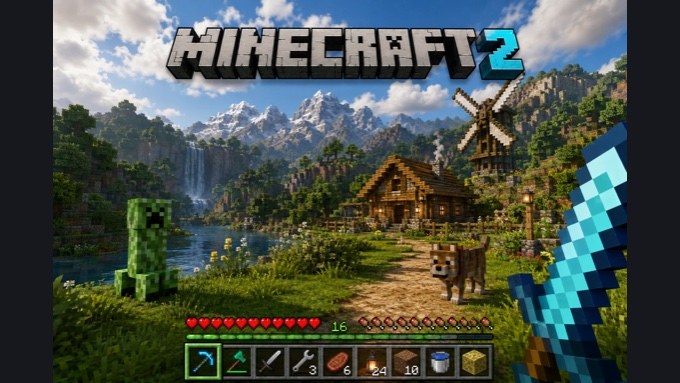
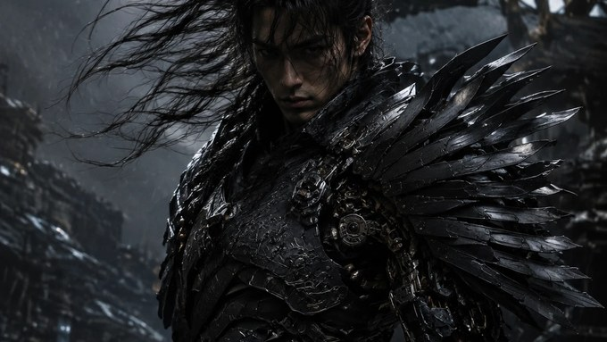
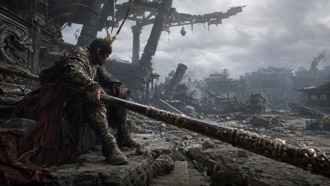
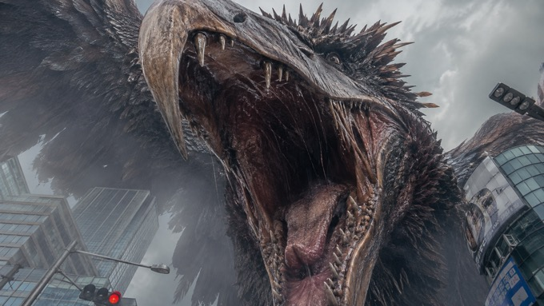
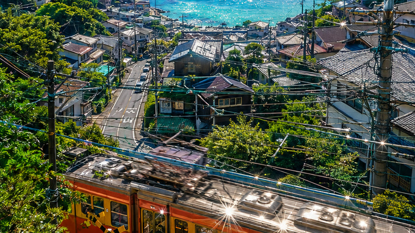
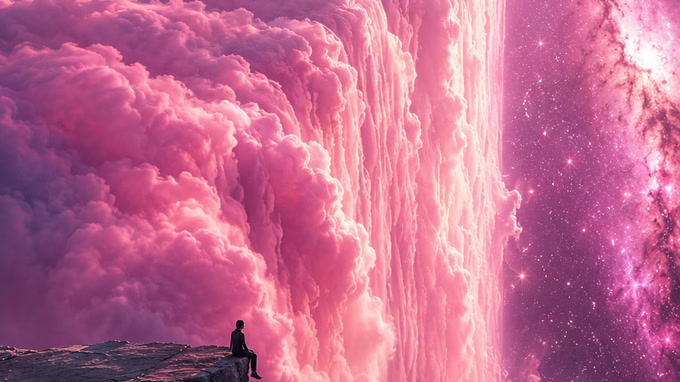
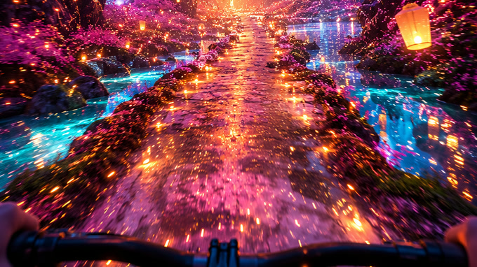
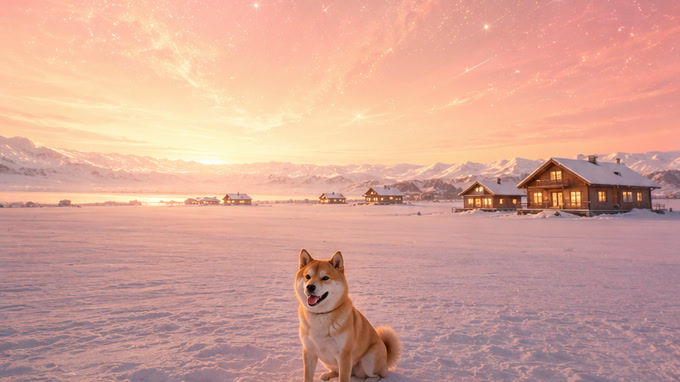

# Image & Video Prompt · AI 图像与视频提示词库

> 一个以**视觉风格**分类为主、同时收录视频生成方法的中文 AI 提示词（Prompt）收藏库。
> 图像提示词提供可直接投喂给模型的**完整摄影/美术指令**；视频内容覆盖角色、场景、镜头、时序、对白、约束与负面清单。

<p>
  
  
  
</p>

---

## 目录

- [这是什么](#这是什么)
- [它能做什么](#它能做什么)
- [快速开始](#快速开始)
- [仓库 Skill](#仓库-skill)
- [提示词导航](#提示词导航)
  - [宏大风格 · 东方神界巨构](#宏大风格--东方神界巨构)
  - [武侠 · 蒸汽朋克、机甲与暗黑浪客](#武侠--蒸汽朋克机甲与暗黑浪客)
  - [西游记 · 齐天大圣](#西游记--齐天大圣)
  - [怪兽 · 都市巨物灾难](#怪兽--都市巨物灾难)
  - [梦幻空灵 · 超现实天象](#梦幻空灵--超现实天象)
  - [梦幻 · 宇宙云瀑](#梦幻--宇宙云瀑)
  - [治愈 · 夏日旅行、梦幻雪原与窗边奇景](#治愈--夏日旅行梦幻雪原与窗边奇景)
  - [宫崎骏画风 · 复古旅行海报](#宫崎骏画风--复古旅行海报)
  - [日常 emo · 手机随手拍](#日常-emo--手机随手拍)
  - [游戏 · 体素世界截图](#游戏--体素世界截图)
  - [视频提示词 · VEO 3 制作方法](#视频提示词--veo-3-制作方法)
- [作品示例](#作品示例)
- [提示词写作方法论](#提示词写作方法论)
- [模板变量语法](#模板变量语法)
- [目录与命名规范](#目录与命名规范)
- [贡献](#贡献)
- [声明](#声明)

---

## 这是什么

这个仓库收集的是**长文本、结构化、可复用**的图像与视频生成提示词及方法。

和常见的「关键词串」型 prompt 不同，这里的提示词更接近一份**分镜说明书**——它先一句话锁死画幅与媒介，再逐段规定摄影机在哪、用什么焦段、画面分几层、每层放什么、材质怎么反光、光从哪来、允许出现哪一种动态，最后附上正向关键词块和 Negative Prompt。正向部分全是肯定句，所有「不要什么」一律以术语形式收进 Negative Prompt。

因此同一个文件在不同时间、不同模型上出图，**世界观和镜头语言是稳定的**，适合成组产出（比如「九宫格」系列、同一角色的昼夜两版）。

## 它能做什么

| 场景 | 怎么用 |
| --- | --- |
| **直接出图** | 复制整份 `.md` 内容粘贴进模型对话框，一次成图，不需要调参 |
| **成组系列图** | 用同一份基础设定 + 更换单一变量（时间/天气/动态），保证多张图风格一致，见 [`武侠/机甲-白天.md`](武侠/机甲-白天.md) 与 [`武侠/机甲-夜晚.md`](武侠/机甲-夜晚.md) |
| **拆件复用** | 长提示词按 `【】` / `##` 分节，可只取「摄影机」「材质」「Negative Prompt」等段落，拼进自己的 prompt |
| **学习 prompt 结构** | 对照阅读长短两类提示词，理解「三层空间 + 尺度对比 + 单一主导动态」的写法 |
| **做成模板** | 见 [`游戏/我的世界.md`](游戏/我的世界.md) 的参数化写法，可接入自动化流程批量生成 |
| **制作视频** | 阅读 [`视频提示词/提示词.md`](视频提示词/提示词.md)，学习声音设计、文生视频、图生视频，以及「身、场、镜、时、台、约、负」七段式结构 |

适配文本理解能力强的图像模型：Nano Banana / Gemini 系、Seedream、即梦、Sora、Midjourney（建议 `--style raw`，超长文本需压缩）、Flux、Stable Diffusion（配合长文本编码器）。

## 快速开始

```bash
git clone https://github.com/Gloomysunday28/image-prompt.git
```

1. 在下面的[提示词导航](#提示词导航)里挑一个风格；
2. 打开对应 `.md`，**全文复制**（包含 Negative Prompt 段落）；
3. 粘贴到图像模型，按文件开头标注的画幅设置比例（`16:9` 或 `9:16`）；
4. 不满意时**只改一个变量**（天气、时间、机位高度、人物尺寸），不要整段重写——这是这套提示词保持稳定的关键。

---

## 仓库 Skill

仓库内置两个 Skill，分工是「你有想法」和「你没想法」。

### `image-prompt-generator` · 有想法时把它写成 Prompt

[`skills/image-prompt-generator/`](skills/image-prompt-generator/SKILL.md)。输入一个题材、画面想法或参考图，它会在东方神界巨构、真人武侠工业都市、生物机械剑圣、暴风荒野浪客、东方神话史诗、都市巨型怪兽灾难、梦幻空灵、宇宙云瀑与高速森林骑行、夏日治愈、粉金雪原宠物与窗边云塔奇景、复古旅行插画、日常 emo、体素游戏等路线中选择合适画风，生成可直接投喂模型的完整提示词；明确要求生图时也可以直接生成图片。

```text
使用 $image-prompt-generator，参考这张图的构图，按东方神话史诗路线直接生成一张新图，并附上最终 Prompt。
```

### `image-scene-inventor` · 没想法时替你想场景

[`skills/image-scene-inventor/`](skills/image-scene-inventor/SKILL.md)。解决「模板都在，但不知道拿模板做什么」。

它**唯一的风格来源就是本仓库里的模板文件**，没有任何预设的风格表或场景池。它先从分类中选择一份主模板，再**判定这份模板到底在规定什么**，然后按对应方式派生。

派生方式**跟着模板的主体走**，而不是跟着目录名走：

| 模板类型 | 代表文件 | 保留 | 重想 |
| --- | --- | --- | --- |
| 环境主导 | `治愈/夏日海边`、`梦幻空灵/童话`、`武侠/赛博朋克` | 媒介、镜头、空间层次、尺度手法、光色、材质、描述精度、Negative 逻辑 | 地点、建筑、载具、道具、天象、奇观、故事时刻 |
| 角色主导 | `武侠/将军`、`武侠/骑士-正面`、`怪兽/近距离大鸟` | 立绘格式、设计配方、真实性锚点、材质工艺、逐部位粒度、形制排除逻辑 | 物种、身份、装备主题、造型母题、武器、配色 |
| 双主体 | `武侠/机甲` 三版、`西游记/悟空` | 两侧规格 | 两侧题材，不能只换一侧 |
| 设定集 | `宏大风格/prompt-two` | 分节体系与「每张一种主导动态」的规矩 | 各节具体内容，成组输出 |
| 参数化 | `游戏/我的世界` | 变量语法、HUD 与构图骨架 | 每个变量的 `default` 值 |
| 元指令 | `日常 emo/prompt-one` | 对模型说话的方式与「不完美」质感要求 | 快照内容 |

成品**一律是规格式 Prompt**：分节标题、可测量参数（焦段、机位高度、俯仰角、主体占画幅比例）、单一主导动态、关键词块与 Negative Prompt。仓库里像 [`西游记/悟空.md`](西游记/悟空.md) 这类模板本身是叙事体，通篇「不是 X 而是 Y」的对照句和「王已经坐下了」这类情绪判词——技能只取它规定的内容，把情绪落成面部、视线、重心与动静对比，把对照句里的 X 下沉进 Negative，不把这套腔调抄进成品。

关键差别在于：环境型模板里「人物身份与服装」属于可换的题材层，而角色型模板里服装的**工艺与结构逻辑**属于风格层、只有**主题与母题**才换——用同一把尺子量所有模板会把角色设定类模板直接删空。

默认产出与模板没有共同具体物件的新题材：保留“怎么拍、怎么画、画面如何成立”，不保留“原来拍了什么”。原模板里的具体元素若承担尺度参照、引导线或前景压框作用，会在新题材中重新设计等效元素。只有明确要求保留角色、沿用世界、拍前后时刻或只改一个变量时，才进入续拍模式；`机甲-白天`/`机甲-夜晚` 这类「共用设定 + 只改一个变量」的系列图是被支持的正常模式。

关键约定是**模板即定义，分类不是定义**。例如 [`治愈/夏日海边.md`](治愈/夏日海边.md) 是梦幻真实摄影，明确禁止插画感与动漫感；[`治愈/滑板治愈.md`](治愈/滑板治愈.md) 则是日系动画电影背景美术与高质量 3D CGI / 写实摄影融合。用户只说「治愈系」时，技能会先区分这两条路线并选择一份主模板，而不是把整个目录概括成一种通俗画风。其他分类同样以文件为准。

```text
基于我的治愈模板，帮我想三个场景，直接给中英双版完整 Prompt
宏大风格那套还能拍什么？
沿用悟空的角色设定，换成大战开始前的凌霄宝殿场景
用怪兽模板的贴脸巨物构图，改拍一台失控的巨型采矿机
按将军那份的设定粒度，帮我想一个全新角色，不要机械武士
我不知道做什么，列一下仓库里有哪些风格，挑一个帮我想
```

---

## 提示词导航

| 分类 | 文件 | 画幅 | 篇幅 | 一句话 |
| --- | --- | --- | --- | --- |
| 宏大风格 | [宫阙图 - (风格 1).md](宏大风格/宫阙图%20-%20%28风格%201%29.md) | 16:9 | 短 | 悬崖天宫巨构，港式奇幻武侠电影语言 |
| 宏大风格 | [prompt-two.md](宏大风格/prompt-two.md) | 16:9 | 长 | 天宫系列世界观设定集，供九宫格成组出图 |
| 武侠 | [蒸汽朋克.md](武侠/蒸汽朋克.md) | 16:9 | 长 | 东方蒸汽朋克工业水城，真人电影实拍质感 |
| 武侠 | [蒸汽朋克-水城.md](武侠/蒸汽朋克-水城.md) | 16:9 | 长 | 水城变体，屋脊剑客俯瞰运河与机械塔 |
| 武侠 | [赛博朋克.md](武侠/赛博朋克.md) | 16:9 | 中 | 屋顶武士背影俯瞰黄昏工业巨城 |
| 武侠 | [机甲.md](武侠/机甲.md) | 16:9 | 长 | 生物机械剑圣 × 暴雨都市战争剧照 |
| 武侠 | [机甲-白天.md](武侠/机甲-白天.md) | 16:9 | 长 | 白天版，含铠甲/头盔/流马尾完整设定 |
| 武侠 | [机甲-夜晚.md](武侠/机甲-夜晚.md) | 16:9 | 长 | 夜晚暴雨版，与白天版共用角色设定 |
| 武侠 | [将军.md](武侠/将军.md) | 9:16 | 中 | 生物机械武士半身立绘，人物反推提示词 |
| 武侠 | [骑士-正面.md](武侠/骑士-正面.md) | 9:16 | 长 | 全覆式头盔机械武将正面全身立绘 |
| 武侠 | [浪客.md](武侠/浪客.md) | 9:16 | 长 | 暴风雨前夕，暗黑浪人持刀独立紫色荒野花海 |
| 西游记 | [悟空.md](西游记/悟空.md) | 16:9 | 长 | 大战后的凌霄宝殿，齐天大圣独坐废墟 |
| 怪兽 | [近距离大鸟.md](怪兽/近距离大鸟.md) | 16:9 | 长 | 都市街道极致仰视，山岳级火山鸟兽扑向镜头 |
| 梦幻空灵 | [prompt-one.md](梦幻空灵/prompt-one.md) | 9:16 | 短 | 巨型锦鲤遨游星云，低角度仰拍 |
| 梦幻空灵 | [童话.md](梦幻空灵/童话.md) | 16:9 | 长 | 七彩天河逆光，第三人称跟拍探索感 |
| 梦幻空灵 | [无人区-童话.md](梦幻空灵/无人区-童话.md) | 16:9 | 长 | 渡轮甲板仰望巨大星河漩涡 |
| 梦幻空灵 | [森林骑行.md](梦幻空灵/森林骑行.md) | 9:16 | 长 | 第一人称高速骑行穿越粉紫花树、蓝色瀑布与橙金灯海 |
| 梦幻 | [瀑布.md](梦幻/瀑布.md) | 9:16 | 长 | 渺小人物坐在宇宙尽头，凝视矩形世界边缘的粉色云瀑 |
| 治愈 | [滑板治愈.md](治愈/滑板治愈.md) | 9:16 | 中 | 滑板少年冲下海岸公路的夏日治愈画面 |
| 治愈 | [夏日海边.md](治愈/夏日海边.md) | 9:16 | 长 | 复古电车掠过盛夏海滨山城，海湾与积雨云闪耀通透 |
| 治愈 | [狗子-雪地.md](治愈/狗子-雪地.md) | 9:16 | 中 | 柴犬半蹲于无限雪原，仰望粉金宇宙天穹与暖光木屋 |
| 治愈 | [猫咪床边.md](治愈/猫咪床边.md) | 9:16 | 中 | 窗台橘猫安睡，托斯卡纳山城后方升起巨型积雨云塔 |
| 宫崎骏画风 | [意大利旅游.md](宫崎骏画风/意大利旅游.md) | 不限 | 短 | 阿马尔菲海岸复古旅行海报插画 |
| 日常 emo | [prompt-one.md](日常%20emo/prompt-one.md) | 竖版 | 短 | 让模型「拍」一张深夜 emo 的手机快照（英文） |
| 游戏 | [我的世界.md](游戏/我的世界.md) | 16:9 | 短 | 体素世界第一人称游戏截图模板（英文，含变量） |
| 视频提示词 | [提示词.md](视频提示词/提示词.md) | 视频 | 长 | VEO 3 中文配音、音效、一致性与七段式 Prompt 教程 |

### 宏大风格 · 东方神界巨构

追求「**极远处的巨物压迫感**」。核心手法是不对称电影构图：右侧近景用被裁切的宫殿局部压框，左侧留出大面积云海负空间，极远处再放一座横向宽广如山脉的主城核心——距离数公里仍要有绝对视觉重量，明确禁止远景发白、发灰、缩小。

- [`宫阙图 - (风格 1).md`](宏大风格/宫阙图%20-%20%28风格%201%29.md)：单张成图用。40–50mm 平视、人眼高度 1.4 米，明确写死「不航拍」。
- [`prompt-two.md`](宏大风格/prompt-two.md)：**设定集**，不是单张提示词。分【巨物迎客松】【天界建筑语言】【仙界地面】【仙人观看方式】【无朝代仙衣】【开放式构图】等段落，规定了云瀑、天河、仙鹤等九种可选动态，每张只用一种主导动态，用来产出一整组世界观统一的图。

### 武侠 · 蒸汽朋克、机甲与暗黑浪客

这一组的共同目标是**真人电影实拍质感**，所有文件开头都用大段否定把模型从「概念艺术 / 游戏 CG / 数字绘画 / 油画」上拽下来。

- [`蒸汽朋克.md`](武侠/蒸汽朋克.md)：东方蒸汽朋克巨型工业水城，中式塔楼飞檐与钢铁平台、铜管、锅炉共存，要求符合现实工程逻辑——铆钉、焊缝、支撑结构、承重桥梁一样不少。
- [`蒸汽朋克-水城.md`](武侠/蒸汽朋克-水城.md)：同题材的水城变体。高空第三人称背后视角，剑客站在屋脊最高处俯瞰运河、港口与穿行的工业运输船，右侧近景压一座青铜色机械塔（氧化、锈蚀、油污、缓慢泄出的蒸汽），指定 ARRI Alexa 35 + 24mm、清晨或黄昏体积光。与 `蒸汽朋克.md` 世界观一致，区别在于机位更高、水网与尺度对比更重。
- [`赛博朋克.md`](武侠/赛博朋克.md)：第三人称背后视角，武士站在锈红色工业屋顶最前端俯瞰整座水上巨城。指定了 ARRI Alexa 35 + 20mm 电影镜头、黄昏逆光、前中远三层景深衰减，并对皮肤毛孔、发丝、金属氧化、布料垂坠等逐项提出真实材质要求。
- [`机甲.md`](武侠/机甲.md) / [`机甲-白天.md`](武侠/机甲-白天.md) / [`机甲-夜晚.md`](武侠/机甲-夜晚.md)：同一位「未来东方剑圣」的三个变体，按【场景】【城市真实性】【城市规模】【天气环境】【摄影机】【人物设计】【机械铠甲】【胸甲】【头盔】【流马尾结构】【围巾与披帛】【披风】【武器】【镜头真实感】【Real Film Keywords】【Negative Prompt】逐节展开。白天/夜晚两版共用角色设定，只换光照与天气，是本仓库「控制单一变量做系列图」的范例。
- [`将军.md`](武侠/将军.md)：**人物反推提示词**，不写场景只写角色。黑色生物机械装甲、层叠如金属羽翼的巨型肩甲、鳞片胸甲与暴露的液压关节，反复强调「不是机器人 / 不是机甲驾驶员 / 不是全覆盖盔甲」，保持真人五官与真人身体比例。适合当角色设定块，拼进上面任意一条场景提示词。
- [`骑士-正面.md`](武侠/骑士-正面.md)：**正面全身立绘**，与 `将军.md` 同为人物向提示词，但把头盔单独当成一个设计难点来写——主体取欧洲骑士 Armet / Close Helmet 的封闭轮廓，明确禁止日式兜的宽大外翻护颈与锅錣结构，再加东方武将冠角、极长黑色马尾、暗红破损围巾与披风。逐部位写到肩甲、胸甲、臂甲、裙甲、腿甲、刀与磨损痕迹，是本仓库最细的一份角色设定。
- [`浪客.md`](武侠/浪客.md)：9:16 竖版真人电影武侠。摄影机以离地 60 厘米、人物后方偏左 35° 的低机位仰拍，让暗黑浪人背对镜头站在紫色花海中；破损羽织、长发、斗笠绑带和花草被同一股强风吹向左侧，上半画面由暴风眼般的自然积雨云主导。示例图见 [`浪客.png`](武侠/浪客.png)。

### 西游记 · 齐天大圣

[`悟空.md`](西游记/悟空.md)：大战结束后的凌霄宝殿废墟，孙悟空独坐左侧前景。使用 24mm–28mm 低机位广角与侧后方 30°–45° 构图，让超长金箍棒从手中斜向延伸至右下方近景，以强烈透视串联人物和数百米纵深的天庭残骸。人物不怒吼、不摆英雄姿势，核心情绪是「王已经坐下了」；示例图见 [`悟空.png`](西游记/悟空.png)。

### 怪兽 · 都市巨物灾难

[`近距离大鸟.md`](怪兽/近距离大鸟.md)：第一人称站在现代都市街道中央，以 40mm–50mm 镜头向上倾斜 80°–85°，让山岳级史前鸟兽贴近镜头并占据画面 85%–90%。构图拒绝完整轮廓，只保留超出画框的巨喙、胸腔、翼根和少量摩天楼尺度参照；明亮阴天曝光确保湿润口腔、角质、活体皮肤和硬质羽毛清晰可见。示例图见 [`近距离大鸟.png`](怪兽/近距离大鸟.png)。

### 梦幻空灵 · 超现实天象

真实摄影质感 + 现实中不可能存在的天空，靠**巨大尺度对比**制造空灵感。

- [`prompt-one.md`](梦幻空灵/prompt-one.md)：最短的一条。巨型锦鲤在星云中游动，小人背对观众仰望，锦鲤低头看他。
- [`童话.md`](梦幻空灵/童话.md)：严格规定「近距离、低机位、几乎正后方、向左偏 15°–20°」的第三人称跟拍，配【七彩天河】【太阳与逆光】【严格避免】等段落，要的是「普通人旅途中误入童话区域被同行者随手拍下」的感觉。
- [`无人区-童话.md`](梦幻空灵/无人区-童话.md)：第一人称站在海上渡轮甲板，20–24mm 广角，天空核心是巨大星河漩涡。前提是**先让人相信这是一艘真实的普通渡轮**，然后才发现天空不对劲。
- [`森林骑行.md`](梦幻空灵/森林骑行.md)：9:16 竖版第一人称高速骑行。18mm–20mm 超广角镜头固定在骑行者头部或胸前，黑色车把只占画面底部，湿润狭窄道路以一点透视冲向橙金色森林深处；粉紫花树、青蓝溪流与瀑布、暖色天灯和大量粒子构成强烈冷暖碰撞。示例图见 [`森林骑行.png`](梦幻空灵/森林骑行.png)。

### 梦幻 · 宇宙云瀑

[`瀑布.md`](梦幻/瀑布.md)：9:16 竖版超现实宇宙梦境。左下黑色岩石悬崖上的渺小人物安静坐着，面对在矩形世界边缘垂直坠落的无尽粉色云海；右侧纵向银河与云瀑平行贯穿画面，通过 20mm–24mm 广角、8%–10% 人物占比和 90 度云层断崖制造宇宙尺度的孤独与敬畏。示例图见 [`瀑布.png`](梦幻/瀑布.png)。

### 治愈 · 夏日旅行、梦幻雪原与窗边奇景

[`滑板治愈.md`](治愈/滑板治愈.md)：9:16 竖版，日系动画背景美术 × 高质量 3D CGI 写实质感。14mm 超广角低机位跟拍，少年踩滑板沿陡坡公路冲向海岸，人物刻意画小以突出世界尺度，公路的黄色中心线充当视觉引导线。

[`夏日海边.md`](治愈/夏日海边.md)：9:16 竖版的梦幻真实摄影。摄影机从铁路上方 15–25 米俯视日本盛夏海滨山城，以近距离掠过的红橙色复古电车、层叠住宅与架空电线构成密集前景；中景是宝石般闪耀的巨大蓝绿色海湾，海平线两侧堆叠复杂积雨云，顶部盛夏太阳带来真实星芒与镜头眩光。示例图见 [`夏日海边.png`](治愈/夏日海边.png)。

[`狗子-雪地.md`](治愈/狗子-雪地.md)：9:16 竖版第一人称超现实真实摄影。镜头在成年人眼睛高度严格平视，柴犬半蹲于 5–7 米外的平坦雪原，暖光木屋退到 50–100 米中景；地平线被压低，让占画面约 75% 的粉金宇宙光带、星尘与流星建立巨大而温柔的天空纵深。示例图见 [`狗子-雪地.png`](治愈/狗子-雪地.png)。

[`猫咪床边.md`](治愈/猫咪床边.md)：9:16 竖版真人摄影。高大黑色木框窗户从左右和顶部构成暗色天然取景框，左下窗台上的小橘猫安静睡觉；窗外托斯卡纳山城被压在画面下方，居中的超高积雨云从地平线一直生长到顶部，以 75%–80% 的天空占比制造日常生活与巨大自然奇观的尺度反差。示例图见 [`猫咪床边.png`](治愈/猫咪床边.png)。

### 宫崎骏画风 · 复古旅行海报

[`意大利旅游.md`](宫崎骏画风/意大利旅游.md)：现代铅笔插画 + 1950–60 年代旅行海报风。阿马尔菲海岸悬崖公路、白色老爷车、地中海帆船、前景柠檬枝框景，丝网印刷质感与松散笔触。整条提示词只有一段，适合当作短提示词的写法参考。

### 日常 emo · 手机随手拍

[`prompt-one.md`](日常%20emo/prompt-one.md)：英文短提示词，反向利用「不完美」——要求轻微运动模糊、光照不均、冷调偏灰、深夜孤独感，让模型输出一张像是 iPhone 误触拍下的生活快照。适合做人物写实向的自拍/生活流图像。

### 游戏 · 体素世界截图

[`我的世界.md`](游戏/我的世界.md)：英文**参数化模板**。第一人称体素世界游戏截图，包含 3D 标题 logo、两只生物、手持道具，以及底部完整 HUD（血条、经验条、饥饿条、9 格快捷栏）。所有可变部分都写成变量，改几个词就能换一套截图。

### 视频提示词 · VEO 3 制作方法

[`提示词.md`](视频提示词/提示词.md)：从中文配音、音色、情绪与背景音入手，说明文生视频和图生视频的一致性控制方法，并以动物自拍视频为实践案例。后半部分总结「身、场、镜、时、台、约、负」七段式结构，帮助逐项明确角色、环境、镜头、时间轴、对白、技术约束和负面限制。

---

## 作品示例

> 预览图统一为 340×191 缩略图，点击可看原图。

| <a href="宏大风格/宫阙图%20-%20%28风格%201%29.png"></a> | <a href="武侠/蒸汽朋克.png"></a> | <a href="武侠/赛博朋克.png"></a> |
| :---: | :---: | :---: |
| **宏大风格 · 宫阙图**<br />[`宫阙图 - (风格 1).md`](宏大风格/宫阙图%20-%20%28风格%201%29.md) | **武侠 · 蒸汽朋克**<br />[`武侠/蒸汽朋克.md`](武侠/蒸汽朋克.md) | **武侠 · 赛博朋克**<br />[`武侠/赛博朋克.md`](武侠/赛博朋克.md) |
| <a href="武侠/机甲-白天.png"></a> | <a href="武侠/机甲-夜晚.png"></a> | <a href="梦幻空灵/童话.png"></a> |
| **武侠 · 机甲（白天）**<br />[`武侠/机甲-白天.md`](武侠/机甲-白天.md) | **武侠 · 机甲（夜晚）**<br />[`武侠/机甲-夜晚.md`](武侠/机甲-夜晚.md) | **梦幻空灵 · 童话**<br />[`梦幻空灵/童话.md`](梦幻空灵/童话.md) |
| <a href="宫崎骏画风/意大利旅游.png"></a> | <a href="治愈/滑板治愈.png"></a> | <a href="游戏/我的世界.png"></a> |
| **宫崎骏画风 · 意大利旅游**<br />[`宫崎骏画风/意大利旅游.md`](宫崎骏画风/意大利旅游.md) | **治愈 · 滑板**<br />[`治愈/滑板治愈.md`](治愈/滑板治愈.md) | **游戏 · 我的世界**<br />[`游戏/我的世界.md`](游戏/我的世界.md) |
| <a href="武侠/蒸汽朋克-水城.png"></a> | <a href="武侠/将军.png"></a> | <a href="武侠/骑士-正面.png"></a> |
| **武侠 · 蒸汽朋克（水城）**<br />[`武侠/蒸汽朋克-水城.md`](武侠/蒸汽朋克-水城.md) | **武侠 · 将军**<br />[`武侠/将军.md`](武侠/将军.md)（竖版原图，缩略图为裁切） | **武侠 · 骑士（正面）**<br />[`武侠/骑士-正面.md`](武侠/骑士-正面.md)（竖版原图，缩略图为裁切） |
| <a href="西游记/悟空.png"></a> | <a href="怪兽/近距离大鸟.png"></a> | <a href="治愈/夏日海边.png"></a> |
| **西游记 · 悟空**<br />[`西游记/悟空.md`](西游记/悟空.md) | **怪兽 · 近距离大鸟**<br />[`怪兽/近距离大鸟.md`](怪兽/近距离大鸟.md) | **治愈 · 夏日海边**<br />[`治愈/夏日海边.md`](治愈/夏日海边.md)（竖版原图，缩略图为适配） |
| <a href="梦幻/瀑布.png"></a> | <a href="武侠/浪客.png"></a> | <a href="梦幻空灵/森林骑行.png"></a> |
| **梦幻 · 瀑布**<br />[`梦幻/瀑布.md`](梦幻/瀑布.md)（竖版原图，缩略图为裁切） | **武侠 · 浪客**<br />[`武侠/浪客.md`](武侠/浪客.md)（竖版原图，缩略图为裁切） | **梦幻空灵 · 森林骑行**<br />[`梦幻空灵/森林骑行.md`](梦幻空灵/森林骑行.md)（竖版原图，缩略图为裁切） |
| <a href="治愈/狗子-雪地.png"></a> | <a href="治愈/猫咪床边.png"></a> |  |
| **治愈 · 狗子雪地**<br />[`治愈/狗子-雪地.md`](治愈/狗子-雪地.md)（竖版原图，缩略图为裁切） | **治愈 · 猫咪床边**<br />[`治愈/猫咪床边.md`](治愈/猫咪床边.md)（竖版原图，缩略图为裁切） |  |

---

## 提示词写作方法论

仓库里的长提示词遵循同一套结构，照着写就能复现这种稳定度：

1. **先定画幅与媒介**——`16:9 横向电影级真实摄影画面`，一句话锁死比例和成像类型。媒介决定后面整份提示词的语言：实拍写焦段、景深、传感器噪点；2D 动画背景写轮廓线、色块分层、透视收敛；水彩写纸纹、湿边、留白。**给插画类媒介写摄影参数是最常见的错误。**
2. **正向部分只写肯定句**——不要在正文里写「这不是概念艺术 / 不是游戏 CG」。模型对正向文本里的 `概念艺术`、`游戏 CG` 这些 token 一样会产生注意力，负面定义写在正文里经常反而把它们召唤出来。想堵住插画倾向，就把机位、焦段、光比、材质的物理反射写死——**用具体规定去占位，比用否定去驱赶有效得多**；所有排除项一律下沉到第 9 步。
3. **摄影机语言**——机位高度（1.4m / 1.5–1.7m）、焦段（14mm / 20–24mm / 40–50mm）、俯仰（平视、不航拍）、与主体的距离和偏角。这是控制画面最有效的一段。插画类媒介改写透视收敛程度与前景遮挡比例。
4. **三层空间**——近景压框、中景延展、极远处主体，明确每层放什么、占多大。
5. **尺度对比**——人物一律写小，让建筑/天象承担体量，「人小 → 世界大」是空灵和压迫感的来源。
6. **材质与光**——真实物理材质、空气透视、光源方向与色温，并规定阴影里保留冷色层次、高光不过曝。
7. **单一主导动态**——一张图只允许一种运动（云瀑、水瀑、仙鹤掠过、涟漪），避免画面被动效撕碎。
8. **关键词块**——收尾处集中堆正向关键词（如 `Real Film Keywords`），补强质感。
9. **Negative Prompt**——把 3D illustration、anime、movie poster、plastic armor、empty city、oversaturated colors 等失败模式逐条列出。**写成术语，不写成句子**：`god rays, spacecraft, poster layout`，而不是「画面里不应该出现任何宗教式的神光或飞船」。绝不能否掉正向里要求的东西。
10. **分节 + 空行**——用 `【】` 或 `##` 切块、段间留空行。既方便模型逐段解析，也方便你只取其中一段复用。

## 模板变量语法

[`游戏/我的世界.md`](游戏/我的世界.md) 使用了带默认值的变量占位符：

```text
{argument name="game title" default="MINECRAFT 2"}
{argument name="environment" default="lush, blocky landscape with a river..."}
{argument name="mob 1" default="blocky green creeper"}
{argument name="held item" default="pixelated blue diamond sword"}
```

- 直接整段粘贴给支持模板的工具，它会提示你填参数；
- 手工使用时，把整个 `{...}` 替换成你想要的内容即可，默认值就是一份可用的示例；
- 新增模板类提示词时，沿用这个写法，保证每个变量都有可直接出图的 `default`。

## 目录与命名规范

```text
image-prompt/
├─ 宏大风格/                 # 一级目录 = 视觉风格
│  ├─ 宫阙图 - (风格 1).md
│  ├─ 宫阙图 - (风格 1).png
│  └─ prompt-two.md
├─ 武侠/
│  ├─ 蒸汽朋克.md
│  ├─ 蒸汽朋克.png        # 成图与提示词同名，便于对照
│  ├─ 蒸汽朋克-水城.md    # 变体用「主题-变量」命名
│  ├─ 蒸汽朋克-水城.png
│  ├─ 赛博朋克.md
│  ├─ 赛博朋克.png
│  ├─ 机甲.md
│  ├─ 机甲-白天.md
│  ├─ 机甲-白天.png
│  ├─ 机甲-夜晚.md
│  ├─ 机甲-夜晚.png
│  ├─ 将军.md            # 人物反推提示词
│  ├─ 将军.png
│  ├─ 骑士-正面.md
│  ├─ 骑士-正面.png
│  ├─ 浪客.md
│  └─ 浪客.png
├─ 梦幻空灵/
│  ├─ prompt-one.md
│  ├─ 童话.md
│  ├─ 童话.png
│  ├─ 无人区-童话.md
│  ├─ 森林骑行.md
│  └─ 森林骑行.png
├─ 梦幻/
│  ├─ 瀑布.md
│  └─ 瀑布.png
├─ 治愈/
│  ├─ 滑板治愈.md
│  ├─ 滑板治愈.png
│  ├─ 夏日海边.md
│  ├─ 夏日海边.png
│  ├─ 狗子-雪地.md
│  ├─ 狗子-雪地.png
│  ├─ 猫咪床边.md
│  └─ 猫咪床边.png
├─ 宫崎骏画风/
│  ├─ 意大利旅游.md
│  └─ 意大利旅游.png
├─ 日常 emo/
├─ 游戏/
│  ├─ 我的世界.md
│  └─ 我的世界.png
├─ 西游记/
│  ├─ 悟空.md
│  └─ 悟空.png
├─ 怪兽/
│  ├─ 近距离大鸟.md
│  └─ 近距离大鸟.png
├─ 视频提示词/
│  └─ 提示词.md
├─ skills/
│  ├─ image-prompt-generator/     # 有想法 → 写成完整 Prompt
│  │  ├─ SKILL.md
│  │  ├─ agents/openai.yaml
│  │  └─ references/
│  │     ├─ prompt-blueprints.md
│  │     └─ style-catalog.md
│  └─ image-scene-inventor/       # 没想法 → 读模板想场景 + 中英双版 Prompt
│     ├─ SKILL.md
│     └─ agents/openai.yaml
└─ preview/          # README 作品示例用的 16:9 统一缩略图
```

- 一级目录按**风格**划分，不按模型划分；
- 未命名主题的通用提示词用 `prompt-one.md` / `prompt-two.md` 递增；
- 有明确主题的用中文主题名，变体加后缀（`机甲-白天`、`无人区-童话`）；
- 有成图时，PNG 与提示词**同名同目录**存放。

## 贡献

欢迎提交新的提示词：

1. 选一个已有风格目录，没有合适的再新建一级目录；
2. 按 [提示词写作方法论](#提示词写作方法论) 的结构撰写，长提示词请带上 Negative Prompt；
3. 尽量附一张实际出图，并在 commit message 里写清用了哪个模型；
4. 在本文件的[提示词导航](#提示词导航)表格中补一行。

## 声明

- 提示词仅供学习与创作参考，实际出图效果随模型、版本、随机种子变化；
- 「宫崎骏画风」等目录名仅描述视觉取向，不代表与相关作者或工作室存在任何关联；
- 生成内容请遵守所用模型的使用条款及当地法律法规。
