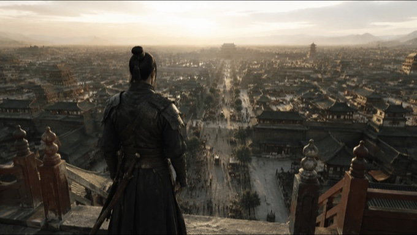
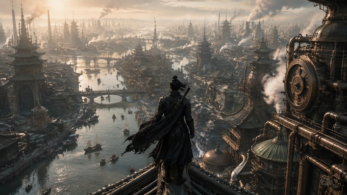
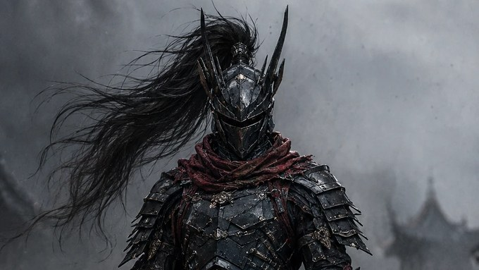
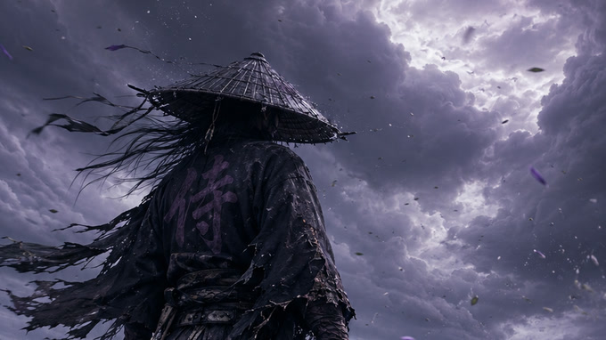
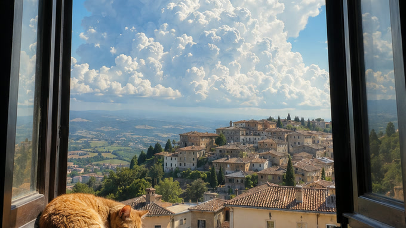

# Image Prompt · AI 图像提示词库

> 结构化、可复用的中文 AI 绘画提示词收藏库。每一条都不是关键词堆砌，而是一份完整的摄影/美术指令：画幅、机位、焦段、空间层次、材质、光线、动态、Negative Prompt 一应俱全。

<p>
  
  
  
</p>

## 📖 快速入口

- **[🖼️ 提示词画廊](docs/gallery.md)** — 全部 25 条，含配图、标签与可直接复制的提示词全文
- **[🎬 VEO 3 视频提示词方法](docs/veo3.md)** — 配音、一致性控制与「身、场、镜、时、台、约、负」七段式
- **[🤖 仓库 Skill](#-仓库-skill)** — 有想法时写成 Prompt，没想法时替你想场景
- **[✍️ 提示词写作方法论](#️-提示词写作方法论)** — 这套提示词为什么稳定

## ⚡️ 这是什么

和常见的「关键词串」型 prompt 不同，这里的提示词更接近一份**分镜说明书**——先一句话锁死画幅与媒介，再逐段规定摄影机在哪、用什么焦段、画面分几层、每层放什么、材质怎么反光、光从哪来、允许出现哪一种动态，最后附上正向关键词块和 Negative Prompt。正向部分全是肯定句，所有「不要什么」一律以术语形式收进 Negative Prompt。

因此同一份提示词在不同时间、不同模型上出图，**世界观和镜头语言是稳定的**，适合成组产出。

适配文本理解能力强的图像模型：Nano Banana / Gemini 系、Seedream、即梦、Sora、Midjourney（建议 `--style raw`，超长文本需压缩）、Flux、Stable Diffusion（配合长文本编码器）。

## 🗂️ 分类总览

每条提示词带三组标签：`category` 单选大类，`type` 决定改写它时该保留哪一层，`styles` / `scenes` 是多选的媒介与题材标签。**类型**的含义：环境保留镜头与空间、换地点与奇观；角色保留立绘格式与工艺粒度、换物种与母题；双主体两侧规格都得保留；设定集成组出图；参数化只改变量默认值；元指令是写给模型的说话方式。

<!-- GENERATED:OVERVIEW:START -->

| 分类 | &nbsp;&nbsp;条数&nbsp;&nbsp; | 类型分布 | 提示词 |
| --- | --- | --- | --- |
| **宏大风格** | 2 条 | 环境 / 设定集 | [宫阙图](docs/gallery.md#case-1)、[天宫设定集](docs/gallery.md#case-3) |
| **游戏** | 1 条 | 参数化 | [我的世界](docs/gallery.md#case-2) |
| **梦幻空灵** | 6 条 | 环境 | [星云锦鲤](docs/gallery.md#case-4)、[童话](docs/gallery.md#case-7)、[无人区-童话](docs/gallery.md#case-8)、[瀑布](docs/gallery.md#case-21)、[森林骑行](docs/gallery.md#case-23)、[公路巨云](docs/gallery.md#case-26) |
| **宫崎骏画风** | 1 条 | 环境 | [意大利旅游](docs/gallery.md#case-5) |
| **日常 emo** | 1 条 | 元指令 | [深夜快照](docs/gallery.md#case-6) |
| **武侠** | 9 条 | 环境 / 双主体 / 角色 | [蒸汽朋克](docs/gallery.md#case-9)、[机甲](docs/gallery.md#case-11)、[机甲-夜晚](docs/gallery.md#case-12)、[机甲-白天](docs/gallery.md#case-13)、[赛博朋克](docs/gallery.md#case-14)、[将军](docs/gallery.md#case-15)、[蒸汽朋克-水城](docs/gallery.md#case-16)、[骑士-正面](docs/gallery.md#case-17)、[浪客](docs/gallery.md#case-22) |
| **治愈** | 4 条 | 环境 | [滑板治愈](docs/gallery.md#case-10)、[夏日海边](docs/gallery.md#case-20)、[狗子-雪地](docs/gallery.md#case-24)、[猫咪床边](docs/gallery.md#case-25) |
| **西游记** | 1 条 | 双主体 | [悟空](docs/gallery.md#case-18) |
| **怪兽** | 1 条 | 角色 | [近距离大鸟](docs/gallery.md#case-19) |

<!-- GENERATED:OVERVIEW:END -->

## 🖼️ 作品示例

<!-- GENERATED:GALLERY:START -->

| <a href="data/images/case1.png"></a> | <a href="data/images/case2.png"></a> | <a href="data/images/case5.png"></a> |
| :---: | :---: | :---: |
| **例 1·宫阙图**<br />[查看提示词](docs/gallery.md#case-1) | **例 2·我的世界**<br />[查看提示词](docs/gallery.md#case-2) | **例 5·意大利旅游**<br />[查看提示词](docs/gallery.md#case-5) |
| <a href="data/images/case7.png"></a> | <a href="data/images/case9.png"></a> | <a href="data/images/case10.png"></a> |
| **例 7·童话**<br />[查看提示词](docs/gallery.md#case-7) | **例 9·蒸汽朋克**<br />[查看提示词](docs/gallery.md#case-9) | **例 10·滑板治愈**<br />[查看提示词](docs/gallery.md#case-10) |
| <a href="data/images/case12.png"></a> | <a href="data/images/case13.png"></a> | <a href="data/images/case14.png"></a> |
| **例 12·机甲-夜晚**<br />[查看提示词](docs/gallery.md#case-12) | **例 13·机甲-白天**<br />[查看提示词](docs/gallery.md#case-13) | **例 14·赛博朋克**<br />[查看提示词](docs/gallery.md#case-14) |
| <a href="data/images/case15.png"></a> | <a href="data/images/case16.png"></a> | <a href="data/images/case17.png"></a> |
| **例 15·将军**<br />[查看提示词](docs/gallery.md#case-15) | **例 16·蒸汽朋克-水城**<br />[查看提示词](docs/gallery.md#case-16) | **例 17·骑士-正面**<br />[查看提示词](docs/gallery.md#case-17) |
| <a href="data/images/case18.png"></a> | <a href="data/images/case19.png"></a> | <a href="data/images/case20.png"></a> |
| **例 18·悟空**<br />[查看提示词](docs/gallery.md#case-18) | **例 19·近距离大鸟**<br />[查看提示词](docs/gallery.md#case-19) | **例 20·夏日海边**<br />[查看提示词](docs/gallery.md#case-20) |
| <a href="data/images/case21.png"></a> | <a href="data/images/case22.png"></a> | <a href="data/images/case23.png"></a> |
| **例 21·瀑布**<br />[查看提示词](docs/gallery.md#case-21) | **例 22·浪客**<br />[查看提示词](docs/gallery.md#case-22) | **例 23·森林骑行**<br />[查看提示词](docs/gallery.md#case-23) |
| <a href="data/images/case24.png"></a> | <a href="data/images/case25.png"></a> |
| **例 24·狗子-雪地**<br />[查看提示词](docs/gallery.md#case-24) | **例 25·猫咪床边**<br />[查看提示词](docs/gallery.md#case-25) |

<!-- GENERATED:GALLERY:END -->

## 🚀 怎么用

1. 在[画廊](docs/gallery.md)里挑一条；
2. 复制该条 `text` 代码块的**全文**（包含 Negative Prompt 段落）；
3. 粘贴到图像模型，按标注的画幅设置比例；
4. 不满意时**只改一个变量**（天气、时间、机位高度、人物尺寸），不要整段重写——这是这套提示词保持稳定的关键。

## 🤖 仓库 Skill

两个 Skill 分工是「你有想法」和「你没想法」，唯一的风格来源都是本仓库的提示词文件，没有预设风格表——上面的 `type` 标签就是它们的路由依据。完整规则见各自的 `SKILL.md`。

**[`image-prompt-generator`](skills/image-prompt-generator/SKILL.md) · 有想法时把它写成 Prompt**

输入一个题材、画面想法或参考图，在仓库已沉淀的视觉路线中选择合适画风，生成可直接投喂模型的完整提示词；明确要求生图时也可以直接生成图片。

```text
使用 $image-prompt-generator，参考这张图的构图，按东方神话史诗路线直接生成一张新图，并附上最终 Prompt
```

**[`image-scene-inventor`](skills/image-scene-inventor/SKILL.md) · 没想法时替你想场景**

先选一份主模板，判定它到底在规定什么，再按 `type` 派生——保留「怎么拍、怎么画、画面如何成立」，重想「原来拍了什么」。成品一律是规格式 Prompt。核心约定是**模板即定义，分类不是定义**：说「治愈系」时它会先区分例 20 的写实摄影与例 10 的日系动画背景美术，而不是把整个分类概括成一种通俗画风。

```text
基于我的治愈模板，帮我想三个场景，直接给中英双版完整 Prompt
沿用悟空的角色设定，换成大战开始前的凌霄宝殿场景
按将军那份的设定粒度，帮我想一个全新角色，不要机械武士
我不知道做什么，列一下仓库里有哪些风格，挑一个帮我想
```

## ✍️ 提示词写作方法论

仓库里的长提示词遵循同一套结构，照着写就能复现这种稳定度：

1. **先定画幅与媒介**——`16:9 横向电影级真实摄影画面`，一句话锁死比例和成像类型。媒介决定后面整份提示词的语言：实拍写焦段、景深、传感器噪点；2D 动画背景写轮廓线、色块分层、透视收敛；水彩写纸纹、湿边、留白。**给插画类媒介写摄影参数是最常见的错误。**
2. **正向部分只写肯定句**——不要在正文里写「这不是概念艺术 / 不是游戏 CG」。模型对正向文本里的 `概念艺术`、`游戏 CG` 这些 token 一样会产生注意力，负面定义写在正文里经常反而把它们召唤出来。想堵住插画倾向，就把机位、焦段、光比、材质的物理反射写死——**用具体规定去占位，比用否定去驱赶有效得多**；所有排除项一律下沉到第 9 步。
3. **摄影机语言**——机位高度（1.4m / 1.5–1.7m）、焦段（14mm / 20–24mm / 40–50mm）、俯仰（平视、不航拍）、与主体的距离和偏角。这是控制画面最有效的一段。
4. **三层空间**——近景压框、中景延展、极远处主体，明确每层放什么、占多大。
5. **尺度对比**——人物一律写小，让建筑/天象承担体量，「人小 → 世界大」是空灵和压迫感的来源。
6. **材质与光**——真实物理材质、空气透视、光源方向与色温，并规定阴影里保留冷色层次、高光不过曝。
7. **单一主导动态**——一张图只允许一种运动（云瀑、水瀑、仙鹤掠过、涟漪），避免画面被动效撕碎。
8. **关键词块**——收尾处集中堆正向关键词（如 `Real Film Keywords`），补强质感。
9. **Negative Prompt**——把 3D illustration、anime、movie poster、plastic armor、empty city、oversaturated colors 等失败模式逐条列出。**写成术语，不写成句子**：`god rays, spacecraft, poster layout`，而不是「画面里不应该出现任何宗教式的神光或飞船」。绝不能否掉正向里要求的东西。
10. **分节 + 空行**——用 `【】` 或 `##` 切块、段间留空行。既方便模型逐段解析，也方便你只取其中一段复用。

**模板变量语法**：例 2 使用带默认值的变量占位符 `{argument name="mob 1" default="blocky green creeper"}`。手工使用时把整个 `{...}` 替换掉即可，默认值本身就是一份可出图的示例。新增模板类提示词时沿用这个写法。

## 🧱 仓库结构

```text
image-prompt/
├─ data/
│  ├─ prompts/case1.md … case25.md   # 唯一手写数据源：front-matter + 提示词正文
│  ├─ images/caseN.png               # 出图原图
│  ├─ images/thumbs/caseN.jpg        # 画廊缩略图
│  └─ prompts.json                   # 生成产物
├─ docs/
│  ├─ gallery.md                     # 生成产物：完整画廊
│  └─ veo3.md                        # VEO 3 视频提示词方法
├─ scripts/generate.mjs              # 生成器
├─ skills/                           # 两个 Agent Skill
└─ README.md                         # 落地页（含生成区块）
```

**为什么用 `caseN.md` 而不是中文标题当文件名**：标题、分类、标签全在 front-matter 里，文件名只是稳定 ID。改标题、换分类、调标签都不会移动文件，也就不会打断 `docs/gallery.md#case-N` 的锚点、图片配对和 Skill 引用。新增一条只要：放一个 `caseN.md`（+ 可选配图），跑一次生成器。

## 🤝 贡献

```bash
# 1. 新建 data/prompts/case26.md，头部写 front-matter：
#    id / title / category / type / styles / scenes / aspect / image / summary
# 2. 可选：把出图放到 data/images/case26.png，缩略图放 data/images/thumbs/case26.jpg
# 3. 重新生成
node scripts/generate.mjs
```

正文按[提示词写作方法论](#️-提示词写作方法论)撰写，长提示词请带上 Negative Prompt。`docs/gallery.md`、`data/prompts.json` 和 README 的两个生成区块**不要手改**。

## 📄 声明

- 提示词仅供学习与创作参考，实际出图效果随模型、版本、随机种子变化；
- 「宫崎骏画风」等分类名仅描述视觉取向，不代表与相关作者或工作室存在任何关联；
- 生成内容请遵守所用模型的使用条款及当地法律法规。
