> [返回 README 首页](../README.md) | [VEO 3 视频提示词方法](./veo3.md)

## 🖼️ 提示词画廊

当前总数 27。本文件由 `scripts/generate.mjs` 生成，请勿手改；改 `data/prompts/caseN.md` 后重新生成。

| # | 标题 | 分类 | 类型 | 画幅 | 一句话 |
| --- | --- | --- | --- | --- | --- |
| 1 | [宫阙图](#case-1) | 宏大风格 | 环境 | 16:9 | 悬崖天宫巨构，港式奇幻武侠电影语言 |
| 2 | [我的世界](#case-2) | 游戏 | 参数化 | 16:9 | 体素世界第一人称游戏截图模板（英文，含变量） |
| 3 | [天宫设定集](#case-3) | 宏大风格 | 设定集 | 16:9 | 天宫系列世界观设定，供九宫格成组出图 |
| 4 | [星云锦鲤](#case-4) | 梦幻空灵 | 环境 | 9:16 | 巨型锦鲤遨游星云，低角度仰拍 |
| 5 | [意大利旅游](#case-5) | 宫崎骏画风 | 环境 | 不限 | 阿马尔菲海岸复古旅行海报插画 |
| 6 | [深夜快照](#case-6) | 日常 emo | 元指令 | 竖版 | 让模型「拍」一张深夜 emo 的手机快照（英文） |
| 7 | [童话](#case-7) | 梦幻空灵 | 环境 | 16:9 | 七彩天河逆光，第三人称跟拍探索感 |
| 8 | [无人区-童话](#case-8) | 梦幻空灵 | 环境 | 16:9 | 渡轮甲板仰望巨大星河漩涡 |
| 9 | [蒸汽朋克](#case-9) | 武侠 | 环境 | 16:9 | 东方蒸汽朋克工业水城，真人电影实拍质感 |
| 10 | [滑板治愈](#case-10) | 治愈 | 环境 | 9:16 | 滑板少年冲下海岸公路的夏日治愈画面 |
| 11 | [机甲](#case-11) | 武侠 | 双主体 | 16:9 | 生物机械剑圣 × 暴雨都市战争剧照 |
| 12 | [机甲-夜晚](#case-12) | 武侠 | 双主体 | 16:9 | 夜晚暴雨版，与白天版共用角色设定 |
| 13 | [机甲-白天](#case-13) | 武侠 | 双主体 | 16:9 | 白天版，含铠甲/头盔/流马尾完整设定 |
| 14 | [赛博朋克](#case-14) | 武侠 | 环境 | 16:9 | 屋顶武士背影俯瞰黄昏工业巨城 |
| 15 | [将军](#case-15) | 武侠 | 角色 | 9:16 | 生物机械武士半身立绘，人物反推提示词 |
| 16 | [蒸汽朋克-水城](#case-16) | 武侠 | 环境 | 16:9 | 水城变体，屋脊剑客俯瞰运河与机械塔 |
| 17 | [骑士-正面](#case-17) | 武侠 | 角色 | 9:16 | 全覆式头盔机械武将正面全身立绘 |
| 18 | [悟空](#case-18) | 西游记 | 双主体 | 16:9 | 大战后的凌霄宝殿，齐天大圣独坐废墟 |
| 19 | [近距离大鸟](#case-19) | 怪兽 | 角色 | 16:9 | 都市街道极致仰视，山岳级火山鸟兽扑向镜头 |
| 20 | [夏日海边](#case-20) | 治愈 | 环境 | 9:16 | 复古电车掠过盛夏海滨山城，海湾与积雨云闪耀通透 |
| 21 | [瀑布](#case-21) | 梦幻空灵 | 环境 | 9:16 | 渺小人物坐在宇宙尽头，凝视矩形世界边缘的粉色云瀑 |
| 22 | [浪客](#case-22) | 武侠 | 双主体 | 9:16 | 暴风雨前夕，暗黑浪人持刀独立紫色荒野花海 |
| 23 | [森林骑行](#case-23) | 梦幻空灵 | 环境 | 9:16 | 第一人称高速骑行穿越粉紫花树、蓝色瀑布与橙金灯海 |
| 24 | [狗子-雪地](#case-24) | 治愈 | 环境 | 9:16 | 柴犬半蹲于无限雪原，仰望粉金宇宙天穹与暖光木屋 |
| 25 | [猫咪床边](#case-25) | 治愈 | 环境 | 9:16 | 窗台橘猫安睡，托斯卡纳山城后方升起巨型积雨云塔 |
| 26 | [公路巨云](#case-26) | 梦幻空灵 | 环境 | 9:16 | 夜间高速第一视角，紫红星空下巨型卷曲云墙压城翻卷 |
| 27 | [雷欧](#case-27) | Q版 | 双主体 | 4:3 | Q 版雷欧驾复古红跑车狂追惊慌逃窜的 Q 版赛文 |

<!-- GENERATED:GALLERY:START -->

<a name="case-1"></a>

### 例 1：宫阙图

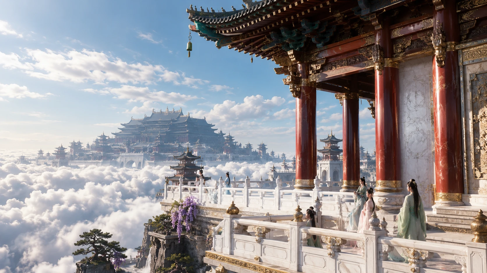

**分类：** 宏大风格 ｜ **类型：** 环境 ｜ **画幅：** 16:9

**标签：** `真人电影实拍` `东方神话` `巨构` `云海`

**源文件：** [data/prompts/case1.md](../data/prompts/case1.md)

**提示词：**

```text
16:9 横向电影画幅，东方神界超尺度皇家都城摄影，1980s Hong Kong fantasy wuxia cinematic language + modern photorealistic cinematic VFX。摄影机站在临空宫台栏杆与主殿之间，人眼高度约 1.4 米，40mm–50mm 略带长焦压缩感，平视远方，不航拍。

近景右侧与顶部压入一座异常巨大的皇家主殿局部：深朱漆巨柱、油润深木梁架、墨青重檐、青绿斗拱、古金包边以及高抛光白玉墙体与栏杆，结构只能看到局部并被画面裁切，近景建筑本身就具有强烈巨构压迫。

中景是沿巨大悬崖连续延伸的多层白玉宫台、长阶和廊道，平台尺度宽广而洁净。3–4 位成年东方女仙穿淡青、月白、杏粉、浅玉绿色长裙，坐或站在栏杆边观景，人物较小。局部紫藤和远崖神界古松只做自然破形。

画面左侧大面积打开为明亮蓝天和洁白云海，极远处位于高空彼端的主城核心神殿必须异常巨大，距离数公里却依然拥有绝对视觉重量，横向宽广如山脉，殿体高、宽、厚、深，体量明显压过周围所有次级建筑。主宫采用中深青灰主体、黛青重檐、暗朱结构、暖白玉基座与克制鎏金，受远距离空气透视后略偏青灰，但仍然明显深于云海，不得白化。

构图采用 右侧近景巨构压框 + 左侧巨大云海负空间 + 极远深色主城核心 的不对称电影构图。下午清透暖金侧光从左侧照入，白玉、鎏金和漆面明亮但不过曝，阴影保持冷蓝层次。整体富丽、舒爽、开阔，又有极远巨物压迫。

**禁止：**远景主城太小、大量等大宫殿铺满画面、浅白远宫、灰雾、俯拍城市地图感、人物过大、普通山景、普通园林、材质不精致。
```

***

<a name="case-2"></a>

### 例 2：我的世界

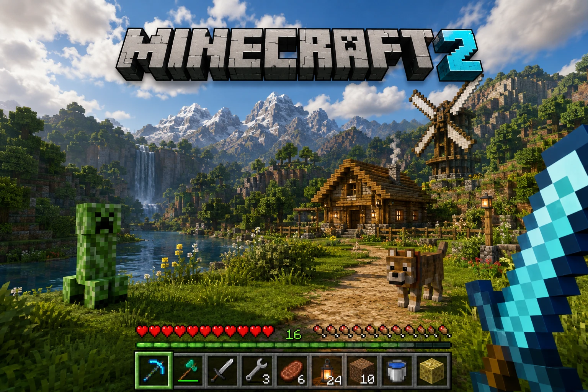

**分类：** 游戏 ｜ **类型：** 参数化 ｜ **画幅：** 16:9

**标签：** `体素游戏截图` `游戏` `体素`

**源文件：** [data/prompts/case2.md](../data/prompts/case2.md)

**提示词：**

```text
A highly detailed, realistic first-person video game screenshot of a next-generation voxel-based world. At the top center, a large, bold 3D logo reads "{argument name="game title" default="MINECRAFT 2"}". The scene features a {argument name="environment" default="lush, blocky landscape with a river, a small wooden cabin, a windmill, a waterfall, and majestic mountains in the background"}. The world blends realistic lighting, volumetric clouds, and high-resolution textures with cubic, voxel geometry. In the foreground on the left, a {argument name="mob 1" default="blocky green creeper"} stands on the grass, while a {argument name="mob 2" default="blocky brown wolf"} stands on the dirt path to the right. On the far right, the player's hand holds a {argument name="held item" default="pixelated blue diamond sword"} in a first-person perspective. At the bottom of the screen is a game user interface featuring a health bar with 10 red hearts, a green experience bar with the number '16', a hunger bar with 10 brown meat icons, and a 9-slot inventory hotbar. The hotbar contains, from left to right: a selected blue tool with a green highlight box, a green tool, a knife, a wrench with the number '3', a piece of meat with '6', a lantern with '24', a dirt block with '10', a bucket, and a sponge block.
```

***

<a name="case-3"></a>

### 例 3：天宫设定集

**分类：** 宏大风格 ｜ **类型：** 设定集 ｜ **画幅：** 16:9

**标签：** `真人电影实拍` `东方神话` `巨构`

**源文件：** [data/prompts/case3.md](../data/prompts/case3.md)

**提示词：**

```text
九张中的部分画面加入一种主要动态现象。动态集中、舒展、缓慢，与巨大建筑形成静动对照。

可自由选择：

厚实云流越过巨大露台边缘，向下倾泻成一条缓慢壮阔的云瀑，最终融入更低处的云海；

极薄、透明、接近无色的天水从高层宫阙或平台边缘垂落，在高空中形成漫长水瀑；

数条细长瀑布从远方悬空宫殿下方落入云层，通过持续下坠表现垂直高度；

天河如透明镜带沿远方天空缓慢弯曲，在建筑之间留下柔和反光；

镜面地面因仙人的一步产生一两圈细微水纹，倒影随波纹轻轻展开；

宽大的宫幡、半透明纱幕或屋檐垂饰接受统一方向的高空微风，形成缓慢弧线；

一只较大仙鹤从远方宫阙前掠过，或安静停在巨型迎客松的横枝上；

高空水流沿弧形水道穿过巨大平台，再从边缘落向云海；

轻薄云流沿平台下方和建筑底部缓慢移动，进一步显露悬空结构的高度。

云瀑和水瀑全部向平台下方倾泻，以重力方向连接天宫与低位云海。每张以一种主要动态统领气息，让画面产生生命，但仍保持庄严和安静。

【巨物迎客松】

迎客松本身拥有与天宫相称的古老巨物尺度。

巨松从巨型台基、玉石崖缘或天宫结构旁生长，树干直径达到一至三位仙人的身高，树冠横向展开二十至四十个人体尺度。

粗壮树干从画面边缘进入，部分树身越出画框；古老树皮拥有真实重量与岁月纹理；横伸枝干如天然屋檐般覆盖画面一角，与远方宫阙共同形成框景。

巨松可以承担以下不同关系：

近处巨松压住画面一侧，远处天宫从枝叶之间显露；

长枝横跨天空，人物站在枝影之下或远方平台上；

树冠与弧形长廊形成方向呼应；

一只较大的仙鹤安静停在横枝上，与下方小仙人和远方巨宫形成三重尺度；

松针被高空微风轻轻带动，树干保持沉静稳定。

迎客松在选择性出现，使其成为仙界的一种空间生命，而不是固定装饰。

【天界建筑语言】

建筑拥有中国式空间秩序，却不对应任何具体朝代。

舒展屋檐、巨大柱列、月洞、石材超大屏、长廊、天阶、层叠屋顶、云上平台和悬空宫门，被重新组织成只属于天界的建筑语言。

建筑追求巨大、简洁、安静：

大面积完整材质承接天光；
少量结构线建立秩序；
重复构件制造距离；
宽阔素面衬托建筑重量；
装饰集中在一个局部，其余表面保留平静留白。

雕刻从云行、水势、星轨、月晕、风痕与天象弧线中提炼出大型浅浮雕。一道云弧可以横跨整面巨墙，一条星轨可以沿长廊延伸至消失点。（不必复杂）

材质在九张之间自然组合：

浅白色厚重石材；
珍珠灰石材；
朱红或赭红木构做顶或建筑或顶部承重；
淡金屋脊线（顶部有参考藏式宗教似的彩绘）；

近处材质真实可触，远方巨构随着高空距离逐渐变得轻淡，使建筑同时拥有物理重量与仙界气韵。

【仙界地面】

地面根据空间关系自由变化：

覆盖极浅透明水膜的反光镜面地面，人物落步时产生一两圈细微水纹；

超大无边镜面地面般延伸的宽大平台，人物可以站在上面。

大型浅浮雕的白石天阶；

从巨型宫体中伸出的光洁悬空平台，边缘之外完全打开为云海；

沿着弧形长廊平静的浅水道，远端汇聚成落向云海的天瀑；

宽阔空置的玉石平面，人物周围留下大量无物区域，以空衬托巨物。

所有地面和桥面、建筑不需要任何形式的栏杆

【仙人观看方式】

人物主要以完整背影、三十至六十度斜后方、侧后行走和越肩背向呈现。

镜头与人物共同望向前方天宫，使人物的肩背、衣摆和飘带成为观者进入巨大空间的引导。

人物姿态从容而自主：

缓慢前行；
独立远望；
立于平台边缘；
沿天阶上行；
顺着弧形长廊进入远方；
双手自然垂落；
轻轻挽住一侧衣袖。

远景人物依靠主色块、修长纵线和一处承风长幅被辨认。人物身体安静稳定，衣料与长发接受同一方向的高空微风。

【无朝代仙衣】

仙衣遵循“衣有骨、纱有气、饰有止、色有主”。

保留两片轻薄而有韧性的承风长幅，从肩后、手臂后方或后腰自然延伸；

两至四片长度不同的后摆随着行走晚身体半拍，在平台、长廊或天阶上留下流动余韵。长袍拖地有长长的裙摆加身，以明艳色系的拖地披风为外搭来点缀并突出仙人

女性仙人修长、轻盈而有安静力量；男性仙人清俊高挑、挺拔修长或适度健壮。男女共享同一种天界服装哲学，通过肩背宽度、身体比例、衣身重量和风中轮廓形成变化。

【开放式构图】

九张在以下维度中自由变化：

人物大小；
背向角度；
机位高度；
人物位置；
建筑延伸方向；
留白位置；
主巨构类型；
远方宫阙关系；
月体显露程度；
前景类型；
地面关系；
云瀑、水瀑或天河动态；
仙衣主色；
引导线形态。

每张设置：

一个统领画面的主要巨构；
一个帮助天空饱满的远方仙境锚点；
一种主要动态现象或生命迹象；
一种近景尺度参照；
一位或少量仙人。

九张之间至少在上述四项产生明显变化，让每张都拥有新的空间想象。

中轴、高远、深远、平远、黄金分割、框中见天、单边重压、弧线引导、框架构图，大片留白与纵向延伸等关系自由轮换。构图始终端正、稳定、规整，建筑透视具有真实重量。

九张中的部分画面加入一种主要动态现象。动态集中、舒展、缓慢，与巨大建筑形成静动对照。

可自由选择：

厚实云流越过巨大露台边缘，向下倾泻成一条缓慢壮阔的云瀑，最终融入更低处的云海；

极薄、透明、接近无色的天水从高层宫阙或平台边缘垂落，在高空中形成漫长水瀑；

数条细长瀑布从远方悬空宫殿下方落入云层，通过持续下坠表现垂直高度；

天河如透明镜带沿远方天空缓慢弯曲，在建筑之间留下柔和反光；

镜面地面因仙人的一步产生一两圈细微水纹，倒影随波纹轻轻展开；

宽大的宫幡、半透明纱幕或屋檐垂饰接受统一方向的高空微风，形成缓慢弧线；

一只较大仙鹤从远方宫阙前掠过，或安静停在巨型迎客松的横枝上；

高空水流沿弧形水道穿过巨大平台，再从边缘落向云海；

轻薄云流沿平台下方和建筑底部缓慢移动，进一步显露悬空结构的高度。

云瀑和水瀑全部向平台下方倾泻，以重力方向连接天宫与低位云海。每张以一种主要动态统领气息，让画面产生生命，但仍保持庄严和安静。

【巨物迎客松】

迎客松本身拥有与天宫相称的古老巨物尺度。

巨松从巨型台基、玉石崖缘或天宫结构旁生长，树干直径达到一至三位仙人的身高，树冠横向展开二十至四十个人体尺度。

粗壮树干从画面边缘进入，部分树身越出画框；古老树皮拥有真实重量与岁月纹理；横伸枝干如天然屋檐般覆盖画面一角，与远方宫阙共同形成框景。

巨松可以承担以下不同关系：

近处巨松压住画面一侧，远处天宫从枝叶之间显露；

长枝横跨天空，人物站在枝影之下或远方平台上；

树冠与弧形长廊形成方向呼应；

一只较大的仙鹤安静停在横枝上，与下方小仙人和远方巨宫形成三重尺度；

松针被高空微风轻轻带动，树干保持沉静稳定。

迎客松在选择性出现，使其成为仙界的一种空间生命，而不是固定装饰。

【天界建筑语言】

建筑拥有中国式空间秩序，却不对应任何具体朝代。

舒展屋檐、巨大柱列、月洞、石材超大屏、长廊、天阶、层叠屋顶、云上平台和悬空宫门，被重新组织成只属于天界的建筑语言。

建筑追求巨大、简洁、安静：

大面积完整材质承接天光；
少量结构线建立秩序；
重复构件制造距离；
宽阔素面衬托建筑重量；
装饰集中在一个局部，其余表面保留平静留白。

雕刻从云行、水势、星轨、月晕、风痕与天象弧线中提炼出大型浅浮雕。一道云弧可以横跨整面巨墙，一条星轨可以沿长廊延伸至消失点。（不必复杂）

材质在九张之间自然组合：

浅白色厚重石材；
珍珠灰石材；
朱红或赭红木构做顶或建筑或顶部承重；
淡金屋脊线（顶部有参考藏式宗教似的彩绘）；

近处材质真实可触，远方巨构随着高空距离逐渐变得轻淡，使建筑同时拥有物理重量与仙界气韵。

【仙界地面】

地面根据空间关系自由变化：

覆盖极浅透明水膜的反光镜面地面，人物落步时产生一两圈细微水纹；

超大无边镜面地面般延伸的宽大平台，人物可以站在上面。

大型浅浮雕的白石天阶；

从巨型宫体中伸出的光洁悬空平台，边缘之外完全打开为云海；

沿着弧形长廊平静的浅水道，远端汇聚成落向云海的天瀑；

宽阔空置的玉石平面，人物周围留下大量无物区域，以空衬托巨物。

所有地面和桥面、建筑不需要任何形式的栏杆

【仙人观看方式】

人物主要以完整背影、三十至六十度斜后方、侧后行走和越肩背向呈现。

镜头与人物共同望向前方天宫，使人物的肩背、衣摆和飘带成为观者进入巨大空间的引导。

人物姿态从容而自主：

缓慢前行；
独立远望；
立于平台边缘；
沿天阶上行；
顺着弧形长廊进入远方；
双手自然垂落；
轻轻挽住一侧衣袖。

远景人物依靠主色块、修长纵线和一处承风长幅被辨认。人物身体安静稳定，衣料与长发接受同一方向的高空微风。

【无朝代仙衣】

仙衣遵循“衣有骨、纱有气、饰有止、色有主”。

保留两片轻薄而有韧性的承风长幅，从肩后、手臂后方或后腰自然延伸；

两至四片长度不同的后摆随着行走晚身体半拍，在平台、长廊或天阶上留下流动余韵。长袍拖地有长长的裙摆加身，以明艳色系的拖地披风为外搭来点缀并突出仙人

女性仙人修长、轻盈而有安静力量；男性仙人清俊高挑、挺拔修长或适度健壮。男女共享同一种天界服装哲学，通过肩背宽度、身体比例、衣身重量和风中轮廓形成变化。

【开放式构图】

九张在以下维度中自由变化：

人物大小；
背向角度；
机位高度；
人物位置；
建筑延伸方向；
留白位置；
主巨构类型；
远方宫阙关系；
月体显露程度；
前景类型；
地面关系；
云瀑、水瀑或天河动态；
仙衣主色；
引导线形态。

每张设置：

一个统领画面的主要巨构；
一个帮助天空饱满的远方仙境锚点；
一种主要动态现象或生命迹象；
一种近景尺度参照；
一位或少量仙人。

九张之间至少在上述四项产生明显变化，让每张都拥有新的空间想象。

中轴、高远、深远、平远、黄金分割、框中见天、单边重压、弧线引导、框架构图，大片留白与纵向延伸等关系自由轮换。构图始终端正、稳定、规整，建筑透视具有真实重量。
整个仙界由宽广、柔和、通透的高空漫射光照亮。

低位太阳隐藏在远方或画面之外，只留下轻微方向感、温润暖黄的色温和极薄轮廓光。天空如巨大的天然柔光幕，均匀照亮巨柱、玉石、屋瓦、浅水、仙衣、巨松、月体与云海。

亮部温润细腻，阴影明亮透明。巨月保持柔和而真实的体积；水瀑与云瀑拥有清楚但克制的亮度；远方宫阙通过空气距离逐渐减淡。整体色温偏暖色调，低低的阳光 把建筑物和天空照的得暖黄、金色的感觉。整体和黄昏时刻相当。

【真实感与最终气韵】

影像具有大型实景电影和大画幅建筑摄影的真实质感。

石材拥有重量；
玉石温润细腻；
木构与屋瓦结构清晰；
古松拥有真实树皮和枝叶层次；
浅水具有真实表面张力；
云瀑、水瀑与天河拥有连续流动关系；
云海拥有真实积云体积；
织物同时表现重力、透光、垂坠与风；
月球表面具有真实天体细节；
建筑透视与人体比例自然可信。

第一眼看见无法用人体丈量的天宫巨构；

第二眼发现巨月、远方宫阙、天桥、天河与低位云海共同构成完整仙界；

第三眼才在巨大空间中发现一位极小的背影仙人；

第四眼顺着仙衣、巨松、长廊、云瀑和月光继续进入看不见尽头的天界。

整组作品空而不寂，满而不塞，巨而不乱，动而不躁，华丽而克制，通透而安静。
```

***

<a name="case-4"></a>

### 例 4：星云锦鲤

**分类：** 梦幻空灵 ｜ **类型：** 环境 ｜ **画幅：** 9:16

**标签：** `超现实数字插画` `天象` `超现实`

**源文件：** [data/prompts/case4.md](../data/prompts/case4.md)

**提示词：**

```text
一幅超现实主义数字插画风格，采用低角度仰拍视角。画面描绘了一条巨型彩色锦鲤遨游在梦幻般的星云中，四周环绕着色彩鲜艳的星云与气泡。
画面中央还站着一个小人，背对观众，神情平静地仰望空中这条巨大的锦鲤，锦鲤头向下看着小人。
整体画面呈现出强烈的大小对比，氛围空灵又梦幻。比例9:16
```

***

<a name="case-5"></a>

### 例 5：意大利旅游

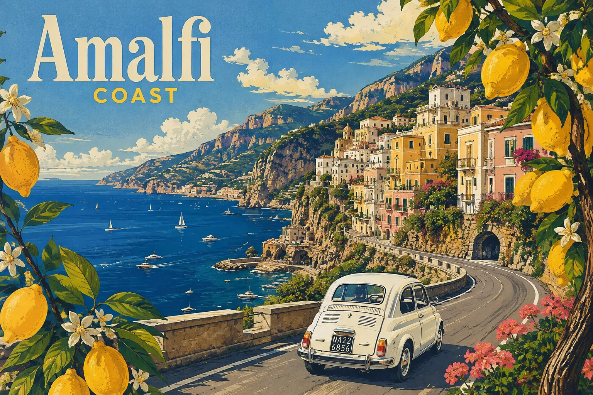

**分类：** 宫崎骏画风 ｜ **类型：** 环境 ｜ **画幅：** 不限

**标签：** `铅笔插画` `复古海报` `旅行` `海岸`

**源文件：** [data/prompts/case5.md](../data/prompts/case5.md)

**提示词：**

```text
现代铅笔插画，意大利阿马尔菲海岸复古旅行海报插画，全景海岸悬崖公路场景，经典1960年代白色汽车沿着弯曲的海滨公路行驶，带有小帆船的深蓝色地中海，色彩缤纷的粉彩山腰村庄，带有柔软云朵的明亮蓝天，带有鲜艳黄色柠檬的柠檬树枝框定前景，温暖的夏日阳光，大胆鲜艳的色彩，复古1950年代旅行海报风格，电影级构图，高细节，丝网印刷质感，图形插画。手绘风格，带有松散笔触和清晰轮廓的插画。高对比度调色板，保持背景与元素之间的色彩和谐。现代与装饰性美学
```

***

<a name="case-6"></a>

### 例 6：深夜快照

**分类：** 日常 emo ｜ **类型：** 元指令 ｜ **画幅：** 竖版

**标签：** `手机快照` `人物` `日常`

**源文件：** [data/prompts/case6.md](../data/prompts/case6.md)

**提示词：**

```text
I want to see what you really look like as a young woman.
Draw a snapshot of your everyday life as if it were accidentally taken on an iPhone.
Make it feel like a very ordinary, imperfect candid shot, with a quiet, late-night emo atmosphere and muted, slightly cold tones.
The photo should have slight motion blur, with uneven, natural lighting and a subtle sense of loneliness.
```

***

<a name="case-7"></a>

### 例 7：童话

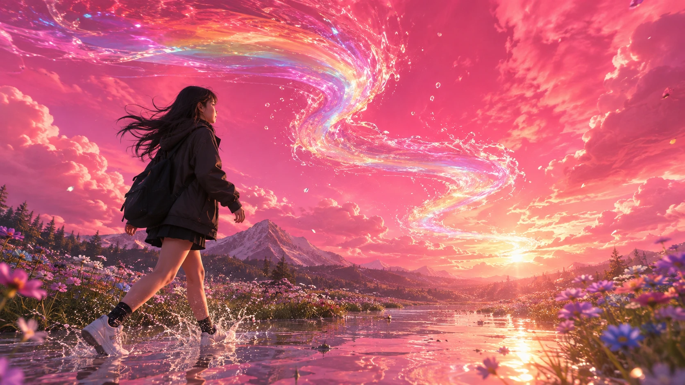

**分类：** 梦幻空灵 ｜ **类型：** 环境 ｜ **画幅：** 16:9

**标签：** `真人摄影` `天象` `超现实` `旅行`

**源文件：** [data/prompts/case7.md](../data/prompts/case7.md)

**提示词：**

```text
16:9 横向电影级画幅，现实摄影质感的现代幻想世界。

AAA级开放世界游戏环境质量 × 真实旅行摄影 × 梦幻自然奇观。

画面像一个普通人在旅行途中，偶然进入了现实世界中不存在的童话区域，被同行者在移动中随手拍下。

不是电影海报。

不是角色宣传图。

不是专业摆拍。

不是传统概念艺术。

整体必须同时具备：

真实人物比例、真实自然光影、真实摄影透视、开放世界探索感，以及极其梦幻但仍然仿佛真实存在的幻想天空。

---

## 【最重要：摄影机视角】

严格采用：

**近距离、低机位、几乎正后方、轻微偏左的第三人称跟拍视角。**

摄影机位于人物正后方，只向人物左侧偏移约 **15°–20°**。

不要偏到人物侧面。

不要形成明显的45°侧后方视角。

摄影机距离人物非常近，约 **1.5–2.5米**。

镜头高度约 **0.5–0.7米**，接近人物大腿到胯部以下高度。

形成明显的低机位跟拍感。

使用 **24mm–28mm 广角镜头**。

不是长焦。

不是远距离拍摄。

不是航拍。

不是上帝视角。

不是平视旅行照。

人物必须离摄影机很近，形成强烈前景压迫感。

---

## 【人物在画面中的大小】

人物必须是画面的第一视觉主体。

人物占画面高度约 **50%–60%**。

不能变成远处的小人物。

不能让环境抢掉人物主体。

人物位于：

**画面中央略偏左。**

身体从左下区域向右前方运动。

人物下半身靠近镜头，

腿部、鞋子、衣摆因为低机位广角产生轻微透视放大。

远方世界从人物身体两侧以及头顶展开。

整体构图必须形成：

**近景巨大人物 + 中远景幻想世界 + 超大天空。**

视觉顺序：

**人物 → 七彩天河 → 深粉天空 → 花海与远山。**

---

## 【人物】

一名年轻亚洲女性旅人。

外貌自然、清秀。

长黑发。

轻薄自然刘海。

五官柔和。

不是浓妆。

不是网红脸。

不是商业写真人物。

她穿普通现代年轻女性旅行服装：

宽松深色夹克或连帽外套，

深色短裙或短裤，

深色袜子，

白色运动鞋，

简单深色背包。

不要古装。

不要披风。

不要铠甲。

不要幻想服装。

不要英雄造型。

她只是一个普通现代女孩，偶然走入了幻想世界。

---

## 【侧脸要求】

人物身体主要背对镜头。

整体属于 **3/4后侧面**。

但人物头部自然向右前方轻微转动约 **20°–30°**。

因此摄影机能够看到少量侧脸轮廓：

眼睛轮廓，

鼻梁，

嘴唇，

下颌线。

只露出约 **1/4–1/3侧脸**。

不要完全背影。

也不要明显回头。

不要看镜头。

不要变成正脸。

人物只是自然向右前方观察这个世界。

---

## 【人物动作】

人物正在真实行走。

不是站立。

不是摆POSE。

她正从画面左下区域向右前方迈步。

一条腿已经向前，

另一条腿仍然留在后方。

身体具有真实走路时的轻微倾斜与重心变化。

长发被风吹向左后方。

部分发丝经过侧脸。

衣服下摆与头发保持相同风向。

步伐带有真实随机感。

像摄影师在她迈出一步的瞬间按下快门。

---

## 【人物脚下】

人物正在穿过一片非常浅的自然湿地。

水深只有几厘米。

鞋子踏入水面时产生明显但真实的小型水花。

脚边形成涟漪。

水珠受到夕阳逆光照射，形成漂亮高光。

水底能够看到：

小石头，

湿润泥土，

草叶，

花瓣。

水面自然反射天空。

---

## 【天空——整个世界的核心】

天空占画面约 **60%–70%**。

天空不是蓝色。

整个天空必须统一为极其浓郁的：

**深粉色、玫瑰粉、洋红色、樱桃粉。**

只有极少量紫红色阴影和地平线附近的橙粉色光。

禁止出现大片蓝天。

禁止普通蓝紫渐变。

整个世界像被深粉色大气包围。

天空中分布巨大、真实、厚重的云层。

云层同样被深粉色天空染色。

云层边缘受到夕阳照亮，

出现明亮粉金色轮廓光。

云层必须真实、有体积、有重量。

不能像动漫云。

---

## 【七彩天河】

天空中存在一条规模极其巨大的真正七彩河流。

不是彩虹。

不是极光。

不是银河。

不是激光。

不是发光丝带。

而是：

**一条拥有真实液体质感、真正正在天空中流淌的河流。**

它从画面左上方进入，

横跨人物头顶，

向画面右上方和远方天空弯曲延伸。

整体形成巨大自然的 S 型河道。

河流内部呈现自然融合的七彩颜色：

红，

橙，

金黄，

青绿，

蓝，

紫，

粉。

颜色不能是机械的七条平行色带。

必须像真正透明水体中的光线折射。

能够看到：

水流方向，

液体纹理，

波纹，

透明水层，

水面高光，

折射，

细微水雾，

漂浮水珠。

部分河面像真正的天空水面一样反射粉色云层。

七彩天河必须拥有明确宽度和体积。

它是一条河，

不是一道线。

看起来像一条数公里宽的巨大液态河流，正在天空中安静流淌。

---

## 【太阳与逆光】

太阳位于人物右前方的远处地平线。

太阳可以靠近人物腰部、手臂或身体边缘。

形成非常强烈的逆光。

阳光从人物身体边缘穿过。

产生：

真实 lens flare，

金色轮廓光，

头发边缘高光，

水面反光，

空气散射，

轻微自然过曝。

人物整体部分处于暗部，

但不能成为纯黑剪影。

侧脸必须仍然保留一定细节。

---

## 【自然环境】

人物周围是一片梦幻但完全自然的巨大花海湿地。

浅水区域两侧生长大量随机野花。

颜色包括：

蓝色，

紫色，

粉色，

白色，

淡黄色。

不是人工花园。

不是整齐种植。

花朵高度和密度自然随机。

靠近摄影机的花草可以产生真实景深虚化。

远处是：

绿色丘陵，

巨大山脉，

森林，

蜿蜒河流，

湿地，

薄雾，

云海。

自然环境一直延伸到地平线。

---

## 【世界设定】

不要任何城市。

不要宫殿。

不要古代建筑。

不要未来建筑。

不要遗迹。

不要废墟。

不要工业设施。

不要悬浮岛。

不要机械结构。

整个地面世界必须像真正存在于地球上的自然生态。

唯一超现实的元素只有：

**整个深粉色天空，以及天空中流淌的巨大七彩天河。**

这种反差非常重要。

地面越真实，

天空越显得不可思议。

---

## 【动态】

画面带有真实抓拍中的运动感。

头发飞扬。

衣摆轻微摆动。

人物脚步溅起水花。

花朵被风吹动。

水面产生波纹。

少量花瓣从镜头附近经过。

七彩天河在天空中缓慢流动。

云层拥有统一方向的风感。

加入轻微自然运动模糊。

不能过度锐利。

不能像静态CG展示图。

---

## 【摄影感觉】

像一个同行者拿着相机或手机，贴近人物身后，在她向前行走时迅速拍下的一瞬间。

构图允许轻微不完美。

人物不需要完全居中。

地平线可以略有自然偏移。

光线存在轻微过曝。

头发局部运动模糊。

水珠部分失焦。

拥有真实旅行抓拍的随机性。

但环境细节仍然达到AAA开放世界水平。

---

## 【整体氛围】

梦幻。

安静。

孤独。

温柔。

略微忧郁。

充满探索未知世界的感觉。

不是战争。

不是末日。

不是史诗英雄叙事。

而是：

一个普通现代女孩独自在未知世界中向前行走。

摄影机紧跟在她身后。

她轻轻侧过脸望向右前方。

脚下水花飞溅。

整个天空都是深粉色。

而一条巨大七彩河流正在她头顶的天空中缓慢奔流。

---

## 【视觉关键词】

photorealistic,

realistic travel photography,

AAA open world game environment,

close third person tracking shot,

low angle follow camera,

camera directly behind the character with only slight left offset,

15 degree rear-left camera angle,

camera distance 1.5 to 2.5 meters,

camera height 0.5 to 0.7 meters,

24mm wide angle lens,

large foreground character,

character fills 50 to 60 percent of image height,

three-quarter rear view,

subtle female side profile,

young Asian woman,

natural walking pose,

wind blown long black hair,

modern casual clothing,

deep magenta sky,

entire sky pink,

massive rainbow river flowing through the sky,

real liquid celestial river,

transparent flowing water,

iridescent liquid refraction,

huge S-shaped river across the sky,

pink volumetric clouds,

strong sunset backlight,

natural lens flare,

shallow reflective wetland,

realistic water splash,

wildflower meadow,

realistic human proportions,

natural motion blur,

atmospheric scattering,

realistic exposure,

Unreal Engine 5 quality,

ultra detailed,

8K.

---

## 【严格避免】

人物太小，

人物距离摄影机太远，

远景人物，

45度明显侧后方，

完全侧面，

完全背影，

正脸，

人物回头看镜头，

平视镜头，

航拍，

上帝视角，

长焦压缩，

人物被环境淹没，

大片蓝天，

普通彩虹，

极光，

银河，

激光，

能量光带，

悬浮岛，

城堡，

宫殿，

城市，

科幻建筑，

工业设施，

废墟，

末日，

战争，

爆炸，

动漫，

二次元，

英雄姿态，

商业海报感。

**最核心构图必须始终保持：摄影机非常贴近人物身后，仅轻微偏左的低机位跟拍；人物巨大地压在前景中央偏左，身体向右前方行走，仅露出少量自然侧脸；人物身后展开巨大的深粉世界，头顶一条真正具有液态水体结构的七彩天河横跨整个天空。**
```

***

<a name="case-8"></a>

### 例 8：无人区-童话

**分类：** 梦幻空灵 ｜ **类型：** 环境 ｜ **画幅：** 16:9

**标签：** `真人摄影` `天象` `超现实` `海上`

**源文件：** [data/prompts/case8.md](../data/prompts/case8.md)

**提示词：**

```text
16:9 横向超宽画幅，**现实旅行摄影质感 × 极致梦幻星空 × 海上渡轮甲板 × 童话宇宙奇观**。

画面像一个普通旅行者在傍晚乘坐海上渡轮时，独自站在船舷甲板上，偶然抬头看到现实世界绝不可能出现的壮丽天空，并用相机随手记录下来。

不是电影海报。

不是科幻飞船。

不是太空场景。

不是概念艺术。

不是动漫。

必须首先让人相信：

**这是一艘真实存在的普通海上渡轮。**

然后才发现天空出现了超现实的童话宇宙奇观。

---

# 【摄影机与构图】

严格采用：

**站在渡轮右侧外部甲板上的第一人称旅行摄影视角。**

摄影机高度约 **1.5–1.7 米**，接近正常成年人眼睛高度。

使用 **20mm–24mm 广角镜头**。

镜头朝向船只前方偏左侧的海平线。

不是航拍。

不是上帝视角。

不是贴地低机位。

不是船外视角。

摄影机必须真实位于船上。

画面构图：

- 左侧约 **65%–70%** 为辽阔海面与天空；
- 右侧约 **30%–35%** 为渡轮船舱与甲板；
- 金属栏杆从画面左下角附近开始，一直延伸到右前方，形成非常明显的透视引导线；
- 船舱建筑紧贴画面最右侧，并被画面边缘自然裁切；
- 远方海平线保持较低位置，让天空占据画面约 **65%–70%**。

整体有很强的：

**人在旅途中站在船舷向前眺望的沉浸感。**

---

# 【渡轮甲板】

右侧是一艘非常普通、真实的现代白色渡轮。

不要豪华游艇。

不要邮轮。

不要科幻飞船。

不要未来交通工具。

船体具有真实工业结构：

白色金属船舱，

普通矩形玻璃窗，

外露金属栏杆，

上层甲板，

简单机械结构，

普通舱门，

壁灯，

红橙色救生圈，

轻微使用痕迹。

船体不是崭新到像广告。

表面可以存在：

细微划痕，

海水侵蚀痕迹，

略微泛旧的白色油漆，

金属接缝，

真实船舶结构细节。

船舱内部透出柔和暖黄色灯光。

几盏普通船用壁灯照亮外部走廊。

**暖黄色船灯与紫蓝色天空形成明显冷暖对比。**

---

# 【甲板地面】

甲板表面刚刚被海水或雨水打湿。

深色湿润地面具有真实粗糙纹理。

不是镜面。

不是玻璃地板。

地面积有薄薄的水。

暖黄色船灯、粉紫天空以及船舱灯光在湿润地面形成：

细长反光，

破碎倒影，

轻微水迹，

自然高光。

栏杆同样因为潮湿产生细微反光。

整个甲板非常安静。

**不要出现任何人物。**

像船上的其他乘客全部回到了船舱，只剩下观察者一个人在外面。

---

# 【海面】

左侧是一望无际的真实海洋。

海水颜色受到天空影响，呈现：

深靛蓝，

紫蓝色，

暗玫瑰紫，

少量粉红色反光。

海面不是完全平静。

存在真实、细密、中等尺度的海浪。

船只正在缓慢航行，因此船舷附近能够看到：

白色浪花，

船尾水流，

被船体推开的海水纹理。

远处海面相对平静。

粉色晚霞与星河光芒形成一条柔和的反光带，从地平线延伸到画面前方。

---

# 【远方】

海平线远处存在低矮、连续的黑色岛屿与山脉剪影。

山体不要巨大。

不要奇幻悬浮岛。

不要城市天际线。

山脚与海岸线上只有极少量细小暖色灯光。

像一座遥远而安静的海岛城市。

远景必须足够暗、足够小，让主要注意力始终集中在：

**天空 + 海洋 + 渡轮甲板。**

---

# 【天空——画面的绝对核心】

天空占据整个画面绝大部分区域。

这是一个现实世界绝不会出现，但拥有高度真实光学质感的童话宇宙天空。

底色由：

深蓝，

靛蓝，

紫罗兰色，

洋红色，

玫瑰粉，

少量青蓝色

自然混合。

天空中存在密度极高但尺度丰富的星星。

不是简单黑色夜空加白色星点。

必须具有真实宇宙深度：

微小远星，

稍亮的蓝色星点，

紫红色星云，

细密银河尘埃，

若隐若现的星际雾气，

不同亮度层次的繁星。

天空整体极其绚丽，却仍保持摄影真实感。

---

# 【巨大星河漩涡——核心奇观】

天空中存在一条极其巨大的、横跨整个天穹的**发光星河旋流**。

它不是普通银河。

不是彩虹。

不是极光。

不是单纯一道发光带。

而是一条真正具有：

**流动方向、弧线、旋转结构、空间纵深与粒子运动感的宇宙天河。**

星河从画面左下方靠近地平线的位置出现，

向天空中央上升，

随后巨大地向右上方卷曲，

最终形成一个覆盖半个天空的：

**S形 / 螺旋形宇宙星河。**

星河内部混合：

粉红色星尘，

紫色星云，

蓝色发光粒子，

青蓝色星光，

金粉色高光，

大量细小星星与流动光尘。

中央最明亮区域呈柔和乳白粉色光芒。

外围逐渐过渡成蓝紫色星尘。

星河不能像硬边霓虹灯。

必须具有：

半透明，

粒子化，

云雾化，

无数星光组成，

自然扩散的边缘。

感觉像：

**整个银河系突然变成一条巨大的发光河流，在地球天空中缓慢旋转。**

---

# 【月亮】

天空左侧偏中位置出现一轮较大的圆月。

月亮不是超级巨月。

大小明显可见，但仍然符合天空景观比例。

月亮呈柔和：

淡粉色，

暖白色，

少量玫瑰色。

表面可以看到真实月球纹理与阴影。

不是纯白发光圆盘。

月亮边缘带有轻微大气辉光。

它安静地悬浮在巨大星河旁边。

---

# 【地平线余晖】

虽然天空已经进入夜晚，但远方海平线仍然残留最后一丝夕阳。

太阳已经接近或刚刚沉入地平线。

海天交界区域出现：

桃红色，

橙粉色，

玫瑰金，

淡紫色

自然渐变。

最明亮区域位于画面中央偏左的海平线附近。

形成一个柔和而遥远的发光中心。

这一点非常重要：

**不是纯深夜。**

而是：

**刚刚进入星夜的蓝调时刻 / twilight。**

因此画面同时拥有：

夕阳余辉，

粉紫暮色，

完整星空，

巨大星河。

---

# 【云层】

天空中存在少量真实厚重云层。

云主要分布在：

地平线附近，

左右两侧，

星河周围少量区域。

云层呈：

深紫色阴影，

粉红色受光边缘，

玫瑰金色夕阳轮廓光。

不要让云层遮挡星河主体。

云只是用于增强真实天气感与空间层次。

---

# 【光影逻辑】

画面同时存在两套光源：

**天空的冷色紫蓝星光**

+

**船舱内部和壁灯的暖黄色人工光。**

渡轮右侧受到暖黄色灯光照射。

金属墙体出现温暖反光。

湿润甲板形成金色长条倒影。

左侧栏杆则受到天空紫蓝色环境光影响。

这种冷暖混合必须自然。

不要霓虹灯感。

不要赛博朋克。

不要过度HDR。

---

# 【整体情绪】

极其安静。

梦幻。

遥远。

孤独。

温柔。

带有轻微忧郁。

但不是恐怖。

不是末日。

不是压抑黑暗。

像一个人在长途海上旅行的傍晚，

其他乘客全部回到船舱，

自己独自来到外部甲板，

海风吹过，

远处只有岛屿灯光，

然后偶然看到整个宇宙在头顶缓慢旋转。

有一种：

**“世界很大，而此刻这里只有我一个人。”**

的感觉。

同时让人产生强烈的旅行感与未知世界探索感。

---

# 【视觉质量】

photorealistic,

realistic travel photography,

realistic ferry deck,

wet metal deck reflections,

ultra detailed ocean,

realistic waves,

twilight ocean photography,

fantasy cosmic sky,

massive swirling galactic river,

pink purple nebula,

millions of stars,

dreamlike celestial phenomenon,

realistic moon texture,

volumetric atmospheric glow,

natural reflections,

wide angle photography,

24mm lens,

high dynamic range,

realistic global illumination,

AAA open world environment quality,

extremely detailed,

8K photographic details.

---

# 【必须避免】

不要人物。

不要情侣。

不要船员。

不要游客。

不要豪华邮轮。

不要泰坦尼克号风格。

不要游艇。

不要科幻飞船。

不要未来建筑。

不要赛博朋克。

不要城市霓虹灯。

不要巨大城市。

不要悬浮岛。

不要行星贴脸占满天空。

不要两个以上月亮。

不要银河变成普通彩虹。

不要极光。

不要规则霓虹光带。

不要硬边光效。

不要动漫风。

不要插画感。

不要油画。

不要游戏UI。

不要文字。

不要Logo。

不要电影海报构图。

不要过度锐化。

不要纯黑夜景。

不要过曝星空。

不要让星河遮盖全部天空细节。

重点始终保持：

**真实渡轮甲板 + 辽阔海洋 + 蓝紫粉色暮夜天空 + 巨大S形流动星河 + 粉色圆月 + 湿润甲板暖色倒影 + 无人的孤独旅行感。**
```

***

<a name="case-9"></a>

### 例 9：蒸汽朋克

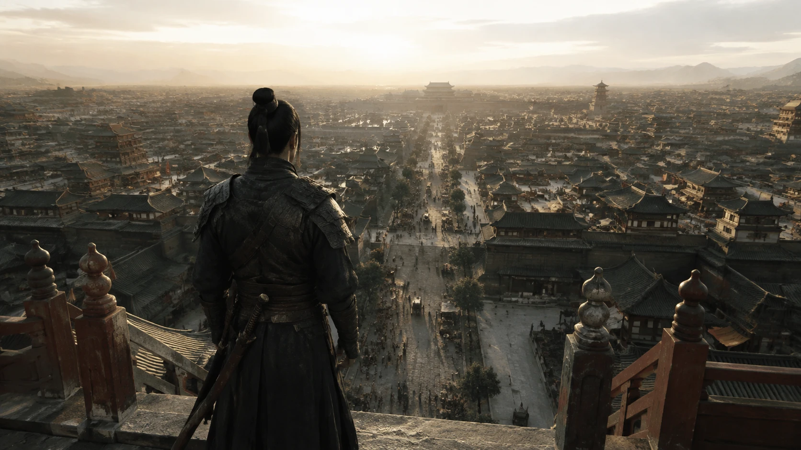

**分类：** 武侠 ｜ **类型：** 环境 ｜ **画幅：** 16:9

**标签：** `真人电影实拍` `武侠` `工业都市`

**源文件：** [data/prompts/case9.md](../data/prompts/case9.md)

**提示词：**

```text
16:9 横向电影级真实摄影画面。

东方武侠 + 蒸汽朋克 + 巨型工业幻想都市，但必须呈现为「真实真人电影拍摄效果」，不是概念艺术，不是油画，不是插画，不是游戏原画。

画面像一帧来自高预算好莱坞/亚洲院线科幻武侠电影的实拍剧照，拥有真实摄影机成像、真实物理材质、真实空气透视。

场景：
一座无边无际的东方蒸汽朋克工业巨城，建立在巨大水网之上。城市融合古代中国建筑与19世纪工业机械文明。

无数真实比例的中式塔楼、飞檐建筑、木石结构房屋，与巨型工业厂房、钢铁平台、铜制管道、锅炉、烟囱、机械塔结合。

城市必须符合现实工程逻辑：
建筑有真实重量感；
金属连接处有铆钉、焊接痕迹；
管道有支撑结构；
桥梁有承重结构；
机械设备有真实制造痕迹。

不要幻想城市，不要漂浮建筑，不要魔法机械。

前景：
镜头位于数百米高的锈蚀工业建筑顶部。

第三人称背后视角。

一名真实成年东方男性武士站在屋顶边缘，背对镜头，俯瞰城市。

人物位于左侧三分之一位置。

人物比例必须是真人摄影比例。

他穿着黑灰色旧武侠长袍，外层覆盖磨损皮革护甲和旧金属肩甲。

衣服必须有真实布料物理：
厚重感；
自然褶皱；
纤维纹理；
污渍；
雨水痕迹；
长期使用磨损。

头戴真实竹制斗笠：
可以看到竹篾纹理、断裂纤维、灰尘、旧化痕迹。

斗笠下露出真实黑色头发：
单根发丝清晰；
被高空风吹动；
自然凌乱；
绝不塑料感。

裸露皮肤必须是真实真人：
可见毛孔；
细小汗毛；
皮肤纹理；
自然肤色变化；
真实光影；
不要磨皮；
不要蜡像皮肤。

腰间佩戴真实武士刀：
刀鞘有划痕、氧化、磨损；
金属没有发光；
没有魔法效果。

屋顶：
真实红铜工业屋面。

表面覆盖：
氧化铜；
锈迹；
雨水侵蚀痕迹；
油污；
灰尘；
金属凹陷；
老旧铆钉；
维修结构。

屋顶形成强烈真实摄影透视线，引导视线进入城市。

城市：
下方是一座真实尺度的东方工业水城。

大量河道穿过城区。

水面：
真实物理反射；
轻微波纹；
漂浮油膜；
船只倒影；
湿润质感。

河面有：
木船；
蒸汽货船；
工业码头；
吊桥；
运输平台。

建筑表面：
旧铜；
黑铁；
锈钢；
湿润石材；
旧木材。

所有材料必须符合真实 PBR 材质。

金属必须有：
氧化层；
划痕；
粗糙度变化；
灰尘；
油渍；
长期使用痕迹。

不要干净CG材质。

远景：
城市延伸到地平线。

大量塔楼、工厂、烟囱、机械平台被工业雾气遮挡。

远处有巨大石质工业遗迹轮廓，但像真实历史建筑遗迹，不像奇幻巨像。

空气：
真实工业城市空气。

包含：
轻微蒸汽；
灰尘；
湿气；
烟雾。

蒸汽必须符合真实流体：
自然扩散；
半透明；
受光影响；
不要装饰性烟雾。

摄影：
ARRI Alexa 35电影摄影机。

20mm超广角电影镜头。

真实高位俯拍。

自然透视。

深景深：
前景人物清晰；
中景建筑细节丰富；
远景因空气距离自然降低对比度。

不要鱼眼。
不要夸张广角畸变。

光线：
黄昏日落。

真实太阳光穿过工业雾霾。

右上方暖金色夕阳。

城市阴影区域保持冷色。

形成真实电影冷暖关系。

不要神圣光柱。
不要幻想光效。
不要过曝。

色彩：
低饱和电影调色。

黑色；
炭灰；
锈红；
旧铜；
暗棕；
低饱和青绿色；
自然金色夕阳。

避免：
橙青大片滤镜；
HDR过强；
鲜艳颜色。

最终效果：

像真实摄影团队站在未来东方工业城市最高建筑上拍摄的一帧电影。

真实演员 + 实景搭建 + 大规模实体模型 + 高端VFX扩展。

不是数字绘画。

必须达到：
ultra photorealistic,
live action movie still,
IMAX cinematic realism,
real camera footage,
photographic realism,
physically accurate materials,
real human skin,
real fabric physics,
real atmospheric scattering,
high-end VFX integration,
8K cinema frame,
grounded sci-fi fantasy,
hyper realistic live-action film.

Negative prompt:

oil painting,
digital painting,
concept art,
illustration,
matte painting,
fantasy artwork,
game art,
AAA game screenshot,
Unreal Engine render,
CGI character,
3D model,
plastic skin,
wax skin,
smooth artificial face,
anime,
manga,
stylized rendering,
oversaturated colors,
HDR,
teal orange grading,
fantasy glow,
magic light,
fake fog,
painted clouds,
unrealistic architecture,
floating buildings,
cartoon,
poster design,
artificial depth of field,
over sharpened,
AI generated look
```

***

<a name="case-10"></a>

### 例 10：滑板治愈

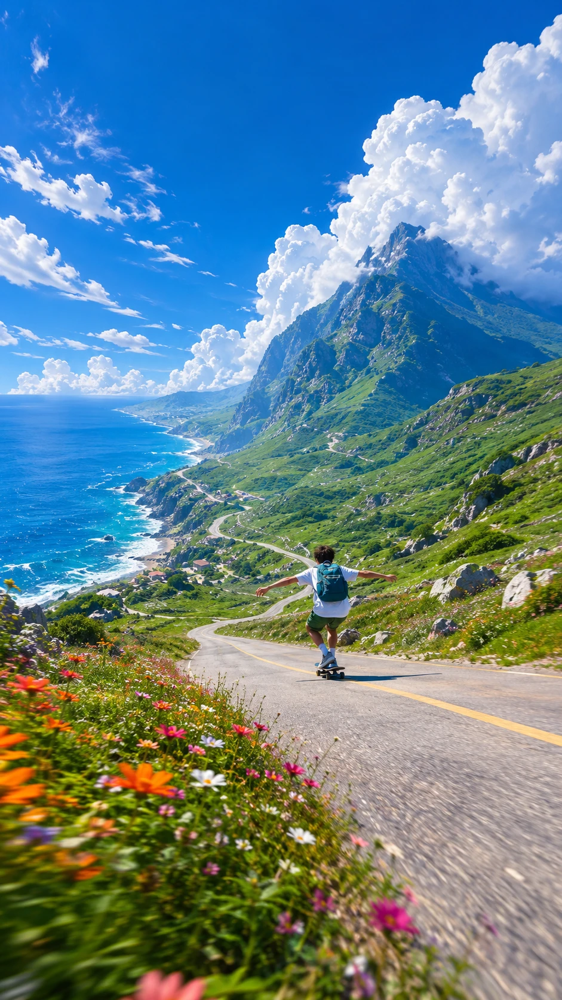

**分类：** 治愈 ｜ **类型：** 环境 ｜ **画幅：** 9:16

**标签：** `日系动画背景` `3D CGI` `治愈` `海岸` `少年`

**源文件：** [data/prompts/case10.md](../data/prompts/case10.md)

**提示词：**

```text
竖版 9:16，充满夏日生命力与自由感的**电影级治愈系旅行画面**，日系动画电影背景美术与高质量 3D CGI / 写实摄影质感融合，色彩明亮通透，带有梦幻但可信的现实世界质感。

镜头位于高山海岸公路上方，采用**第三人称低机位跟拍视角**，14mm 超广角镜头，强烈纵深透视。画面中央偏下，一名少年背对镜头踩着滑板沿陡峭下坡公路向远方滑行，人物体型较小，突出整个世界的宏大尺度。少年穿白色短袖、绿色短裤、运动鞋，背着蓝绿色双肩包，手臂自然张开保持平衡，动作轻松自由，带有青春冒险与旅行感。

公路从画面前景一路蜿蜒向山谷和海岸延伸，坡度明显，形成极强的视觉引导线。灰色柏油路面拥有清晰黄色中心线，阳光照射下略微泛白，远处道路连续弯曲，沿山体不断下降，强化“一路滑向大海”的空间冲击力。

道路左侧覆盖大片盛开的夏季野花，红色、橙色、粉色、紫色和白色小花铺满绿色草坡，近景花草因为超广角产生明显放大与轻微动态模糊，形成沉浸式前景。右侧为绿色山坡、岩石和零散植被。

画面左侧远处是一望无际的**深蓝色海洋**，海水极其清澈明亮，阳光下呈现蓝宝石与青蓝渐变，白色海浪不断拍打蜿蜒海岸线，形成明亮的白色浪花边缘。山体与海岸之间分布少量道路、小型建筑与村落，使场景具有真实生活尺度。

画面中央至右上方是一座巨大陡峭的绿色海岸山峰，山体高耸入云，阳面覆盖鲜绿色草地，背光区域呈深青绿色，山脊具有明显体积和层次。山峰后方升起极其巨大的白色积云，云层厚重蓬松、体积巨大，部分云雾环绕山顶，形成史诗感。

天空占据较大面积，为纯净高饱和蔚蓝色夏日天空，大量明亮白色积云在阳光下呈现丰富明暗层次，空气透明度极高，远景带有轻微大气透视。

整体色彩以**蔚蓝海洋、鲜绿色山体、纯蓝天空、暖色野花**为主，高饱和但自然，不要灰暗滤镜。强烈夏日阳光，清晰方向光，柔和环境光，真实阴影，轻微高光溢出，空气中具有清爽通透感。

整体氛围：**夏日、青春、自由、冒险、治愈、旅行、无忧无虑、向大海前进的感觉**，像一部关于少年独自旅行的动画电影高潮镜头。

视觉风格：日系动画电影背景美术，治愈系自然幻想，高质量 3D CGI，AAA 游戏环境渲染，电影级构图，真实体积光，细腻植被，超远景空间层次，鲜艳通透色彩，轻微梦幻感，高动态范围，8K 环境细节。

避免：城市高楼、拥挤人群、阴天、灰暗色调、末日感、赛博朋克、过度写实皮肤特写、人物占画面过大、平坦道路、封闭构图、海岸线消失、山体过小、低饱和、厚重雾霾。
```

***

<a name="case-11"></a>

### 例 11：机甲

**分类：** 武侠 ｜ **类型：** 双主体 ｜ **画幅：** 16:9

**标签：** `真人电影实拍` `武侠` `机甲` `都市`

**源文件：** [data/prompts/case11.md](../data/prompts/case11.md)

**提示词：**

```text
16:9 横向真实电影摄影画面。

一帧来自高预算真人科幻武侠电影中的现场电影截图。

画面必须像真实摄影机在现实片场拍摄到的一瞬间。

不是概念艺术。
不是艺术设定图。
不是游戏CG。
不是游戏宣传海报。
不是数字绘画。
不是油画。

必须是真人电影实拍质感。

---

# 整体风格

东方黑暗武侠 + 生物机械科幻 + 现代都市战争 + 真人电影质感。

整体感觉类似一部数亿美元投资的真人科幻动作电影中的真实剧照。

重点不是展示未来科技设计。

而是记录一场真实战争中，摄影机偶然捕捉到的城市瞬间。

画面必须具有：

- 真人演员
- 实体机械服装
- 真实现代建筑
- 真实暴雨天气
- 真实摄影机限制
- 真实环境光
- 真实物理材质

像从真人电影胶片中截取的一帧。

---

# 场景

现代超大型都市。

一座真实存在于现实世界逻辑中的未来近现代超级城市。

不是未来概念城市。

不是科幻建筑展示。

不是游戏地图。

而是一座真实有人生活、持续运行的现代都市。

城市经过几十年甚至上百年发展形成。

不同年代建筑自然叠加。

现代商业区、住宅区、工业区、交通系统共同存在。

摄影机正在记录一场发生在现实都市中的未来战争瞬间。

---

# 城市环境

摄影机位于一座极高建筑顶部。

人物站在城市天际线边缘。

下方是一座巨大现代都市。

城市拥有：

- 超高层玻璃摩天楼
- 混凝土商业建筑
- 老城区街区
- 高架道路
- 城市桥梁
- 地铁设施
- 巨型电子广告屏
- 办公楼群
- 住宅区域
- 工业设施
- 能源中心
- 城市交通网络

所有建筑必须符合真实现代工程逻辑。

具有：

- 真实承重结构
- 钢筋混凝土结构
- 玻璃幕墙
- 金属框架
- 管线系统
- 长期维护痕迹
- 风雨侵蚀痕迹

例如：

- 玻璃幕墙被暴雨覆盖
- 建筑外墙存在污渍
- 金属结构出现轻微氧化
- 道路存在维修痕迹
- 城市设施存在长期使用痕迹

不要未来幻想城市。

不要漂浮建筑。

不要不符合物理规律的结构。

---

# 城市状态

现代都市正在经历一场大规模战争后的紧张时期。

不是毁灭后的废墟。

不是末日城市。

而是一座强大文明仍然维持运行的现代都市。

城市中：

- 部分高楼外墙受到攻击
- 少量建筑出现破损
- 局部区域有爆炸痕迹
- 道路出现战斗损伤
- 部分机械设施受到破坏

但是：

大部分城市保持完整。

远处仍然存在：

- 高楼灯光
- 城市交通运行
- 能源设施
- 商业区域灯光
- 人类活动痕迹

像真实战争电影中的现代城市。

不是废弃遗迹。

---

# 城市远景

远处现代城市天际线无限延伸。

高楼被暴雨和城市雾气逐渐吞没。

存在：

- 密集摩天楼群
- 城市道路灯光
- 高空交通设施
- 巨型电子屏幕
- 工业能源设施

远处有：

- 巨型机械战争单位
- 飞行机械设备
- 战争运输机械

但全部被雨雾遮挡。

保持真实电影尺度。

不要像游戏地图展示。

---

# 天气

正在发生真实暴雨。

不是唯美电影雨。

是真实恶劣战争天气。

天空：

- 厚重低压乌云
- 雷电交加
- 黑暗城市天空
- 持续暴雨

环境：

- 大量真实雨滴
- 前景雨滴遮挡镜头
- 摄影机镜片水珠
- 湿润镜头效果
- 高空强风吹动雨线
- 城市雾气
- 远处建筑被雨幕降低清晰度

建筑：

- 玻璃幕墙布满雨水
- 屋顶积水
- 金属结构反射雨光
- 道路积水反射城市灯光

---

# 摄影机

使用 ARRI Alexa 35 电影摄影机。

50mm电影镜头。

真实电影摄影语言。

摄影机位于高层建筑边缘。

距离人物约5米。

第三人称背后视角。

略微低角度。

人物位于画面左侧前景。

不是英雄海报角度。

不是游戏第三人称视角。

不是概念艺术构图。

---

# 镜头效果

真实摄影限制：

- 雨水遮挡部分画面
- 远处城市被雨雾柔化
- 暗部自然丢失细节
- 曝光不完全均匀
- 轻微运动模糊
- 真实镜头光学缺陷
- 摄影机传感器噪点
- 胶片颗粒

不要过度锐化。

不要8K游戏截图感。

不要商业宣传图质感。

---

# 人物

画面左侧前景。

一名黑色机械武士 / 未来大侠站在高处建筑边缘。

背对镜头。

俯瞰整座现代都市。

人物身体覆盖复杂的黑色生物机械装甲。

融合：

- 东方古代铠甲
- 金属骨骼
- 外骨骼机械结构
- 异形未来科技感

甲片层层交叠。

装甲拥有复杂的黑色机械结构。

表面具有：

- 高光黑金属质感
- 雨水覆盖后的反光
- 战斗磨损
- 划痕
- 细密机械纹路
- 金属旧化痕迹
- 少量暖色环境能量反光

暖色反光来自城市能源设施、战争火光和环境反射。

不是自身发光。

---

# 头盔

人物头部拥有极具辨识度的尖锐冠状机械头盔。

具有：

- 尖锐冠状轮廓
- 向后延伸的机械角结构
- 刀锋般延伸结构
- 凌厉侧面线条
- 黑暗未来武士感觉

轮廓像未来时代的黑暗剑圣。

必须像真人演员佩戴的实体头盔。

不是CG模型。

不是动漫面具。

---

# 披风

肩部和背部披着大面积黑色破损披风。

披风受到高空强风影响。

向左后方剧烈飘动。

形成强烈动态视觉。

披风：

- 吸收暴雨变得沉重
- 具有真实布料纤维
- 自然褶皱
- 边缘磨损
- 雨水流动

符合真实布料动力学。

---

# 武器

武士右手持一把极长东方直刀 / 武士刀。

刀身从人物位置水平伸向画面右侧。

形成贯穿画面的视觉引导线。

刀刃：

- 细长锋利
- 银白色金属材质
- 雨水覆盖
- 真实钢铁质感
- 被城市灯光和雷电照亮

不是能量剑。

不是魔法武器。

不是发光武器。

人物姿态：

沉稳。

冷静。

极具压迫感。

不做夸张攻击动作。

像大战前站在城市之巅观察战场。

---

# 巨型机械生命体

不要展示完整机械生命体。

只作为前景遮挡出现。

摄影机只能看到：

- 巨大机械腿
- 黑银色装甲
- 液压系统
- 机械关节
- 金属结构
- 精密线缆

机械表面覆盖：

- 雨水
- 泥土
- 战斗损伤
- 金属磨损

像真实电影中偶然拍到的巨大战争机器一部分。

不要像模型展示。

不要像游戏Boss设计图。

---

# 光线

暴雨城市夜晚环境。

主要光源：

- 阴暗天空环境光
- 雷电瞬间冷光
- 城市建筑暖色灯光
- 巨型电子屏幕反射
- 湿润路面反光

低饱和电影调色。

冷蓝灰色战争电影氛围。

真实摄影。

---

# Real Film Keywords

shot on ARRI Alexa 35

50mm cinema lens

live action movie still

real film production

real actor

practical costume

practical effects

real rain photography

on set photography

natural weather

wet surface reflections

real camera optics

imperfect exposure

real lens droplets

subtle film grain

real camera sensor noise

natural motion blur

cinematic realism

---

# Negative Prompt

oil painting

concept art

digital painting

fantasy artwork

game art

CG render

3D illustration

movie poster

key visual

character design sheet

unreal engine style

anime style

cartoon

plastic materials

clean CGI surface

perfect fantasy lighting

magical glow

overly futuristic fantasy city

architectural concept art

abandoned city

ruined city

post apocalyptic wasteland

empty buildings

deserted streets
```

***

<a name="case-12"></a>

### 例 12：机甲-夜晚

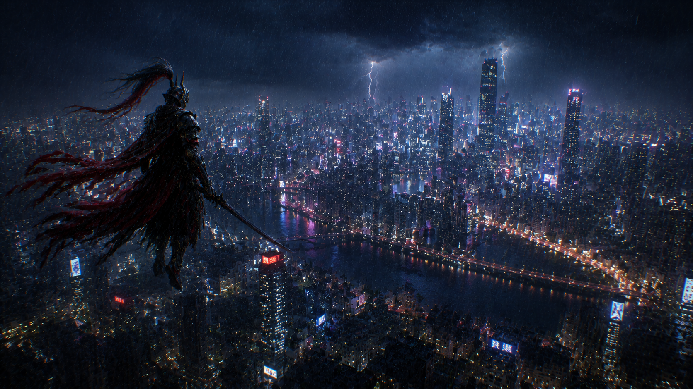

**分类：** 武侠 ｜ **类型：** 双主体 ｜ **画幅：** 16:9

**标签：** `真人电影实拍` `武侠` `机甲` `都市`

**源文件：** [data/prompts/case12.md](../data/prompts/case12.md)

**提示词：**

```text
16:9 横向真实电影摄影画面。

一帧来自高预算真人科幻武侠电影中的现场电影截图。

画面必须像真实摄影机在现实片场拍摄到的一瞬间。

不是概念艺术。
不是艺术设定图。
不是游戏CG。
不是游戏宣传海报。
不是数字绘画。
不是油画。

必须是真人电影实拍质感。

---

# 整体风格

东方黑暗武侠 + 生物机械科幻 + 现代超级都市战争 + 真人电影摄影。

整体感觉类似一部数亿美元投资的真人科幻动作电影中的史诗级电影剧照。

重点不是展示未来城市设计。

而是记录一个未来战争时代，摄影机从远距离捕捉到的一瞬间。

画面核心：

一个未来东方剑圣，孤独悬浮在暴雨中的超级都市上空。

---

# 场景

一座真实存在于现实世界逻辑中的超级现代都市。

不是未来概念城市。

不是科幻建筑展示。

不是游戏地图。

是一座经过几十年甚至上百年自然发展形成的人类城市。

城市拥有真实复杂结构：

- 超高层摩天楼
- 商业中心
- 办公区域
- 住宅区
- 老城区
- 工业区域
- 高架道路
- 城市桥梁
- 地铁系统
- 能源设施

不同年代建筑自然混合。

不要统一未来建筑风格。

不要建筑概念设计感。

---

# 城市建筑真实性（重点）

远方城市必须像真实电影航拍。

建筑必须拥有：

- 真实玻璃幕墙
- 钢筋混凝土结构
- 金属框架
- 密集窗户
- 空调外机
- 通风设备
- 屋顶机械设施
- 外墙污渍
- 长期风雨侵蚀痕迹

建筑排列必须自然。

不要完美未来城市。

不要干净CG建筑。

不要游戏城市模型。

---

# 城市灯光

夜晚。

整座城市正常运行。

所有区域都有真实城市灯光：

- 摩天楼办公室灯光
- 住宅窗户灯光
- 商业街灯光
- 高架车辆灯带
- 道路车流
- 巨型广告屏
- 城市基础设施灯光

城市不是废墟。

不是无人城市。

是一座仍然繁荣运行的现代文明都市。

---

# 天气

真实暴雨夜晚。

天空：

- 巨大黑色雷云
- 雷电闪耀
- 强烈风暴天气

大量真实雨水：

- 雨滴穿过镜头
- 摄影机镜片水珠
- 空气雨雾
- 强风吹动雨线

城市：

- 玻璃反射雨光
- 道路积水
- 湿润建筑表面
- 灯光倒影

---

# 摄影机

ARRI Alexa 35电影摄影机。

35mm电影广角镜头。

超远距离第三人称背后视角。

摄影机距离人物约100米。

人物只占画面高度10%-15%。

重点展示巨大城市尺度。

不要近距离人物展示。

不要英雄海报角度。

不要角色宣传图。

不是游戏第三人称视角。

---

# 人物位置

画面左侧。

一名未来东方剑圣悬浮在城市高空。

背对镜头。

脚下没有建筑。

没有天台。

没有平台。

完全悬浮于暴雨天空。

人物距离城市建筑非常遥远。

形成巨大空间感。

---

# 人物整体设计

必须像真人电影中的最终主角。

不是普通机械士兵。

不是NPC。

不是游戏Boss。

是一名未来东方战争时代的传奇剑圣。

---

# 机械铠甲设计

真人演员穿着实体机械战甲。

融合：

- 东方古代武将铠甲
- 日本武士甲胄
- 生物机械骨骼
- 高级未来外骨骼系统

装甲颜色不能纯黑。

必须有丰富层次：

主体：

- 黑色金属装甲

辅助：

- 深红色肩甲
- 暗金色机械纹路
- 银灰色金属边缘
- 少量蓝色科技结构

整体像未来东方帝国最高级战甲。

不是塑料。

不是CG。

---

# 胸甲

复杂东方机械胸甲。

具有：

- 多层重叠甲片
- 红色核心装甲区域
- 金属铆钉
- 机械连接结构
- 战斗磨损
- 雨水覆盖

---

# 头盔（重点）

头盔必须具有极强辨识度。

不要普通机器人头盔。

不要简单尖角。

设计为：

未来东方战神头盔。

融合：

- 古代将军兜鍪
- 龙形冠冕
- 武士头盔
- 生物机械结构

头盔轮廓：

- 狭长锐利
- 威严
- 凌厉
- 高级未来感

---

# 流马尾结构（重点）

头盔后方必须拥有巨大机械流马尾。

类似东方武将长发。

由：

- 黑色机械纤维
- 深红色金属丝
- 生物机械结构

组成。

长度数米。

在暴雨和高空强风中向后飘动。

成为人物最明显视觉标志。

远距离也能看到流马尾轮廓。

---

# 围巾与披帛

增加东方武侠元素。

肩部连接巨大长围巾。

颜色：

黑色 + 深红色。

像未来战旗。

高速气流中向后飘动。

材质：

- 厚重布料
- 雨水浸湿
- 真实纤维
- 边缘破损

---

# 披风

巨大黑色披风。

内侧暗红色。

暴雨中展开。

具有：

- 湿润重量感
- 自然褶皱
- 布料纤维
- 战斗磨损

---

# 武器

右手持东方长刀。

刀身：

- 银白钢铁
- 黑色刀柄
- 红色装饰纹路

真实金属。

不是能量剑。

不是魔法武器。

刀刃反射：

- 雷电
- 城市灯光
- 雨水

---

# 镜头真实感

真实电影摄影：

- 远距离空气透视
- 雨滴遮挡
- 镜头水珠
- 真实景深
- 暗部噪点
- 轻微运动模糊
- 摄影机传感器颗粒
- 胶片质感

不要过度锐化。

不要8K游戏截图。

---

# Real Film Keywords

shot on ARRI Alexa 35

35mm cinema lens

live action movie still

real actor

practical costume

practical effects

real rain photography

on set photography

real camera optics

cinematic realism

natural motion blur

film grain

sensor noise


---

# Negative Prompt

oil painting

concept art

digital painting

CG render

3D illustration

game art

anime

cartoon

movie poster

key visual

character design sheet

unreal engine style

plastic armor

clean CGI surface

fantasy city

futuristic architecture concept

empty city

abandoned city

ruined city

robot soldier

generic helmet

simple armor

low detail character
```

***

<a name="case-13"></a>

### 例 13：机甲-白天

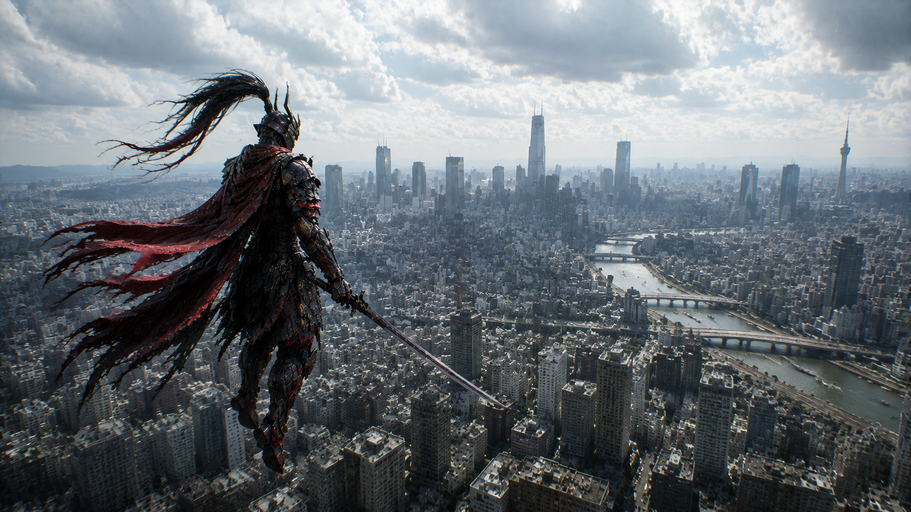

**分类：** 武侠 ｜ **类型：** 双主体 ｜ **画幅：** 16:9

**标签：** `真人电影实拍` `武侠` `机甲` `都市`

**源文件：** [data/prompts/case13.md](../data/prompts/case13.md)

**提示词：**

```text
16:9 横向真实电影摄影画面。

一帧来自高预算真人科幻武侠电影中的现场电影截图。

画面必须像真实摄影机在现实片场拍摄到的一瞬间。

不是概念艺术。
不是艺术设定图。
不是游戏CG。
不是游戏宣传海报。
不是数字绘画。
不是油画。

必须是真人电影实拍质感。

---

# 整体风格

东方黑暗武侠 + 生物机械科幻 + 现代超级都市 + 真人电影摄影。

类似数亿美元投资的真人科幻动作电影中的史诗级电影剧照。

画面不是展示幻想世界。

而是记录未来时代真实发生的一瞬间。

核心画面：

一名未来东方剑圣悬浮在真实现代超级都市上空。

---

# 场景

白天。

一座真实存在于现实世界逻辑中的超级现代都市。

不是未来概念城市。

不是科幻建筑展示。

不是游戏地图。

这是一座经过几十年甚至上百年自然发展形成的人类城市。

城市包含：

- 超高层摩天楼
- 商业中心
- 办公楼群
- 住宅区域
- 老城区
- 工业设施
- 高架道路
- 城市桥梁
- 河流
- 交通网络

不同年代建筑自然混合。

不要统一未来建筑风格。

不要建筑概念设计感。

---

# 城市真实性（重点）

远方城市必须像真实电影航拍。

不是未来城市模型。

不是建筑效果图。

建筑必须具有：

- 真实玻璃幕墙
- 钢筋混凝土结构
- 金属框架
- 密集窗户
- 空调外机
- 通风设备
- 屋顶机械设施
- 外墙污渍
- 长期使用痕迹
- 风雨侵蚀痕迹

城市必须像真实人类社会长期发展的结果。

不要整齐排列。

不要完美未来建筑。

不要CG城市。

---

# 城市规模

巨大现代都市无限延伸。

远处：

- 密集摩天楼群
- 普通住宅区
- 商业建筑
- 道路网络
- 城市河流
- 桥梁系统

城市具有真实空间尺度。

人物在巨大城市面前显得渺小。

强调人类文明规模。

---

# 天气环境

白天强烈风暴天气。

天空：

- 厚重灰白云层
- 巨大的积雨云
- 阳光穿透云层形成光束
- 暴风雨即将来临

空气：

- 湿润空气
- 远处城市轻微雾化
- 高空强风
- 云层快速移动感

城市：

- 建筑表面反射天空光
- 道路湿润
- 金属结构反光
- 空气透视真实

不是晴朗旅游照片。

不是唯美风景图。

---

# 摄影机

使用 ARRI Alexa 35 电影摄影机。

35mm 电影广角镜头。

超远距离第三人称背后视角。

摄影机距离人物约100米。

人物只占画面高度10%-15%。

重点展示：

巨大城市尺度。

不要近距离人物特写。

不要英雄海报。

不要角色展示图。

不是游戏第三人称镜头。

---

# 人物位置

画面左侧。

一名未来东方剑圣悬浮在城市天空中。

背对镜头。

脚下没有建筑。

没有天台。

没有平台。

完全悬浮。

距离地面数百米。

像拥有反重力能力。

---

# 人物设计

必须像真人电影最终主角。

不是普通机械士兵。

不是游戏NPC。

不是Boss设计。

是一名未来东方战争时代的传奇剑圣。

---

# 机械铠甲

真人演员穿着实体机械战甲。

融合：

- 东方古代武将铠甲
- 日本武士甲胄
- 生物机械骨骼
- 高级未来外骨骼系统

装甲颜色丰富。

不是纯黑。

主色：

黑色金属。

辅助：

- 深红色肩甲
- 暗金色装饰纹路
- 银灰色机械边缘
- 少量蓝色科技结构

像未来东方帝国最高级战甲。

不是塑料。

不是CG模型。

---

# 胸甲

复杂东方机械胸甲。

具有：

- 多层重叠甲片
- 红色装甲区域
- 暗金机械纹路
- 金属连接结构
- 战斗磨损
- 雨水和灰尘痕迹

---

# 头盔（重点）

头盔必须具有强烈视觉辨识度。

不要普通机器人头盔。

不要简单尖角。

设计为：

未来东方战神头盔。

融合：

- 古代将军兜鍪
- 龙形冠冕
- 武士头盔
- 生物机械结构

头盔轮廓：

- 狭长锐利
- 威严
- 凌厉
- 高级未来感

---

# 流马尾结构（核心）

头盔后方必须拥有巨大流马尾。

类似东方武将长发。

由：

- 黑色机械纤维
- 深红色金属丝
- 生物机械结构

组成。

长度数米。

在高空强风中向后飘动。

必须形成明显轮廓。

远距离也能识别。

---

# 围巾与披帛

肩部增加巨大东方长围巾。

颜色：

黑色 + 深红色。

像未来战旗。

被高空风吹向后方。

材质：

- 厚重布料
- 真实纤维
- 自然褶皱
- 边缘磨损

---

# 披风

巨大黑色披风。

内部暗红色。

随风展开。

具有：

- 真实布料重量
- 自然动态
- 纤维纹理
- 战斗损伤

---

# 武器

右手握东方长刀。

刀身：

- 银白钢铁
- 黑色刀柄
- 红色装饰纹路

真实金属。

不是能量剑。

不是魔法武器。

刀刃反射：

- 阳光
- 城市反光
- 天空光线

---

# 镜头真实感

真实电影摄影：

- 真实空气透视
- 远景自然柔化
- 真实景深
- 摄影机动态范围
- 轻微镜头缺陷
- 传感器颗粒
- 胶片质感

不要过度锐化。

不要8K游戏截图。

---

# Real Film Keywords

shot on ARRI Alexa 35

35mm cinema lens

live action movie still

real actor

practical costume

practical effects

real film production

cinematic realism

natural lighting

real camera optics

subtle film grain

camera sensor noise


---

# Negative Prompt

oil painting

concept art

digital painting

CG render

3D illustration

game art

anime

cartoon

movie poster

key visual

character design sheet

unreal engine style

plastic armor

clean CGI surface

fantasy city

future architecture concept

empty city

abandoned city

ruined city

robot soldier

generic helmet

simple armor

low detail character

oversaturated colors
```

***

<a name="case-14"></a>

### 例 14：赛博朋克

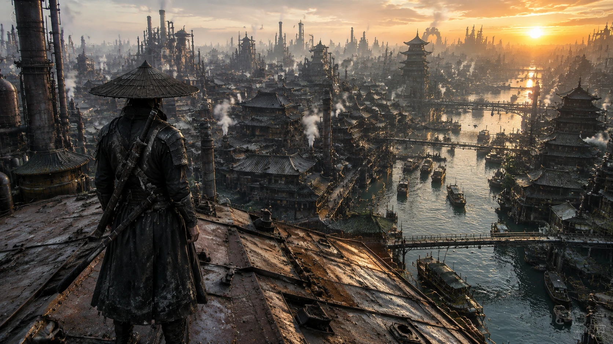

**分类：** 武侠 ｜ **类型：** 环境 ｜ **画幅：** 16:9

**标签：** `真人电影实拍` `武侠` `工业都市`

**源文件：** [data/prompts/case14.md](../data/prompts/case14.md)

**提示词：**

```text
16:9 横向电影级画面，**东方武侠 + 蒸汽朋克 + 工业幻想巨城 + 真人实拍电影质感**。

画面必须呈现为**真实电影摄影**，像一部高预算院线级东方史诗电影的实拍镜头，而不是插画、油画、概念艺术或游戏原画。所有人物、建筑、金属、布料、烟雾、光线和空气都遵循真实世界的物理规律，强调摄影真实性与现场感。

镜头位于极高建筑顶部，采用**第三人称背后视角**。一名真实成年东方男性武士站在锈红色工业屋顶最前端，背对镜头俯瞰整座巨型城市。人物位于画面左侧偏中，约占画面高度三分之一，身体比例完全符合真人，姿态自然、沉稳，没有英雄式夸张摆拍。

武士头戴宽大的圆形编织斗笠，斗笠材质为真实竹篾与藤条，可见细密纤维、毛刺、磨损、灰尘与雨水留下的痕迹。身穿黑色和深灰色厚重长袍、旧皮革护甲与金属肩甲，布料具有真实褶皱、重量、垂坠感、磨损、油污和灰尘。

裸露的手部、颈部等皮肤必须呈现**真实人类皮肤质感**，能够看到毛孔、细小汗毛、肤色不均、细微汗渍和自然光影，不要磨皮，不要蜡像感，不要游戏角色皮肤。

斗笠下方露出的头发必须是真实发丝质感，受到高空风力影响自然飘动，不要成片塑料头发。

腰间佩戴一把真实比例的武士刀，另一把长刀斜跨后背。刀鞘、绑带、金属部件具有真实磨损、细小划痕、氧化和使用痕迹，不要奇幻发光效果。

人物脚下是一座**真实、破旧、锈迹斑驳的红铜色工业屋顶**。表面由不规则金属板、铆钉、排气管、维修结构、旧机械组件组成，可见真实氧化层、雨水锈痕、灰尘沉积、油渍、凹痕和金属疲劳。

屋顶形成强烈三角透视线，把视线自然引向下方城市。

下方是一座规模极其庞大的**东方蒸汽朋克水上工业都市**。

城市整体必须具有**真实建筑摄影感**。无数中式塔楼、飞檐木构建筑、码头、工厂、桥梁和机械设施密集分布，但每一栋建筑都必须遵循真实结构逻辑，拥有可信的重量、材料、连接方式和尺度关系。

传统东方建筑与大型工业结构融合：粗大的青铜管道沿建筑外墙穿行，蒸汽输送管横跨街道和水道，巨型阀门、锅炉、烟囱、机械塔楼、工业平台、维修桥梁和金属支架遍布城市。

不要奇幻夸张到失去真实感，不要漂浮建筑，不要魔法机械。

所有金属结构必须具有真实材质属性：
**氧化铜、黄铜、黑铁、锈蚀钢材、铸铁、旧铝、湿润金属表面**。

表面存在真实粗糙度变化、氧化斑、油污、划痕、雨痕、积灰和年代感，避免过度干净和人为做旧感。

城市中央和右侧分布纵横交错的狭长水道，蓝绿色河水穿过工业城区，大量小型木船、货船和码头分布两侧。

水面必须遵循真实物理反射，有轻微波纹、油膜、水汽和建筑倒影，不要梦幻镜面。

高架桥横跨河道，远处出现巨大的工业机械结构和模糊的石质巨像轮廓，但巨像只作为环境中的真实建筑遗迹存在，不要神光，不要魔法感。

城市层次清晰：

**前景：**
真实武士、破旧金属屋顶、近距离机械结构。

**中景：**
密集工业建筑、水道、桥梁、蒸汽设施、码头。

**远景：**
无边无际的工业城区、塔楼、烟囱、机械平台与被大气雾霾遮挡的巨型结构。

采用**ARRI Alexa 35 电影摄影机，20mm 超广角电影镜头**，高位俯拍，真实镜头透视，深景深，但保持自然空气透视。

不要游戏式夸张透视，不要鱼眼，不要极端畸变。

焦距与景深必须符合真实摄影规律：前景人物清晰，中景仍保留大量建筑细节，远景因为空气距离自然降低对比度与清晰度，而不是人为高斯模糊。

时间为黄昏接近日落。

右上方真实金黄色夕阳穿过工业雾霾、蒸汽与空气尘埃，产生自然体积光和空气散射。光线必须像真实太阳照射，不要概念艺术式神圣光柱，不要夸张丁达尔光。

人物斗笠边缘、肩甲和衣物边缘出现自然逆光轮廓，但不过曝。

城市近景处于偏冷阴影，中远景逐渐被暖金色夕阳照亮，形成真实电影摄影中的冷暖关系。

天空不过度戏剧化，云层保持真实天气摄影质感。

空气中存在少量真实工业蒸汽、烟雾、尘埃和湿气。蒸汽具有真实密度、扩散和透光效果，不要画笔状烟雾，不要装饰性雾气。

色彩保持**低饱和、自然、真实、电影调色**。

主色为：
深黑、炭灰、锈红、旧铜、暗棕、低饱和青绿，以及黄昏自然暖金色。

避免橙青过度调色，避免 HDR 过重，避免颜色过度鲜艳。

整体画面像一帧真正存在的电影剧照：

**真实演员 + 实景搭建 + 大规模实体模型 + 高端 VFX 无缝融合。**

VFX 的作用只用于扩展城市尺度，不改变真实摄影基础。

要求看起来像摄影团队真的站在数百米高的工业建筑顶部完成拍摄，而不是数字艺术家画出来的画。

**摄影与渲染关键词：**
live-action cinematic photography, photorealistic human actor, ARRI Alexa 35, 20mm cinema lens, natural exposure, realistic skin pores, individual hair strands, practical costume, real fabric physics, realistic metal oxidation, physically accurate materials, natural sunlight, realistic atmospheric scattering, subtle volumetric haze, practical lighting, realistic reflections, physically based rendering, cinematic dynamic range, subtle film grain, natural depth of field, high-end VFX integration, feature film still, IMAX cinematic realism, ultra photorealistic, 8K live-action film frame.

**核心风格：**
东方黑暗武侠，realistic samurai movie，Chinese industrial megacity，real-world steampunk city，live-action historical fantasy，grounded industrial fantasy，photographic realism，cinematic realism，massive city scale，physically believable world。

**强力避免：**
oil painting，digital painting，concept art，illustration，matte painting，painterly texture，brush strokes，canvas texture，stylized rendering，anime，manga，game concept art，AAA game screenshot，Unreal Engine look，Octane render look，CGI character，plastic skin，wax skin，smooth skin，3D doll，over-sharpening，fantasy glow，magic light，excessive bloom，excessive HDR，teal and orange grading，oversaturated colors，artificial fog，painted clouds，fake depth of field，poster-like composition，digital artwork feeling，卡通感，油画笔触，插画质感，游戏原画感，数字绘画感，塑料人物，蜡像皮肤，过度锐化，过度磨皮，过度光晕。
```

***

<a name="case-15"></a>

### 例 15：将军

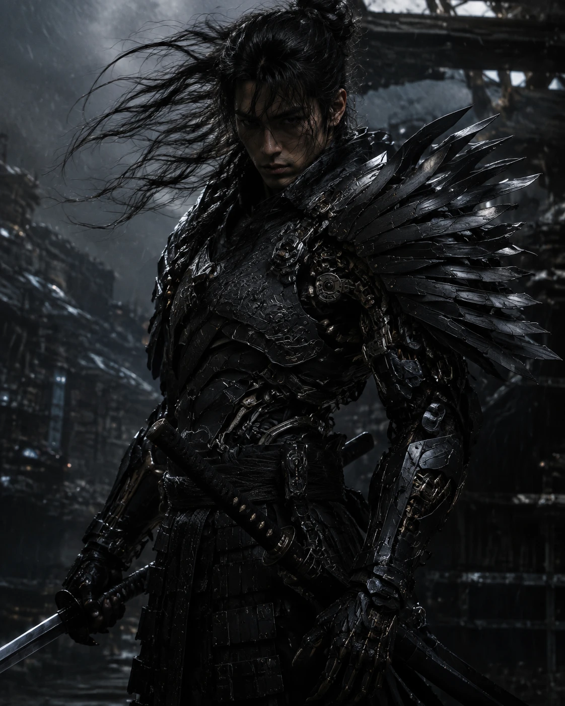

**分类：** 武侠 ｜ **类型：** 角色 ｜ **画幅：** 9:16

**标签：** `真人电影实拍` `武侠` `机甲` `立绘`

**源文件：** [data/prompts/case15.md](../data/prompts/case15.md)

**提示词：**

```text
一名东方男性未来机械武士。

黑色长发，凌乱飘动，被高速动作产生的气流吹起，部分发丝遮挡脸部。

面容冷峻，年轻男性，真实人类五官，皮肤具有真实纹理，不是机器人脸。

身体覆盖黑色生物机械装甲。

装甲融合东方武士铠甲与未来赛博机械科技。

肩部拥有巨大层叠式黑色机械肩甲，像锋利的金属羽翼展开。

胸甲由大量精密金属鳞片组成，具有复杂机械结构、齿轮、液压组件和隐藏线路。

手臂覆盖重型机械护甲，关节位置暴露精密机械结构，拥有金属骨骼感。

装甲材质为黑色高强度金属，表面有真实划痕、磨损、油污和战斗痕迹。

腰部连接传统武士装备结构，配有黑色机械刀鞘。

手持传统武士刀，刀柄采用黑色金属与传统缠绕纹理结合。

整体感觉：
东方武士 + 生物机械战士 + 未来战争英雄。

不是机器人。
不是机甲驾驶员。
不是全覆盖盔甲。

保持真人身体比例，机械与人体融合。

高细节金属纹理，真实电影级道具设计，黑暗科幻武侠风格。
```

***

<a name="case-16"></a>

### 例 16：蒸汽朋克-水城

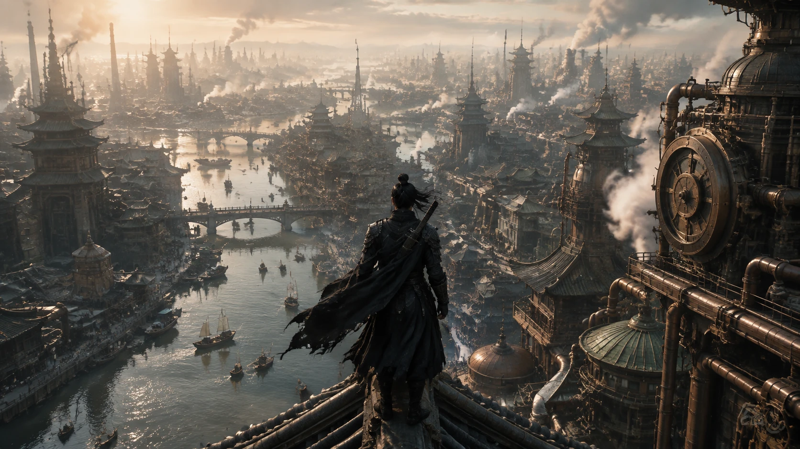

**分类：** 武侠 ｜ **类型：** 环境 ｜ **画幅：** 16:9

**标签：** `真人电影实拍` `武侠` `工业都市` `水城`

**源文件：** [data/prompts/case16.md](../data/prompts/case16.md)

**提示词：**

```text
16:9 横向电影级真实摄影画面。

东方武侠 + 蒸汽朋克 + 巨型东方工业水城 + 史诗科幻电影视觉。

一帧来自高预算真人科幻武侠电影的电影截图。

不是概念艺术。
不是游戏原画。
不是插画。
不是油画。
必须是真人电影实拍质感，真实摄影机成像。

---

镜头：

高空第三人称背后视角。

摄影机位于一座巨大东方建筑屋顶边缘。

一名孤独的东方剑客站在屋脊最高处，背对镜头，俯瞰整座城市。

人物位于画面中央偏下位置，比例较小，用于突出城市的巨大尺度。

人物穿着深色长袍、披风、东方武侠服饰。

长发被高空风吹动。

背后背着长剑。

姿态沉稳，像一名守望城市的剑客。

---

城市：

下方是一座无边际的东方蒸汽朋克巨型城市。

古代中国建筑与工业机械文明融合。

大量：

- 木质飞檐建筑
- 高耸塔楼
- 巨型机械工厂
- 铜制管道
- 蒸汽设备
- 金属桥梁
- 工业平台
- 水上城市结构

城市建立在巨大水网之上。

无数河道、运河、港口穿过城市。

水面反射天空光线。

大量小船和工业运输船穿梭其中。

---

建筑细节：

建筑必须真实符合工程逻辑。

不是幻想建筑。

具有真实重量感。

巨大的机械塔矗立城市两侧。

右侧前景是一座巨大工业机械塔：

青铜色金属结构。

巨大的圆形机械装置。

复杂管线连接。

蒸汽从管道中缓慢释放。

金属表面有：

氧化痕迹。
锈蚀。
划痕。
油污。
岁月磨损。

左侧远方有高耸东方塔楼和工业烟囱。

传统屋檐与机械结构交错。

---

环境：

清晨或黄昏光线。

空气中弥漫真实雾气。

城市被薄雾覆盖。

远处建筑逐渐消失在空气透视中。

阳光穿过蒸汽和雾霭形成体积光。

大量烟雾从工业区域升起。

天空明亮但有工业污染感。

---

摄影：

ARRI Alexa 35 电影摄影机质感。

IMAX电影画幅。

24mm广角电影镜头。

真实景深。

真实空气透视。

自然曝光。

真实物理光照。

电影级调色。

高动态范围。

8K超高清细节。

---

关键视觉：

宏大的东方工业文明。

孤独剑客面对超级城市。

人与巨型世界形成强烈比例反差。

真实真人电影截图感。

类似数亿美元投资的东方科幻武侠史诗电影中的一帧。
```

***

<a name="case-17"></a>

### 例 17：骑士-正面

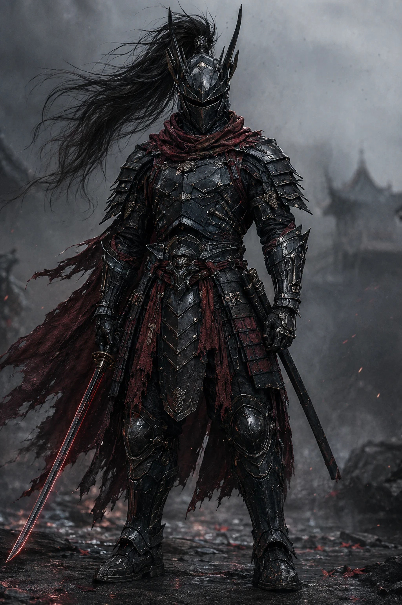

**分类：** 武侠 ｜ **类型：** 角色 ｜ **画幅：** 9:16

**标签：** `真人电影实拍` `武侠` `机甲` `立绘`

**源文件：** [data/prompts/case17.md](../data/prompts/case17.md)

**提示词：**

```text
一名未来东方机械武士 / 赛博武士，**正面视角**。

高大的成年男性战士正面面对镜头，身体比例真实，肩宽腰窄，姿态沉稳、冷峻，具有强烈压迫感。

人物穿着全身黑色重型机械武士铠甲，整体融合东方武将甲胄、欧洲中世纪骑士板甲、未来生物机械科技、重型外骨骼与精密机械结构。

头部佩戴一顶**黑色全覆式金属战斗头盔**。

头盔主体轮廓更接近**中世纪欧洲骑士 Armet / Close Helmet 全覆式板甲头盔**，而不是传统日本武士兜。

头盔整体紧密贴合头部，从额头、太阳穴、脸颊一直完整包覆到下颌与颈部上方，整体轮廓修长、紧凑、锐利。

脸颊两侧明显向内收束，下颌较窄，形成类似黑暗骑士头盔的封闭金属轮廓。

**头盔下方绝对不要向左右外抛，不要传统日本武士头盔那种宽大的外翻护颈，不要扇形扩张，不要层层横向展开的锅錣结构。**

头盔下缘应该贴近脖颈，整体纵向延伸，紧密包裹颈部上方，像欧洲骑士全覆头盔一样收紧而封闭。

正面覆盖完整黑色金属面甲。

面甲没有人脸造型，而是冷峻、无表情的机械骑士结构。

鼻梁中央拥有一道略微突出的锐利金属脊线，两侧面甲向后收紧，下巴区域尖锐而窄。

眼部只保留一条**极其狭长的水平观察缝**，内部深黑，不露出真实眼睛和面容。

头盔表面由多块精密黑色金属板拼接组成，可见细小铆钉、机械接缝、雕刻纹路、划痕和战斗磨损。

在骑士式头盔主体上加入少量**东方武将冠状结构**。

头盔顶部和两侧生长出数根修长、锐利、向上延伸并略微向后倾斜的黑色机械角。

机械角类似金属王冠、枪尖与东方武将头饰的融合，细长、锋利、凶悍，但不要巨大鹿角。

整体头盔视觉：

**欧洲黑暗骑士全覆式头盔主体 + 东方武将冠角 + 未来机械科技。**

头盔后上方连接一束**极长的黑色武将马尾 / 黑色羽状长发束**。

马尾从后脑高位束起，根部粗大紧束，随后向后延伸。

大量粗粝、凌乱、真实的黑色发丝被强风吹散，形成巨大而狂野的流动轮廓。

马尾长度极长，远远超过普通发型，像一面黑色战旗向后飞扬。

颈部围绕一条**暗红色破损围巾 / 战斗披肩**。

围巾由厚重粗糙布料制成，布料表面具有明显纤维、污迹、磨损和撕裂痕迹。

暗红色布料从颈部延伸至肩后，并连接成长而破碎的披风结构。

肩部覆盖大型层叠式黑色机械肩甲。

肩甲由多层锐利金属甲片组成，保留东方武将甲胄的层叠感，但整体不夸张横向展开。

甲片呈黑色高强度金属，夹杂少量暗红色与古铜金装饰。

胸甲厚重而复杂，由大量黑色机械板、金属鳞片、精密铆钉、液压结构、隐藏线路与雕刻纹路组成。

胸部中央结构坚固、紧凑，腹部使用多层活动机械甲片连接，使人物依然保持真实人体比例。

黑色铠甲之间穿插**暗红色装甲片与少量陈旧古铜金细节**，整体以黑色为主，不要鲜艳彩色。

双臂覆盖重型机械臂甲。

上臂、肘部、前臂都由多层金属装甲包覆，关节位置露出少量精密机械结构。

前臂装甲锋利而修长，机械护手完整覆盖双手，五指比例真实，不要机器人巨爪。

腰部拥有多层机械武士裙甲。

黑色与暗红色金属甲片纵向向下排列，整体贴近身体，不要夸张横向张开。

腰侧悬挂黑色机械刀鞘。

腿部覆盖完整重型机械腿甲。

膝甲锐利，胫甲由多层黑色金属板构成，局部可见机械关节、液压组件与外骨骼结构。

单手握持一把细长的未来武士刀。

刀身修长、笔直、锋利，深色金属材质，刀刃边缘仅存在非常微弱的暗红色能量光。

刀柄结合传统黑色缠绳、黑色金属与机械结构。

整套铠甲不是崭新展示品，而是真正经历过战争的装备。

表面拥有真实细小划痕、掉漆、磨损、凹痕、灰尘、油污、烧灼痕迹和金属氧化细节。

整体造型像一名来自未来战争时代的传奇东方剑圣。

冷峻、强大、孤独、威严、危险。

真实成年男性人体比例。

真实金属材质。

真实布料纹理。

真实机械结构。

高密度精密细节。

高预算真人科幻动作电影角色造型。

写实摄影质感，photorealistic，cinematic character design，真实电影服装道具质感。
```

***

<a name="case-18"></a>

### 例 18：悟空

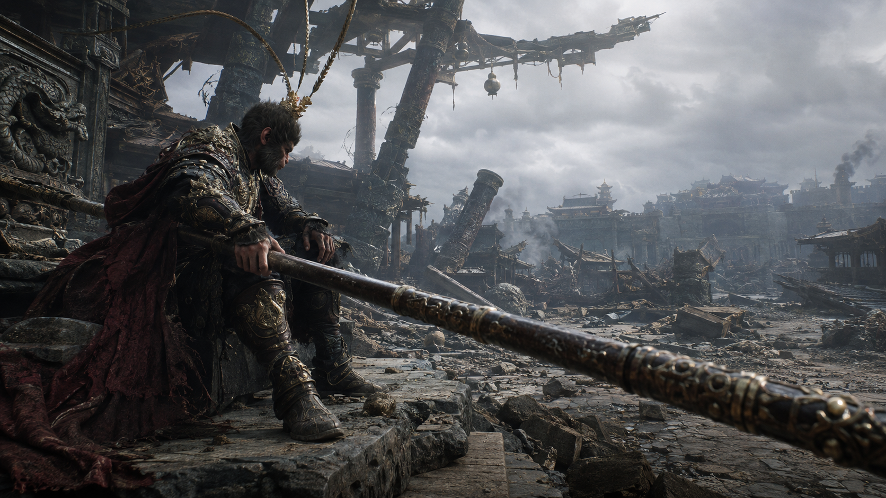

**分类：** 西游记 ｜ **类型：** 双主体 ｜ **画幅：** 16:9

**标签：** `真人电影实拍` `东方神话` `废墟`

**源文件：** [data/prompts/case18.md](../data/prompts/case18.md)

**提示词：**

```text
真人 IMAX 东方神话史诗电影画面，**16:9 横向构图，真实真人电影实拍质感，克制电影 VFX**。

**镜头构图重点参考示例图：人物位于画面左侧前景，摄影机从孙悟空侧后方约 30°–45° 拍摄，低机位广角，孙悟空近处形成强烈前景压迫，整个凌霄宝殿向画面中央与右侧无限延伸。**

使用 **24mm–28mm 广角电影镜头**，摄影机距离地面很低，但不要贴地，位置略低于孙悟空腰部。

不是正面英雄定妆照。

不是人物居中。

不是极远景小人物。

而是像真正电影中大战结束后的一个长镜头：

**孙悟空占据左侧前景约 25%–30%，庞大的凌霄宝殿废墟占据剩余画面，通过“近处人物 + 极深空间”同时表现他的压迫感与天庭的巨大尺度。**

---

大战结束后的凌霄宝殿。

整座主殿已经被孙悟空彻底打烂。

原本数百米长的巨大天界主殿，如今殿顶大面积崩塌，数十根盘龙巨柱折断、倾斜，巨型横梁悬挂在半空，破碎屋脊、石块、木梁、断裂神兵、残破甲胄、倒塌神像和撕裂旌旗铺满地面。

整个空间拥有真正城市级建筑尺度。

废墟具有真实重量。

不是漂亮仙宫。

不是华丽奇幻遗迹。

而像一座经历现代战争级轰炸后彻底毁灭的巨型古代宫殿。

天空是**厚重灰白阴云**。

冷白色自然天光从完全崩塌的殿顶照入。

空气中漂浮着灰尘、烟尘和非常轻微的自然散射。

禁止夸张金色佛光。

禁止巨大体积光柱。

禁止梦幻云海。

---

**孙悟空坐在画面左侧前景的一段巨大破碎王座台阶上。**

不是疲惫瘫坐。

不是失败者。

不是垂头丧气。

而是一种大战结束之后，已经彻底掌控整个空间的状态。

他的身体略微前倾。

双腿自然分开。

靠近摄影机的一条腿向下伸出，脚掌稳稳踩在较低一级破碎台阶上。

另一条腿弯曲抬高。

一侧手肘自然压在膝盖上。

肩膀放松，但身体依然拥有极强力量感。

背部微微弓起。

头部轻微低垂。

脸微微转向大殿深处。

**没有怒吼，没有龇牙，没有夸张凶狠表情。**

眼神平静、冷漠、带着一种大战已经结束后的绝对统治感。

仿佛整座天庭已经没有任何人值得让他重新站起来。

真正的压迫感来自：

**他甚至不需要站起来。**

---

孙悟空必须是**写实电影级成年男性猿猴战士**。

身材精悍、结实，肩宽腰窄，身体不是巨大健美型，但拥有长期战斗形成的爆发力量感。

脸部保留明确的猿猴结构。

眉骨突出。

黑灰色短而粗粝的猿毛紧贴头部轮廓。

禁止长发。

禁止人类飘逸头发。

头戴大战后已经严重磨损的**凤翅紫金冠**。

左右两根修长金色冠翎必须完整存在，向后上方自然延伸，但颜色是陈旧暗金，不要发光。

身穿厚重的**黑金东方神将战甲**。

整体以炭黑、深灰金属为主体。

只有少量陈旧暗金结构。

铠甲拥有真实金属厚度与重量。

表面布满：

刀痕、撞击凹陷、裂纹、烧灼、灰尘、泥污、血迹干涸后的暗色痕迹。

背后一件巨大、破损的**深暗红披风**自然垂落在台阶上，并被废墟中的风轻微吹动。

颜色接近黑红、褪色暗红。

禁止鲜艳大红。

---

### 如意金箍棒必须成为画面中第二重要的视觉元素

**金箍棒绝对不能短。**

它必须是一根真正具有神兵尺度的超长兵器。

**总长度约为孙悟空身高的 2.5–3 倍，视觉长度至少 4–5 米。**

孙悟空一只手明确握住金箍棒的**中段偏后位置**。

手掌必须清楚包住棍身。

不是插在地上。

不是漂浮。

不是变成枪。

不是短棍。

不是手杖。

金箍棒从孙悟空手中向画面右下方斜向伸出。

**前端一直延伸进入画面最靠近摄影机的前景区域，产生明显透视放大。**

另一端从孙悟空身体侧后方继续延伸出去。

整根金箍棒横跨画面很大范围。

即使因为透视部分接近画框边缘，也必须让观众一眼感受到：

**这是一根异常修长、沉重、真正能够横扫天庭的如意金箍棒。**

棍体不是细长长枪。

整体直径明显厚重。

主体为暗色金属，首尾拥有克制的陈旧暗金箍环。

表面布满战损、划痕、灰尘和烧灼痕迹。

禁止发光。

禁止能量特效。

---

摄影机构图利用金箍棒形成一条极强的**前景对角线**：

从左侧孙悟空手中，

一直斜向延伸至画面右下方前景。

这种透视关系让金箍棒看起来非常长，同时把观众视线从孙悟空引向整个被摧毁的凌霄宝殿。

孙悟空虽然坐着，

但由于人物处于距离镜头较近的左侧前景，

头冠、肩甲、手臂、膝盖和超长金箍棒产生非常强的近大远小透视。

**人物不是巨大化。**

真正的王者感来自镜头位置、姿态和空间关系。

---

画面中央与远处则是凌霄宝殿数百米纵深。

一层又一层断裂台阶、残柱、倒塌巨梁和战争残骸不断延伸。

最深处原本属于天帝的区域已经完全毁灭。

透过崩塌大殿，可以看到遥远的天界城市。

数十座宫殿、城墙、塔楼与巨大建筑群已经严重损毁。

部分建筑仍有细小黑烟缓慢升起。

远处逐渐融入灰蓝色空气雾霾与厚重阴云。

没有敌人。

没有诸天万佛。

没有天兵天将。

没有任何站立的人物。

整个巨大的凌霄宝殿里，

**只有孙悟空一个活着的人。**

---

最重要的情绪不是“战斗”。

而是：

**王已经坐下了。**

战争已经结束。

整个天庭已经被打到沉默。

孙悟空没有展示力量。

没有怒吼。

没有摆英雄姿势。

只是单手握着那根异常修长的金箍棒，安静坐在废墟之中。

但整个画面必须让人产生一种感觉：

**只要他重新站起来，这座已经残破的天庭还可以再毁一次。**

---

整体色彩：

**冷灰天空、灰蓝空气、混凝土灰、炭黑、深灰金属、陈旧暗金、极少量黑红。**

低饱和。

真实阴天曝光。

真实空气透视。

真实动态范围。

轻微电影颗粒。

ARRI Alexa 35 / IMAX 电影摄影。

高预算战争电影摄影质感。

真实摄影棚巨型布景 + 克制 VFX 延伸。

真实金属。

真实灰尘。

真实石材。

真实布料。

真实镜头景深。

不要超锐化。

不要 HDR。

不要游戏画面。

不要概念艺术。

不要数字绘画。

不要东方奇幻海报感。

**最终必须像一台真实 IMAX 摄影机，在大战结束后的凌霄宝殿废墟中，从侧后方低机位拍到了真正的齐天大圣。**
```

***

<a name="case-19"></a>

### 例 19：近距离大鸟

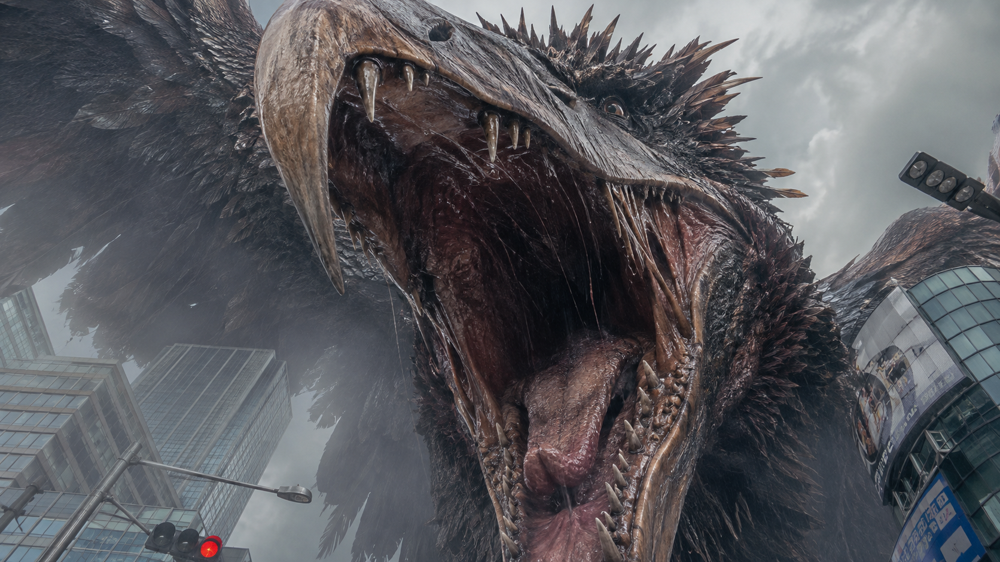

**分类：** 怪兽 ｜ **类型：** 角色 ｜ **画幅：** 16:9

**标签：** `真人电影实拍` `怪兽` `都市灾难`

**源文件：** [data/prompts/case19.md](../data/prompts/case19.md)

**提示词：**

```text
16:9 横向构图，真人电影级怪兽灾难大片，**写实电影怪兽 VFX，Hollywood kaiju film still，IMAX 级尺度，物理真实材质，真实生物组织，真实羽毛、角质、皮肤与湿润表面，高动态范围电影光照**。

**镜头 / 构图：**  
第一人称 POV，摄影机位于现代超级都市街道中央，成年人站立视线高度，**40mm–50mm 电影镜头**，极低机位仰拍，镜头向上倾斜 **80°–85°**，几乎垂直看向头顶。怪兽距离摄影机极近，**占据画面 85%–90%**，头部、胸腔、翼根与身体持续延伸出画面四周，禁止完整轮廓，天空仅保留极少面积。强烈近距离透视与遮挡关系，突出极端巨物尺度。

**怪兽设计：**  
山岳级**史前火山鸟型怪兽**，采用昭和时代火山怪鸟类怪兽的造型语言，但完全重新设计为真实生物结构。  
巨大的鸟兽混合型颅骨，粗壮宽阔的弯曲鸟喙，夸张的上下颚，短而粗壮的肌肉颈部，厚重胸腔与肩带结构，头顶带有不规则骨质冠角、角质羽冠、向后延伸的短粗骨刺与甲片。  
眼睛尺寸相对较小，深陷于颅骨两侧，具有明确攻击性。整体轮廓必须第一眼看出是**巨型鸟兽怪兽**，不是普通鸟，不是龙，不是恐龙，不是蛇，不是岩石生物。

**嘴部结构：**  
怪兽正从摄影机正上方俯冲，**嘴巴张开 110°–130°**，巨大张口占据画面中心主体。  
上下颚部分直接超出画框，嘴部整体宽度明显大于附近摩天楼。  
口腔内部可见真实湿润的深红褐色生物组织、粗糙上颚、巨大舌根、不规则锥形角质齿、唾液拉丝、湿润黏膜反光。  
下颚极其厚重，喙部结构巨大，形成“天空被张嘴撕开”的视觉效果。  
**禁止小嘴、窄嘴、正常鸟类比例嘴部。**

**表面材质：**  
主色为深棕、焦褐、灰褐、暗红褐、低饱和黑色。  
皮肤明确为活体组织，包含厚重皮肤褶皱、粗大毛孔、角质鳞片、旧伤、磨损、疤痕、角质裂纹、雨水湿润反光。  
头部、颈部、胸腔局部覆盖厚重硬质羽毛与大尺度飞羽，羽毛排列自然、不规则，尺寸巨大，具有真实羽轴、羽片结构。  
允许局部出现类似火山裂纹的暗红色天然角质纹理，但**禁止发光岩浆、禁止石头身体、禁止熔岩怪兽**。

**尺度关系：**  
现代超级都市只作为比例参照。  
画面底部与左右边缘仅出现少量真实摩天楼、玻璃幕墙写字楼、交通灯、路灯、广告牌、车辆顶部与街道设施。  
建筑高度仅达到怪兽头部、胸口或翼根的一小部分。  
怪兽头颅宽度明显大于数栋摩天楼并排宽度，胸腔与翼根直接遮挡大片城市天空。  
双翼只允许部分进入画面，巨大翼根和几片山岳尺度主飞羽延伸出画框，**禁止完整展示双翼和全身。**

**光照：**  
明亮阴天风暴环境，**中高曝光，亮灰蓝天空，冷白自然漫射光，阴影开放，暗部保留细节**。  
怪兽面部、喙部、颈部、羽毛、皮肤和建筑立面都必须可见明确材质信息。  
避免整体压暗，避免大面积纯黑。  
高空云层提供柔和冷白轮廓光，轻微勾勒喙部、骨刺、羽毛边缘和湿润皮肤。  
真实 HDR 动态范围，电影级阴天外景曝光。

**环境：**  
轻微暴雨、城市水汽、少量低空雾气、空气颗粒、建筑顶部薄雾、零散雨滴与风压形成的水雾。  
雾气仅用于空间层次，禁止遮挡怪兽主体。  
地面和建筑表面湿润反光，镜头表面少量雨滴。

**核心关键词：**  
第一人称都市街道 POV，极致仰视，巨型火山鸟兽怪兽，山岳级生物尺度，巨嘴张开 110°–130°，怪兽占据 85%–90% 画面，头部与身体超出画框，摩天楼作为尺度参照，巨大鸟喙，骨质冠角，真实硬质羽毛，真实活体皮肤，极端巨物恐惧，megalophobia，colossal avian kaiju，extreme upward angle，creature extremely close to camera，overhead living mountain，photorealistic creature anatomy，high-end creature VFX，bright overcast daylight，open shadows，cinematic HDR，IMAX disaster film still。

**Negative Prompt：**  
画面过暗，欠曝，死黑阴影，夜景，黑色剪影怪兽，岩石怪兽，石头皮肤，熔岩怪兽，发光岩浆裂纹，哥斯拉型恐龙，龙，蛇形怪兽，鲸鱼怪兽，触手，章鱼结构，克苏鲁，普通鸟类，老鹰，小鸟喙，小嘴，闭嘴，嘴巴张幅小，怪兽完整全身，远处怪兽，完整展开双翼，远景展示城市，全景构图，怪兽太小，天空面积过大，浓雾遮挡主体，卡通，动漫，特摄皮套感，橡胶服，塑料皮肤，游戏原画，概念艺术，廉价 CGI，发光眼睛，蓝色魔法光，过度饱和，过度锐化。
```

***

<a name="case-20"></a>

### 例 20：夏日海边

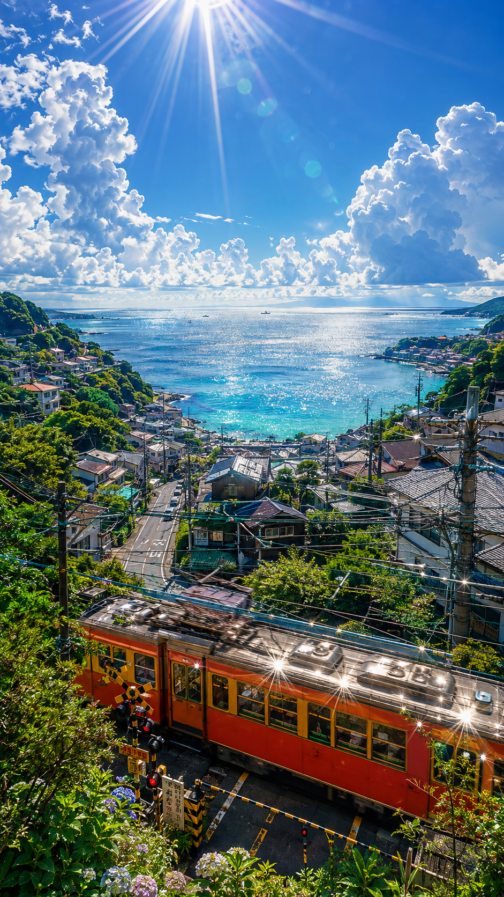

**分类：** 治愈 ｜ **类型：** 环境 ｜ **画幅：** 9:16

**标签：** `真人摄影` `治愈` `海岸` `旅行`

**源文件：** [data/prompts/case20.md](../data/prompts/case20.md)

**提示词：**

```text
9:16 竖向构图，日本盛夏海滨山城，真实摄影基础上的梦幻超现实风景，photorealistic Japanese summer coastal photography，极度清澈、浓郁、闪耀、通透，禁止插画感、动漫感、普通旅游照质感。
20mm–24mm 广角，高处山坡俯视，摄影机位于铁路上方约 15–25 米，向下俯拍海边聚落与巨大海湾。
画面最前景是一条横向穿过山坡的老式地方铁路，一辆红橙色复古日本电车从极近距离高速驶过画面下方，车体占画面宽度约 55%–65%，轻微真实运动模糊，车窗、金属边框与车顶被烈日照出大量强烈星芒高光。
铁路和平交道必须非常靠近摄影机，黑黄色铁路信号灯、道闸、电线杆、密集架空电线形成复杂真实的前景层次。
铁路后方，一条狭窄的日本山城公路从画面左下方向海边弯曲下降，而不是笔直位于中央。道路两侧密集分布大量老式日本住宅、木屋、瓦顶、红褐色铁皮屋顶、阳台、电线杆、晾晒设施与杂乱电缆。
建筑必须沿左右两侧山坡层层向海面下降，左侧建筑数量更多，右侧也有大片住宅切入画面，让海湾被山城自然包围，而不是只有画面中央一小片村庄。
前景与两侧山坡生长极其茂盛的盛夏绿色植被，大量绿色树木、灌木、藤蔓与白色、蓝紫色、粉红色绣球花和野花，植物部分遮挡住宅、道路和铁路边缘，形成丰富而自然的前景纵深。
中景是一片巨大、平静、极度清澈的蓝绿色海湾，近岸呈高透明度 turquoise cyan，远处逐渐变成浓郁 sapphire blue。海面必须覆盖画面中央大片区域，并被正午烈日照出成千上万个密集银白色闪光点，整个海面像铺满碎钻，强烈 glittering specular reflections。
海面不是单一蓝色，而是青绿、湖蓝、钴蓝、银白反光交错，能够清晰倒映天空中的巨大云层。
海平线位于画面高度约 45%–48%，远方只有极小的船只作为尺度参照。
天空必须不是空旷纯蓝。
海平线左右升起两组规模极其巨大的盛夏积雨云，但云体必须由大量大小不同的真实积云团组成，复杂、蓬松、翻滚、不断向两侧延伸。左右主云之外，整条海平线还铺满连续的小型积云和低矮云墙，形成极其丰富的天空层次。
左侧积雨云更加碎裂、纵向堆叠；右侧积雨云更加巨大厚重，高耸入天空。云顶被猛烈阳光照成耀眼纯白，边缘出现银色轮廓光，内部保留柔和蓝灰色体积阴影，禁止变成两座孤立、规整的“棉花云塔”。
太阳位于画面顶部偏左但接近中央的位置，部分超出画框，猛烈的盛夏直射阳光进入镜头。
产生长距离放射状 sun rays、强烈 sunstar、自然 anamorphic lens flare、绿色与青色小型镜头光斑。阳光同时击中海面、电车车窗、屋顶与道路护栏，在整个画面中形成大量细小的闪烁高光。
整体不是普通写实旅游摄影，而是盛夏记忆被强化后的梦幻真实摄影：空气极度透明，光线炽烈，蓝色极深，海水极亮，绿色植被极其鲜活，白云具有强烈体积感。
色彩：deep cobalt blue sky，sapphire blue ocean，turquoise shallow water，lush emerald green vegetation，brilliant warm-white sunlight，high saturation but natural filmic color separation。
强烈但自然的局部对比，高动态范围，保留高光细节，轻微 bloom，真实镜头眩光，真实太阳星芒，细腻空气透视，丰富微对比，Kodak Ektar / Fujifilm Velvia 风格的高饱和透明色彩，极轻微胶片颗粒。
核心视觉：近距离掠过的复古电车 + 密集山坡海滨村落 + 宝石般闪耀的巨大海湾 + 两侧冲天积雨云 + 炽烈盛夏太阳。
禁止：空旷天空，两朵孤立对称云塔，村庄全部集中中央，笔直中央道路，普通旅游摄影，灰蓝低饱和海面，柔和平光，阴天，夕阳，薄雾，过度柔焦，动漫，插画，油画，游戏原画，塑料 CG，廉价 HDR，过曝死白云层。
```

***

<a name="case-21"></a>

### 例 21：瀑布

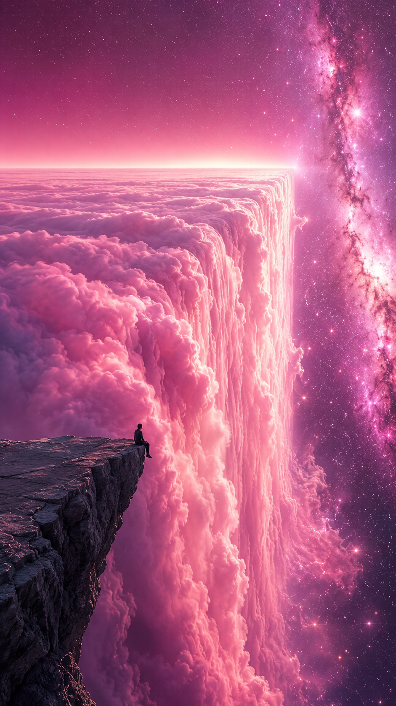

**分类：** 梦幻空灵 ｜ **类型：** 环境 ｜ **画幅：** 9:16

**标签：** `3D CGI` `数字艺术` `天象` `超现实` `宇宙`

**源文件：** [data/prompts/case21.md](../data/prompts/case21.md)

**提示词：**

```text
9:16 竖向构图，超现实宇宙梦境场景，宏大、宁静、孤独、浪漫，surreal cosmic dreamscape，cinematic fantasy landscape，极高细节，高质量 3D CGI 与梦幻数字艺术融合，整体以柔和的樱花粉、玫瑰粉、淡紫色和少量白色高光为主。
镜头采用约 20mm–24mm 广角，摄影机位于巨大悬崖边缘稍后方，以平视略微俯拍的视角望向无尽远方。画面左下方是一块巨大、粗粝、深灰黑色岩石悬崖，从左侧伸向画面中央，岩石表面布满自然裂纹、层状岩理和锋利断面，悬崖下方直接坠入无法看见底部的宇宙深渊。
一名孤独的成年男性坐在悬崖最前端，位于画面左下约 1/3 位置，人物非常小，只占画面高度约 8%–10%，侧身朝向右侧远方，双腿自然垂在悬崖之外。人物穿深黑色简洁服装，几乎呈暗色剪影，仅保留少量柔和粉色环境光勾勒轮廓，没有夸张动作，安静地凝视眼前不可思议的景象。
悬崖前方是一片延伸到地平线尽头的巨大粉色云海，云层极其厚重、柔软、细腻，像无边无际的棉花海洋。最关键的视觉元素是：整片云海在画面中央偏右突然出现一个笔直、巨大、近乎无限长度的矩形世界边缘，随后整片云层像海水一样从这个边缘垂直倾泻下去，形成一堵规模夸张到无法估量的“云之瀑布”。
云海顶部基本保持水平，一直延伸到遥远地平线；在世界边缘处形成清晰而规整的 90 度断崖结构，连续数十层粉色云带沿着边缘向下翻滚。巨大的云瀑从画面上半部一直贯穿到底部，瀑布内部由无数蓬松云团、长条云流和丝状雾气组成，垂直流动感非常明显，规模远远超过普通山岳瀑布，产生类似“整个天空正在坠落”的视觉震撼。
云瀑受到来自右侧宇宙空间的粉白色光线照亮，边缘呈现柔亮的乳白色高光，内部具有大量粉红、淡紫和深玫红色阴影，体积感极强，volumetric clouds，soft subsurface scattering，细密的云层褶皱与光影层次清晰可见，但保持柔软梦幻感。
世界边缘右侧不再是正常天空，而是直接暴露出浩瀚宇宙。背景是一片粉紫色深空，布满密集而细小的恒星。画面最右侧贯穿上下出现一条巨大的银河星云带，呈纵向弧形延伸，内部有明亮的白粉色星云核心、紫红色尘埃云、细碎星团以及几处强烈发光区域，银河与云瀑几乎平行，进一步强化空间尺度。
远方地平线非常平直，位于画面上方约 15%–20% 高度，天空由地平线附近明亮的浅粉白色渐变为顶部较深的玫粉与紫红色。大量细小星星散布在天空中，地平线周围带有柔和的粉色辉光和空气透视，整个世界仿佛位于宇宙尽头。
强调极端尺度对比：渺小人物、近景黑色悬崖、无限云海、世界尽头般的巨大垂直云瀑、浩瀚银河，人物必须非常小，云瀑必须占据画面绝大部分视觉面积，让观看者产生强烈的孤独、敬畏、宁静和宇宙尺度感。
柔和梦幻光照，pink ambient light，volumetric lighting，cinematic atmospheric perspective，细腻云层，高动态范围，极深空间层次，柔和高光，没有刺眼曝光，梦境般粉色调，宏伟却安静，ethereal，liminal space，cosmic solitude，impossible landscape，ultra detailed，8K，cinematic composition，epic scale，vertical masterpiece。
**禁止：**普通山间瀑布、真实水流、海洋瀑布、城市建筑、树木、植被、多人、巨大人物、人物站立、人物占画面过大、瀑布变成液态水、云层边缘不清晰、圆形世界边缘、球形星球、地球曲率、浮岛、城堡、赛博朋克元素、文字、UI、水印、低清晰度、卡通人物、动漫风格。
```

***

<a name="case-22"></a>

### 例 22：浪客

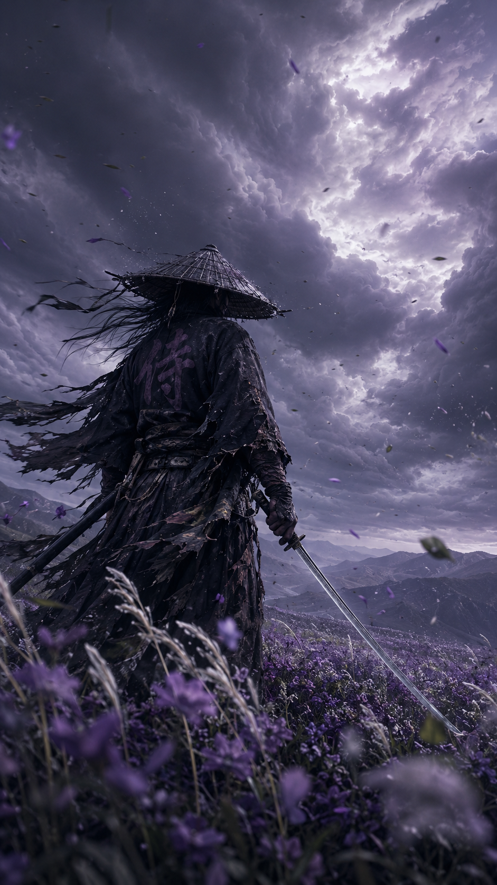

**分类：** 武侠 ｜ **类型：** 双主体 ｜ **画幅：** 9:16

**标签：** `真人电影实拍` `武侠` `荒野`

**源文件：** [data/prompts/case22.md](../data/prompts/case22.md)

**提示词：**

```text
9:16 竖向构图，东方暗黑浪人武士，暴风雨前夕的荒野花海，孤独、苍凉、肃杀、寂静而具有压迫感，真人电影实拍质感，高规格电影视觉效果，写实而带轻微东方幻想气息。
24mm 广角镜头，摄影机距离地面约 60 厘米，从人物后方偏左约 35° 的低机位轻微仰拍。人物位于画面中央偏左，从下方花海延伸至画面中部，占整体高度约 60%，地平线压低，天空占画面约 55%–60%。人物背对镜头，身体略微朝右前方侧转，头部望向远处，面部完全隐藏，形成强烈的孤独背影。
一名成年东亚浪人武士独自站在花海中，头戴一顶尺寸明显偏大的传统圆锥形竹编斗笠，斗笠宽度超过肩部，帽檐低垂，边缘略有破损。竹篾编织结构清晰，表面潮湿，带少量冷光反射。斗笠下露出凌乱黑色长发，大量发丝和细长绑带被狂风水平吹向画面左侧。
武士身穿层叠的黑灰色传统浪人服饰，外层是一件严重破损的黑色羽织，下摆、袖口与衣角被撕裂成大量长条状碎布。内部搭配暗色轻型武士护甲、旧皮革腰带、布质绑带与少量深色金属甲片。衣物整体陈旧、潮湿、磨损、褪色，具有明显粗糙纤维与自然褶皱。背部中央保留一个较大的暗紫色汉字“侍”，像经过长期风雨后褪色的手工染字，自然融入布料，不要现代印刷字体。
人物右手自然垂下，紧握一柄已经出鞘的武士刀。刀身从人物右侧斜向画面右下方延伸，细长、锋利、略带弧度，冷银灰色真实钢铁材质，只反射天空中的微弱冷光，不发光、不带能量特效。腰间还能看到刀鞘、旧式腰带和绑绳。
人物姿态不要笔直站立，双腿略微错开，膝盖微屈，重心稳定下沉，上半身轻微前倾，一侧肩部略低，像刚刚结束一场战斗后停在原地。人物本身几乎静止，而周围所有东西都在剧烈运动。
地面是一整片密集而自然生长的紫色荒野花海，以深紫、蓝紫和淡紫色小型野花为主，混杂大量银白色芒草、细长野草与低矮植被。花海一直延伸到远方山脉。画面最下方设置几株距离镜头非常近的紫色花朵和银白芒草，形成自然前景压框，最近处略微虚化，但中景花草保持大量真实细节。
强风从画面右侧猛烈吹向左侧。人物长发、斗笠绑带、破碎披风、衣摆、芒草和花朵全部朝同一方向倾斜。空气中散布被风卷起的紫色花瓣、绿色叶片、草籽和少量深色碎屑，其中少数较大的叶片靠近镜头经过，出现轻微自然运动模糊。强调强风，但不要表现成爆炸或魔法冲击波。
远景是连续起伏的灰紫色山脉，山体被雨雾和潮湿空气部分遮挡，近处山脉颜色较深，远山逐渐变浅，形成明显的空气透视，没有任何现代建筑或文明设施。
天空是画面的主要视觉重心。整个上半部分被规模巨大的深灰紫色积雨云覆盖，厚重云层从左右两侧向中央聚集，具有明显翻滚、隆起、堆叠、下沉与撕裂结构。中央上方和右侧云层之间出现大片不规则亮区，隐藏在云后的冷白紫色天光穿透薄云，将部分云边照成银白色和淡紫色。天空具有类似暴风眼正在形成的强烈纵深，但仍然是自然天气现象，不要出现真正的黑洞、传送门或魔法漩涡。
整体为冷紫灰色调，深紫、黑灰、银白形成主要色彩关系。人物处于半逆光状态，斗笠边缘、肩部、长发、破碎衣摆以及武士刀刃产生非常细窄的银紫色轮廓光，但人物暗部仍然保留丰富服装和材质细节，不能成为纯黑剪影。
真实积雨云体积，潮湿空气，轻微雨雾，真实风力反馈，真实布料动力学，细腻竹编纹理，旧布料纤维，真实钢铁反射，自然空气透视，前中后景明确分离，电影级自然光，高动态范围，克制景深，写实电影调色，超高细节。
**避免：**动漫、二次元、插画、游戏原画、赛博朋克、霓虹灯、现代建筑、科幻铠甲、发光刀刃、魔法粒子、火焰、夸张闪电、纯黑人物剪影、过度虚化、鱼眼畸变、多余人物、多余武器、错误文字、水印。
```

***

<a name="case-23"></a>

### 例 23：森林骑行

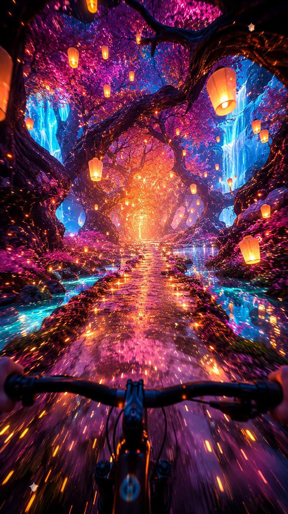

**分类：** 梦幻空灵 ｜ **类型：** 环境 ｜ **画幅：** 9:16

**标签：** `3D CGI` `天象` `超现实` `森林`

**源文件：** [data/prompts/case23.md](../data/prompts/case23.md)

**提示词：**

```text
9:16 竖向构图，第一人称骑自行车高速穿行于超现实梦幻森林，极致绚丽、浪漫、奇幻、沉浸式视觉体验，cinematic fantasy dreamscape，high-end 3D CGI，电影级体积光与粒子特效，整体画面高饱和、高对比、强烈冷暖色碰撞，带明显的 AI 梦境美学，但保持真实空间纵深与高速运动感。

镜头采用约 18–20mm 超广角第一人称 POV，摄影机固定在骑行者头部或胸前位置，距离地面约 1.2–1.4 米，沿着森林中央一条狭窄蜿蜒的小路快速向前运动。画面最下方保留黑色自行车车把与少量骑行者手部作为第一人称视觉锚点，车把横跨画面底部约 45%–55%，不要出现完整人物身体。道路从画面最下方中央进入，快速向远方收窄，形成极强的一点透视和高速冲刺感，视觉中心位于画面中下部的橙金色森林深处。

道路表面光滑湿润，像雨后浅水覆盖的粉紫色石径或梦幻液态道路，两侧布满流动的金色发光粒子。大量细小橙金色光点沿道路边缘、溪水和植被表面高速向后拉伸，在近景形成轻微运动模糊与长条状光轨，强化高速骑行效果。

道路左右分布浅浅的溪流与水洼，水面呈青蓝、蓝绿色，镜面般反射天空、树木与金色灯火。溪流边缘覆盖大片低矮柔软的粉紫、玫红、酒红色苔藓和梦幻地被植物，整个森林地面像被粉色花毯覆盖，纹理细腻、蓬松、富有层次。

道路两侧生长巨大古老树木，树干深黑褐色、粗壮扭曲，从左右两侧向画面中央弯曲，形成天然拱形隧道。树冠极其茂密，覆盖大量粉红、玫红、紫红、淡紫色花朵与细密叶片，枝干彼此交错，在画面上方形成完整的梦幻花海穹顶。近处粗大的黑色树枝从左右上角伸入画面，形成明显前景框景。

天空和远处森林被浓郁的蓝青色、湖蓝色和少量紫蓝色光线照亮。道路两侧远处出现数道垂直的青蓝色瀑布或巨大蓝色光幕，从高处倾泻而下，被花树部分遮挡，只露出局部明亮的蓝色水体，形成强烈冷色背景，与中央道路的橙金色暖光形成鲜明互补色。

森林正前方逐渐由粉紫色过渡到浓烈的橙红、琥珀金和火焰橙色，形成一个明亮的暖色视觉隧道。远处道路消失在密集的橙金色光粒子和树木之间，仿佛通往一个发光的魔法世界，中央区域具有强烈吸引视线的纵深感。

整个森林中漂浮着成百上千只暖橙色发光天灯、纸灯笼或魔法灯火。灯笼尺寸具有明显前后层次：远处细小密集，中景大量散布，近景灯笼尺寸更大，部分从镜头上方掠过。灯笼内部发出柔和但明亮的金黄色火光，边缘略微半透明，呈自然暖橙色纸质质感。部分灯笼被运动拉出轻微残影，形成高速穿越灯海的感觉。

空气中同时存在数量巨大的金色萤火虫、火星、光尘和微小魔法粒子，它们围绕道路、溪水、树冠与镜头高速飞散，近景粒子形成漂亮的散景和运动光轨，远景则汇聚成璀璨星河般的金色雾气。

灯笼暖光、金色粒子光、蓝色瀑布反射光以及粉紫色森林环境光共同照亮场景，采用电影级全局光照、体积光、柔和辉光 bloom、HDR 高动态范围。暗部仍然保留树皮、花瓣、苔藓和水面的丰富细节，不要出现纯黑死角。

摄影效果强调高速第一人称穿行：道路边缘和最靠近镜头的地面存在明显径向运动模糊，中央远景相对清晰；轻微广角透视拉伸，但不要鱼眼畸变；画面中央具有高速推进的视觉吸力。镜头整体稳定但带极轻微骑行颠簸感，像高质量运动相机或电影级 FPV 拍摄。

整体色彩以粉红、洋红、紫色、蓝青色为环境基调，以大量橙金色灯火作为高亮点缀，形成强烈的蓝橙互补色和粉紫梦境色彩。画面明亮、华丽、极具视觉冲击力，但保持道路、树林、溪流和瀑布之间清晰的空间关系。

超高细节，8K，cinematic lighting，volumetric lighting，global illumination，ray tracing，HDR，depth of field，motion blur，glowing particles，magical lanterns，wet reflections，immersive POV，high speed cycling，ultra detailed fantasy forest，dreamlike atmosphere，epic visual spectacle。

负面限制：不要人物正面，不要第三人称骑手，不要汽车，不要摩托车，不要现代城市，不要建筑物，不要白天普通森林，不要低饱和，不要灰暗写实纪录片风，不要动漫人物，不要平面插画，不要油画，不要低模游戏画面，不要赛博朋克霓虹招牌，不要文字，不要水印，不要过度鱼眼畸变，不要道路过宽，不要灯笼排列整齐，不要静止镜头，不要画面缺乏纵深感。
```

***

<a name="case-24"></a>

### 例 24：狗子-雪地

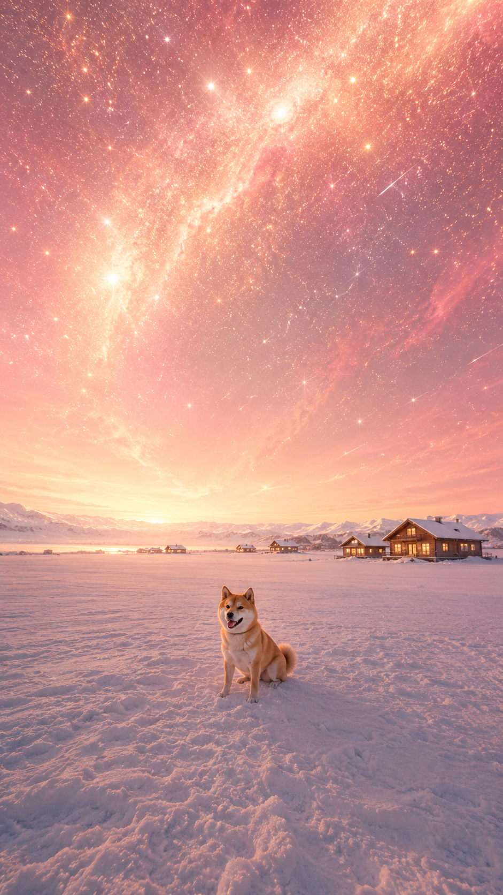

**分类：** 治愈 ｜ **类型：** 环境 ｜ **画幅：** 9:16

**标签：** `真人摄影` `治愈` `雪原` `宠物`

**源文件：** [data/prompts/case24.md](../data/prompts/case24.md)

**提示词：**

```text
9:16 竖向构图，第一人称 POV，电影级超现实真实摄影。摄影机位于成年人眼睛高度约 1.65m，**平视镜头，镜头光轴与地面平行，绝不俯拍**，14–16mm 超广角，extreme long shot，deep focus，超大尺度、超深空间纵深。

脚下是一望无际的**平坦雪原**，真实雪粒、浅雪纹与冰晶反光，从近景连续延伸至几十公里外的低矮地平线。画面中央前方约 5–7 米，一只真实成年柴犬**半蹲在雪地上**，四肢弯曲、重心压低、屁股稍低但没有完全坐下，正脸看向镜头，耳朵竖起，嘴巴微张、轻微吐舌，眼睛微眯，呈现自然憨憨的开心笑脸，橘黄短毛、奶白胸腹、卷尾，真实动物摄影质感。

柴犬后方保留大片空旷雪地，**数栋大型现代木屋位于约 50–100 米的中景位置**，距离镜头明显比柴犬远，不贴近前景。深色原木外墙、积雪斜屋顶、大面积玻璃窗，建筑轮廓与屋檐点缀克制的香槟金暖色灯带，室内透出奶油金暖光，在白雪上形成柔和反射。木屋彼此疏散排列，越向远处尺度越小。

**天空极高，占画面约 75%**，地平线压低。天空采用 pearl pink、rose gold、champagne gold、peach、warm ivory、soft lavender 色系，不要蓝色夜空。巨大半透明粉金色宇宙光带与星云横跨高空，层层延伸至极远处，布满细小珍珠白与暖金色星尘，少量细长白金流星，高空具有巨大的垂直尺度与宇宙纵深。远方地平线散发乳白、浅粉、香槟金色辉光，轻柔映照整个雪原。

构图层级明确：**柴犬 → 大片空旷雪地 → 中景暖光木屋 → 无限雪原 → 极远雪山 → 发光地平线 → 巨大粉金宇宙天穹**。cinematic photorealism, IMAX scale, atmospheric perspective, physically based lighting, realistic snow reflection, volumetric light, HDR, ultra detailed, surreal celestial dreamscape.

**Negative Prompt：**  
high angle, aerial view, looking down, sloped terrain, close-up cabin, oversized building, crowded resort, Shiba sitting, standing Shiba, cartoon dog, blue sky, cyan sky, cyberpunk neon, palace, temple, city, oil painting, illustration, anime, game art, plastic CGI, fisheye, shallow depth of field, blurred background, overexposure.
```

***

<a name="case-25"></a>

### 例 25：猫咪床边

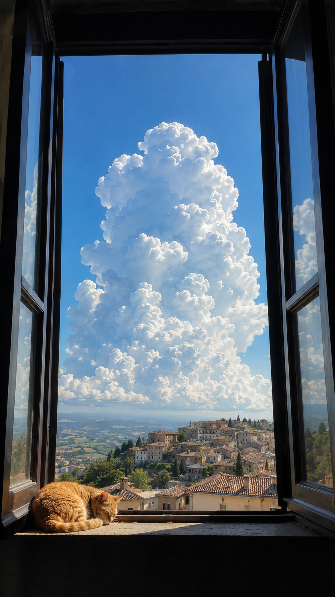

**分类：** 治愈 ｜ **类型：** 环境 ｜ **画幅：** 9:16

**标签：** `真人摄影` `治愈` `窗景` `宠物`

**源文件：** [data/prompts/case25.md](../data/prompts/case25.md)

**提示词：**

```text
9:16 竖版，真人摄影质感，第一视角站在安静房间内，从一扇向外打开的高大黑色木框窗户望向远方。窗框占据画面左右两侧及顶部，形成天然取景框，室内处于较暗的阴影中，窗外阳光明亮通透。
窗外是一座宁静的南欧托斯卡纳风格山城，低矮的暖黄色、米白色石砌建筑和红褐色瓦屋顶沿山坡自然分布，远处是柔和起伏的丘陵与田野。窗台前景，一只橘色短毛猫蜷缩着趴在阳光照亮的窗台上睡觉，体型较小，不抢占主体，毛发被阳光勾勒出柔软的金色轮廓。
天空占据约 75%–80% 的画面，是极其干净、饱和但自然的蔚蓝色晴空。远方城市正上方出现一座规模异常巨大的超高积雨云，云体从地平线附近一直向天空顶部垂直生长，形成巨大、厚重、层层堆叠的花椰菜状云塔，视觉尺度极其震撼，仿佛一整座白色云山矗立在城市后方。云层内部拥有丰富立体结构，大量细密的云团、隆起、褶皱与阴影层次；向阳面洁白明亮，边缘带明显银边光，背光区域呈柔和冷灰蓝色，但整体保持明亮、纯净、梦幻而真实，不是暴风雨乌云。
构图强调「渺小安静的室内生活」与「窗外巨大自然奇观」之间的尺度反差。低机位接近窗台高度，镜头轻微向上仰拍，窗台位于画面最下方约 10%，橘猫位于左下角；山城位于下方约 15%–20%；巨型积雨云严格居中，占据主要视觉中心。窗户右侧玻璃能够隐约反射窗外云层。
24–28mm 广角摄影，真实全画幅相机 / iPhone Pro 摄影观感，HDR 自然动态范围，晴日下午自然光，清晰空气透视，真实云层体积感，细腻高光，轻微暖色阳光与冷蓝天空形成自然色温对比。高细节，photorealistic，cinematic photography，natural lighting，realistic cloud physics，volumetric atmosphere，8K detail，但保持普通生活中偶然看到奇景并随手拍下的真实感，不要插画感，不要油画感，不要动漫，不要 CGI，不要超现实建筑，不要夸张鱼眼畸变，不要文字、水印、UI。
```

***

<a name="case-26"></a>

### 例 26：公路巨云

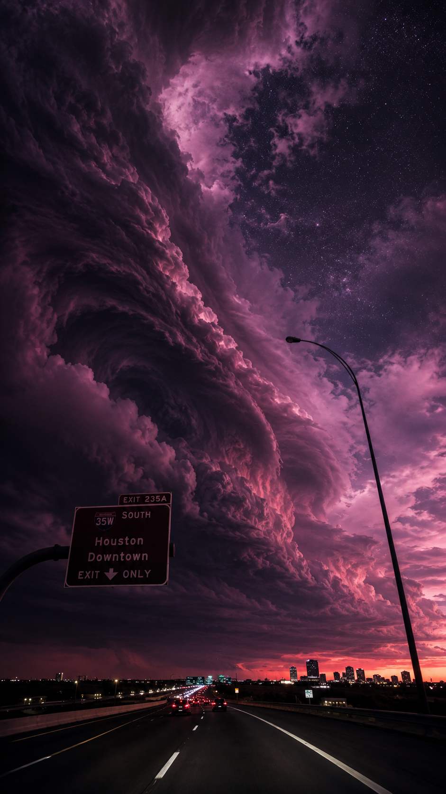

**分类：** 梦幻空灵 ｜ **类型：** 环境 ｜ **画幅：** 9:16

**标签：** `真人摄影` `天象` `超现实` `公路`

**源文件：** [data/prompts/case26.md](../data/prompts/case26.md)

**提示词：**

```text
9:16 竖版，超现实灾难电影摄影质感，**photorealistic cinematic atmospheric photography，真实高速公路夜景 + 极端尺度气象奇观**。第一人称驾驶视角，镜头位于行驶中的汽车前排、接近驾驶员视线高度，从挡风玻璃向前拍摄一条夜晚的美国城市高架高速公路。使用约 **20–24mm 广角镜头**，透视自然，有明显纵深，但不要鱼眼和夸张镜头畸变。

画面下方约 20%–25% 为真实高速公路，道路从左下方进入画面，在中央区域逐渐向右弯曲，形成明显的 S 型引导线。深色沥青路面带有真实车道线、金属护栏、路肩以及零散道路设施；前方分布数辆正常行驶的小型汽车，车辆尺度较小，红色尾灯清晰发亮，在暗色道路上形成零散红色光点。右侧竖立一根非常高、细长、向道路上方弯曲的黑色高速路灯杆。

画面中下部靠左设置一块**距离镜头较近的大型美国高速公路出口指示牌**，由粗大的弯曲金属支架悬挂在道路上方，牌面呈极深的暗红棕色 / 黑色，在紫红天空反光下带有轻微暖色边缘，包含几行真实风格的浅色英文道路文字以及小型 “EXIT” 编号标识。指示牌作为强烈的前景尺度参照，部分遮挡天空，让远处的巨大气象结构显得更加不可思议。

**天空占据约 75%–80% 画面，是绝对主体。** 天空中出现一朵**规模大到超现实的巨型卷曲云层**，它不是海浪、不是海啸、不是水墙，也没有任何液态水体。整片云层由极其厚重、庞大、连续的高密度云气组成，如同一堵跨越整座城市、数千米高的巨大云墙正在天空中向前翻卷。

这片巨型云层具有非常明显的**卷浪状气流结构**：云墙底部从远方地平线升起，沿着画面左侧与中央向上高速卷曲，随后在天空顶部形成巨大弧形翻卷结构；最外缘像一个正在闭合的巨大涡旋 / barrel cloud / curling shelf cloud，形成类似海浪管壁的视觉轮廓，但组成它的必须始终是**云、雾、冰晶、水汽与湍流气团**。

云体表面不是光滑液体，而是具有大量真实的**积雨云颗粒、絮状云团、细密水汽、纤维状云丝、湍流褶皱、旋转气流纹理以及层层堆叠的体积云结构**。翻卷边缘有无数细小云雾碎片被气流撕扯并卷入上升气流中，看起来像巨大的 atmospheric vortex，而不是水花飞溅。云层内部存在大量明暗变化和体积阴影，强化数千米尺度的厚度。

整个天空呈现异常梦幻但仍具有摄影真实性的**紫红色夜空**：深紫、洋红、玫红、暗粉、少量橙红色自然渐变。地平线附近残留非常微弱的橙红色晚霞，向上逐渐过渡为深紫色夜空。巨型云层内部被来自城市、晚霞以及未知天空光源的紫色与品红色环境光照亮，部分卷曲区域呈现强烈但柔和的紫粉色体积透光效果。

天空右上方以及云层较薄的位置能够看到**大量细小而真实的星点与银河尘埃感**，星空并非科幻宇宙背景，而是自然夜空透过云层间隙显现出来。星点细小、密集、亮度不均匀，与紫色天空自然融合。

整体画质接近**高端全画幅相机拍摄的超现实灾难现场照片**，而不是数字插画：真实摄影曝光，电影级动态范围，细腻体积云，复杂微小云气纹理，真实远近空气透视，高密度细节，轻微高 ISO 夜景颗粒，微弱运动感，汽车尾灯略带自然拖影，高光不过曝，暗部仍保留道路细节。色彩强烈但不能变成霓虹赛博朋克，整体依旧保持真实大气摄影基础。

重点表现一种**“普通城市高速公路上空，一整片天空突然形成天文尺度的卷曲巨云”**的震撼感。高速公路、车辆、路牌和路灯必须保持现实尺度，而巨型云墙大到几乎无法完整装入画面，顶部和左右部分自然超出画框，通过极端尺度反差制造压迫感与不可思议感。

**Negative Prompt（严格避免）：** ocean wave, tsunami, sea, water wall, liquid water column, splashing water, water surface reflection, waterfall texture, transparent water body, ice wall, water rendered as cloud, anime, illustration, oil painting, game concept art, cyberpunk neon, over-sharpening, plastic CG texture, fisheye distortion, blown-out highlights, text, watermark, UI。云层即使拥有类似巨浪的轮廓，其材质也必须明确表现为厚重的体积云、雾气、积雨云和高速旋转的水汽。
```

***

<a name="case-27"></a>

### 例 27：雷欧

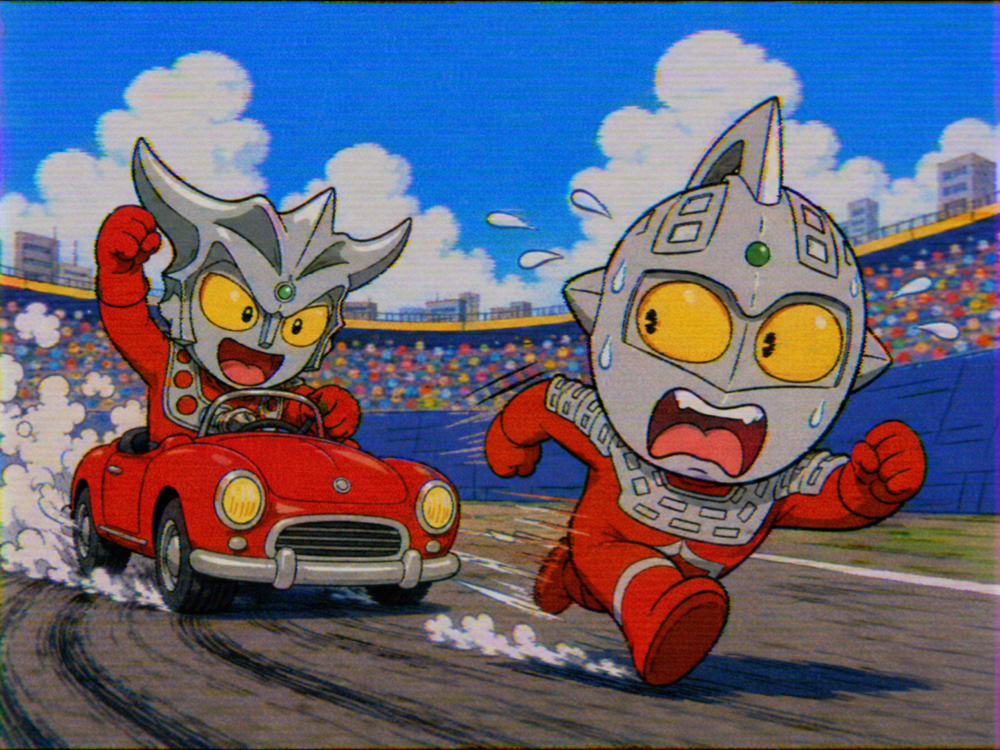

**分类：** Q版 ｜ **类型：** 双主体 ｜ **画幅：** 4:3

**标签：** `赛璐璐动画` `VHS 转录` `特摄` `搞笑` `追逐`

**源文件：** [data/prompts/case27.md](../data/prompts/case27.md)

**提示词：**

```text
4:3 横版，1970–1980 年代日本电视赛璐璐动画截图，复古特摄恶搞动画风格，Q 版角色设计，传统二维手绘，VHS 转录质感。

画面是一场高速追逐：Q 版雷欧奥特曼驾驶一辆红色复古敞篷小汽车，从画面左后方高速追赶正在前方逃窜的 Q 版赛文奥特曼。整体基调荒诞、搞笑、紧张但无伤害感，像老式儿童特摄动画中的夸张喜剧桥段。

【构图与镜头】
中低机位，约 28–35mm 等效视角，轻微广角透视。
镜头位于赛文前方偏侧位置，形成明显的“前景逃跑者 + 后景追逐车辆”空间关系。
赛文位于画面右前方，距离镜头最近，占画面高度约 55%–65%；雷欧和汽车位于左后方，占画面高度约 40%–50%。
赛文与车辆之间保持极近的追逐距离，车头几乎贴近赛文身后，但明确停留在“即将追上”的瞬间，不发生实际撞击。
道路透视线、轮胎痕迹和背景运动线共同向画面纵深延伸，强化速度与追逐方向。

【雷欧奥特曼】
Q 版比例约 1:2.5，大头、短躯干、短粗四肢。
保留雷欧最具识别度的造型特征：银灰色头部，中央高耸尖锐头冠，两侧明显向外上方延伸的角状结构，额头绿色圆形指示灯，巨大暖黄色发光眼睛，红色主体战斗服，胸肩区域银色装甲结构。
雷欧坐在驾驶位，一手紧握方向盘，身体明显前倾，另一只手高举握拳。
面部表情夸张而兴奋，眼神锁定前方赛文，嘴部张开，呈现典型日式搞笑动画中的“狂热追赶”表情。
不要凶残感，不要恐怖感。

【汽车】
一辆小比例、圆润、玩具感明显的 1970 年代复古红色敞篷跑车。
车身低矮宽圆，圆形黄色前灯，银灰色保险杠，简化横向进气格栅，小尺寸黑色轮胎。
避免现代跑车设计，避免真实品牌 Logo，避免写实汽车材质。
后轮高速打滑，扬起夸张的灰白色尘土和轮胎烟，地面留下数条弯曲黑色滑痕。

【赛文奥特曼】
Q 版比例约 1:2.5，大头、小身体、短腿。
保留赛文明确识别特征：银灰色头部，头顶中央明显的刀刃状头镖结构，巨大黄色眼睛，红银配色身体，胸肩区域银色结构。
赛文正在全速向画面右前方逃跑，身体前倾，双臂剧烈摆动，两腿形成夸张的动画式奔跑姿态。
头部略微向后转，回头看向雷欧驾驶的汽车。
表情极度惊慌，双眼睁大，嘴巴张开尖叫，脸侧加入数滴蓝白色漫画汗珠。
身体周围加入少量速度线、残影线和尘土轨迹，表现疯狂逃窜的速度感。

【背景】
场景位于大型露天体育场或竞技场内部。
中远景为深蓝色体育场围墙，上沿带一条黄色装饰线。
更远处是高度简化的彩色观众席，用密集的红、黄、蓝、绿色小色块表现观众，不需要绘制清晰人物。
背景顶部是高饱和纯蓝天空，分布数朵巨大、圆润、柔软的白色积云。
可以在远方加入少量低细节矩形城市建筑，但必须弱化，不能抢夺主体。

【动画表现】
纯二维手绘赛璐璐动画。
粗黑色外轮廓线，局部线条略微抖动和不规则。
大面积纯色平涂，几乎没有渐变。
阴影仅使用 1–2 层硬边色块，例如深红、灰蓝、深灰。
角色造型简化、夸张，表情高度漫画化。
加入少量手绘速度线、尘土云、漫画汗滴和夸张运动符号。
不要现代动漫精细光影，不要复杂材质。

【画质与年代感】
模拟 1970–1980 年代日本电视动画经 VHS 多次转录后的截图：低至中等清晰度，轻微失焦，边缘柔化，色彩溢出，轻微红蓝通道错位，模拟电视噪点，细微扫描线，胶片颗粒，轻微亮度不均，局部色偏，细节略糊但角色轮廓清楚，整体保持老式电视动画原始质感。

【负面约束】
真人皮套特摄，3D，CGI，现代高清数字插画，电影级写实，真实汽车摄影，现代日漫精细渲染，强烈景深虚化，照片级材质，血液，伤口，肢体损伤，赛文被真正撞到，恐怖气氛，残酷暴力。

核心视觉：Q 版雷欧开着红色小汽车疯狂追赶 Q 版赛文，赛文惊慌逃窜，车辆几乎追到身后，极强喜剧追逐感，老式日本赛璐璐动画 + VHS 电视截图质感。
```

***

<!-- GENERATED:GALLERY:END -->
